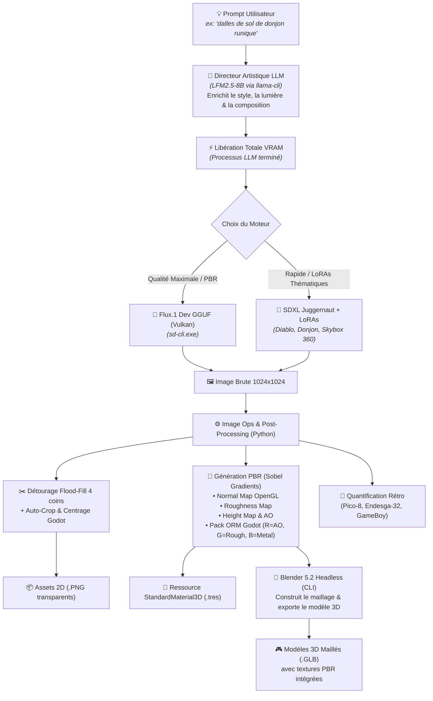
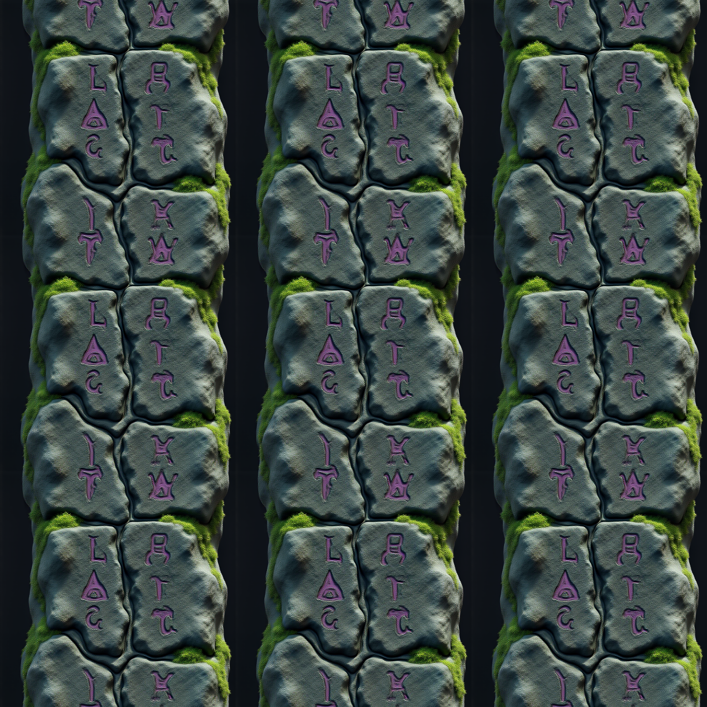
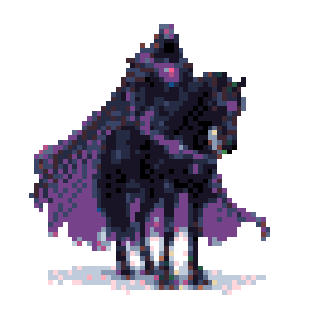
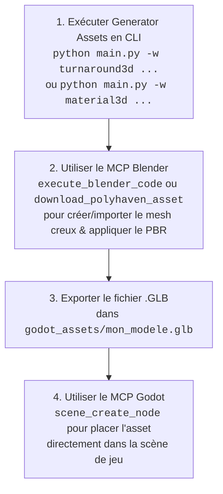

<div align="center">

# ⚔️ Generator Assets

### Moteur de Workflows IA (Headless & Modulaire) pour Assets 2D & 3D Godot Engine
**Flux.1 Dev & SDXL (Vulkan) • Matériaux PBR 3D • Modèles .GLB Blender • Skyboxes 360° • LoRAs • Upscalers ESRGAN**

[](https://www.python.org/)
[](https://godotengine.org/)
[](https://www.vulkan.org/)
[](https://blackforestlabs.ai/)
[](#-workflows-3d--pbr-godot--blender)
[](#-modèles-ia--bibliothèque-de-loras)
[](https://www.blender.org/)
[](LICENSE)

<p align="center">
  <a href="#-architecture-du-pipeline-du-prompt-au-3d-godot">Architecture</a> •
  <a href="#-modèles-ia--bibliothèque-de-loras">Modèles & LoRAs</a> •
  <a href="#-catalogue-complet-des-workflows">Catalogue des Workflows</a> •
  <a href="#-galerie-dassets-générés">Galerie Visuelle</a> •
  <a href="#-référence-complète-de-la-cli">Référence CLI</a> •
  <a href="#-guide-dintégration-godot-4">Intégration Godot 4</a> •
  <a href="#-guide-pour-les-agents-ia-de-codage-blender-mcp--godot-mcp">Guide Agents IA (MCP)</a> •
  <a href="#-installation--démarrage-rapide">Installation</a>
</p>

</div>

---

## 🏛️ Architecture du Pipeline (Du Prompt au 3D Godot)

`generator-assets` est un orchestrateur en ligne de commande (CLI) conçu pour transformer une simple idée textuelle en **véritables assets 2D et 3D prêts pour Godot 4** avec zéro interface web et une efficacité maximale sur GPU :



---

## ⚖️ Ce qui Fonctionne à 100% en Automatique vs Limitations Réelles de l'IA

Pour vous éviter toute déception, voici un état des lieux transparent de ce que le pipeline génère automatiquement en un clic, et des cas particuliers nécessitant une approche différente :

### ✅ 1. 100% Automatique & Immédiatement Prêt pour Godot 4
- **🧱 Sols, Murs & Matériaux PBR (`material3d`)** : Dalles de donjon, pavés médiévaux, roches, métaux, bois avec Normal Maps, Roughness et fichier `.tres` prêt à l'emploi.
- **🌌 Skyboxes & Panoramas 360° (`skybox`)** : Ciels d'orage, galaxies, nuages 360° et ressource `Environment.tres` pour le `WorldEnvironment` de Godot.
- **🎲 Éléments de Décors 3D (`mesh3d`)** : Dalles de sol (`--shape tile`), caisses et coffres (`--shape cube`), piliers de donjon (`--shape pillar`), orbes (`--shape sphere`).
- **🔍 Upscaling IA ESRGAN (`upscale`)** : Agrandissement 2x, 4x, 4K avec conservation parfaite de la transparence.
- **🎨 Assets 2D, Spritesheets & Pixel Art (`generate`, `spritesheet`, `pixelart`)**.

---

### ⚠️ 2. Ce qui NE fonctionne PAS directement en "1-clic magique" (Cas des Casques & Personnages)
- **Le Cas d'un Casque d'Équipement 3D (ex: `casque.png`)** :
  - **Pourquoi ?** Une image 2D vue de face ne contient ni l'intérieur de la tête, ni le dos, ni les côtés à 360°.
  - **Résultat de l'extraction automatique 3D** : Génère un **bas-relief 2.5D bombé par l'avant** (comme une médaille ou une sculpture murale). Ce n'est **pas** un casque creux dans lequel un personnage 3D peut glisser sa tête.
- **Comment créer un vrai casque creux ou un personnage 3D pour Godot ?** :
  1. **Option A (Fiche de référence)** : Utilisez le workflow `turnaround3d` qui génère la **planche orthogonale Face + Profil parfaitement alignée** pour servir de gabarit dans Blender.
  2. **Option B (Mesh de base + Texture PBR)** : Téléchargez un mesh de casque générique basse définition (sur Kenney.nl ou Godot Asset Library) et appliquez-lui les textures PBR générées par notre pipeline (`material3d`).

---

## 🤖 Modèles IA & Bibliothèque de LoRAs

Le système gère dynamiquement les architectures de modèles sans conflit mémoire :

### 1. Modèles de Base Supportés

| Modèle | Fichier | Rôle & Points Forts |
| :--- | :--- | :--- |
| **FLUX.1 [dev]** | `flux1-dev-Q6_K.gguf` | **Moteur par Défaut (3D & Photoréalisme)** : Compréhension textuelle chirurgicale via T5-XXL. Idéal pour les textures PBR, les détails fins et les rendus 1024×1024 épiques. |
| **SDXL Juggernaut** | `juggernautXL_ragnarok.safetensors` | **Moteur de Styles & LoRAs SDXL** : Génération ultra-rapide (~3s/it). Requis pour tous les LoRAs de styles (Diablo, Donjon, 360° Redmond). |
| **LFM2.5 8B** | `LFM2.5-8B-A1B-Q6_K.gguf` | **Directeur Artistique (LLM)** : Enrichit les prompts simples en descriptions professionnelles adaptées à la diffusion. |
| **4x-UltraSharp (ESRGAN)** | `4x-UltraSharp.pth` | **Super-Résolution 4K (Défaut)** : Upscaling IA 4x (1024 ➔ 4096 px) ultra-net avec préservation intégrale du canal Alpha Godot. |
| **RealESRGAN Anime** | `RealESRGAN_x4plus_anime_6B.pth` | **Super-Résolution Stylisée** : Idéal pour les contours nets, cel-shading, cartoon et anime. |

---

### 2. Bibliothèque des LoRAs Installés (`C:\Modeles_LLM\loras\`)

Vous pouvez appliquer un ou plusieurs LoRAs sur n'importe quel workflow via le flag `-l "nom:poids"` (bascule automatiquement sur `JuggernautXL`) :

| Nom du LoRA | Poids | Usage recommandé |
| :--- | :---: | :--- |
| **`game_icon_diablo_style`** | `870 Mo` | Icônes d'items, armes, potions et reliques dans un style Dark Fantasy / Diablo. |
| **`JJsDungeon_XL`** | `435 Mo` | Décors, dalles de sol, murs de pierre et environnements souterrains pour la 3D. |
| **`360RedmondResized`** | `433 Mo` | Panoramas sphériques 360° pour Skyboxes et éclairage d'environnement Godot. |
| **`space_backround-XL-7`** | `217 Mo` | Ciels spatiaux, nébuleuses cosmiques et étoiles pour la 3D. |
| **`game_icon_v1.0`** | `2.6 Go` | Icônes de jeu stylisées et objets d'inventaire aux contours nets. |

```bash
# Vérifier la liste des LoRAs et upscalers disponibles à tout moment :
python main.py --list-loras
python main.py --list-upscalers
```

---

## 🎨 Galerie d'Assets Générés

| Sol Runique PBR (Albedo) | Relief 3D (Normal Map OpenGL) | Pack ORM (AO + Roughness) | Dalle 3D GLB (`mesh3d`) |
| :---: | :---: | :---: | :---: |
|  |  |  |  |
| *Texture de couleur* | *Gradients de relief en temps réel* | *R=AO, G=Roughness, B=Metal* | *Raccord sans couture* |

| Potion Diablo (`SDXL LoRA`) | Casque ESRGAN 2048x2048 (`upscale`) | Casque Pixel Art (`pico8`) | Monture Endesga (`32 couleurs`) |
| :---: | :---: | :---: | :---: |
|  |  |  |  |
| *SDXL + LoRA Diablo* | *Super-résolution 4x nette* | *Palette 16 couleurs Pico-8* | *Palette 32 couleurs Endesga* |

---

## 📦 Catalogue Complet des Workflows

Le projet intègre **25 workflows spécialisés** sélectionnables via le paramètre `-w <nom>` :

```text
📋 Workflows Disponibles :
  • ip_adapter   : Cohérence de style & charte graphique (IP-Adapter) depuis une image de référence + Palettes Godot
  • anim_loop    : Boucles de textures & shaders animés fluides (Loop Engine / AnimateDiff) (.gdshader / .tres)
  • pose_control : Contrôle d'armatures & poses de personnages (ControlNet OpenPose) + Scène Godot (.tscn) & Marker2D
  • tts_dialogue : Synthèse vocale émotionnelle (TTS / Kokoro) synchronisée avec portraits RPG et lip-sync Godot
  • audio_ambience: Ambiances sonores immersives & paysages procéduraux en boucle sans couture (.wav / .ogg / .tres)
  • material3d   : Pack Matériau 3D PBR complet (Albedo, DeepBump Normal, Roughness, Height, AO, ORM + .tres Godot)
  • character3d  : Personnage 3D Humanoïde MakeHuman/MPFB2 (.blend + .glb) avec textures PBR et traits signature
  • mesh3d       : Modèle 3D Maillé .GLB complet avec textures PBR pour Godot (Blender Headless)
  • voxel3d      : Modèle 3D Voxel (.GLB) optimisé avec Vertex Colors pour GridMap Godot 4
  • autotile_pack: Planche d'Autotiles 47 tuiles (Wang / Minimal 3x3) + Ressource TileSet.tres
  • rembg        : Détourage IA haute précision (RMBG-1.4 / BiRefNet ONNX) sans frange blanche
  • flowmap      : Cartes de flux vectoriels (Flowmaps) et Shaders d'eau/lave animés (.gdshader + .tres)
  • ui_9slice    : Cadres d'UI, fenêtres d'inventaire et boutons 9-Patch extensibles (.tres / .tscn)
  • rife_interp  : Super-fluidité d'animation IA (RIFE v4 ONNX) : multiplie les trames (60 FPS)
  • vfx_flipbook : Planches d'animation de particules VFX (Flipbooks 4x4) et matériaux Godot 4
  • rpg_portrait : Galerie de dialogues RPG multi-émotions (Neutre, Joie, Colère...) + JSON Godot
  • sfx          : Effets sonores & bruitages procéduraux (.wav / .ogg) pour AudioStreamPlayer
  • skybox       : Environnement Skybox 360° équirectangulaire et ressource Environment Godot 4
  • turnaround3d : Planche de modélisation 3D (Vues orthogonales Face + Profil calibrées pour Blender)
  • generate     : Asset 2D isolé (LLM -> Diffusion -> Détourage -> Centrage Godot)
  • upscale      : Super-résolution IA (ESRGAN Vulkan / Lanczos) avec préservation du canal Alpha
  • spritesheet  : Planche de sprites multi-angles (Face, Profils, Dos) avec export JSON Godot
  • variations   : Déclinaisons thématiques d'éléments (Feu, Glace, Poison, Foudre, etc.)
  • tileable     : Textures seamless / tuiles de terrain infinies pour TileMaps Godot
  • pixelart     : Conversion & quantification rétro (Pico-8, Endesga-32, GameBoy)
  • batch        : Génération par lots depuis un fichier JSON de recette
```

---

### 0. 👤 Workflow `character3d` : Pipeline Canonique Personnage Humanoïde (MakeHuman / MPFB2)
Génère un personnage 3D complet prêt pour Godot 4 et Blender en 3 étapes automatisées :
1. **Génération de la peau PBR & Décalques Signature** : Peau MakeHuman photoréaliste propre avec application organique des cicatrices, cernes de fatigue et détails de personnage (sans découpe ni artefact 2D).
2. **Construction 3D Canonique MakeHuman** : Résolution barycentrique des vêtements (`.mhclo`), yeux, cheveux et morphing d'âge/morphologie.
3. **Export GLB + Scène .blend + Rendu Studio de Validation Cycles**.

```bash
# Exécution du pipeline complet avec portrait de référence et recette MPFB2 :
uv run python scripts/character_pipeline.py --portrait "assets/portraits/marc_portrait.png" --recipe-script "poc_3d/create_marc_mpfb2.py" --name marc_novice
```

---

### 👗 Gestion & Aiguillage IA des Vêtements 3D MakeHuman

#### 1. Catalogue & Aiguilleur Sémantique Bilingue (177 Modèles 3D) (`core/clothes_catalog.py`)
- Base de données JSON [`data/clothes_catalog.json`](file:///C:/GIT/generator-assets/data/clothes_catalog.json) indexant **177 modèles 3D MakeHuman** (robes de moine, capes, armures, salopettes, bottes, barbes, coiffures, chemises, chapeaux).
- Aiguillage automatique bilingue (FR / EN) depuis n'importe quelle description textuelle :
```bash
# Reconstruire le catalogue d'assets :
uv run python core/clothes_catalog.py
```

#### 2. Retexturation IA sur Patrons UV Existants (`scripts/retexture_uv_garment.py`)
- Part des vrais patrons UV MakeHuman pour préserver 100% de la géométrie, des boutons, poches et coutures, et transforme la matière (denim -> toile de jute médiévale, cuir vieilli) avec sa Normal Map PBR :
```bash
uv run python scripts/retexture_uv_garment.py
```

#### 3. Compilation MakeClothes depuis un Maillage 3D / IA 3D (`makeclothes_from_mesh.py`)
- Transforme n'importe quel modèle 3D (`.obj`, `.glb`, `.fbx`) issu d'une IA 3D ou modélisé en Quads en vêtement MakeHuman officiel (`.mhclo`) avec liaison barycentrique automatique :
```bash
uv run python scripts/makeclothes_from_mesh.py --mesh "assets/models/cape.obj" --name "cape_voyageur" --category "clothes"
```

#### 4. Import Automatique de Packs d'Assets MakeHuman (`install_asset_packs.py`)
- Extrait et installe des packs ZIP MakeHuman Community dans le répertoire MPFB et met à jour le catalogue :
```bash
uv run python scripts/install_asset_packs.py
```

---

### 1. 🧱 Workflow `material3d` : Pack Matériau PBR 3D Complet (DeepBump ONNX)
Génère toutes les cartes de textures nécessaires au rendu physique réaliste dans Godot 4 (avec estimation neuronale DeepBump) et produit le fichier ressource `.tres` prêt à l'emploi.

```bash
# Estimation PBR neuronale depuis une texture 2D :
python main.py -w material3d -i godot_assets/sol_runique_albedo.png -o sol_pbr

# Génération complète depuis un concept textuel :
python main.py -w material3d "dalles de pierre gothique sombre avec runes violettes et mousse" -s 1024 -o sol_runique
```

---

### 2. ✂️ Workflow `rembg` : Détourage IA Haute Précision (RMBG-1.4 / BiRefNet)
Détoure les images avec un réseau de neurones ONNX ultra-rapide, éliminant les halos blancs même sur les cheveux, les armes et le verre semi-transparent.

```bash
python main.py -w rembg -i godot_assets/cheval.png -o cheval_transparent
```

---

### 3. 🌊 Workflow `flowmap` : Cartes de Flux Vectoriels & Shaders Godot
Génère une texture de vélocité vectorielle (R=X, G=Y, B=Magnitude) avec turbulences (Curl Noise) et produit le code `.gdshader` et le matériau `.tres` avec double-échantillonnage déphasé sans couture.

```bash
python main.py -w flowmap "riviere de lave fluide" --angle 45 --turbulence 0.4 -o lave_flow
```

---

### 4. 🖼️ Workflow `ui_9slice` : Cadres & Boutons 9-Patch Extensibles
Génère un cadre d'interface d'inventaire ou dialogue, analyse les bordures et produit la ressource `StyleBoxTexture.tres` et la scène `NinePatchRect.tscn` Godot 4.

```bash
python main.py -w ui_9slice -i godot_assets/cadre_source.png --margin 32 -o fenetre_inventaire
```

---

### 5. 🧊 Workflow `voxel3d` : Modèles 3D Voxel (.GLB) pour GridMap Godot 4
Extrude et discrétise un sprite 2D en volume 3D Voxel avec optimisation géométrique (culling des faces internes invisibles) et exporte un fichier `.glb` avec Vertex Colors via Blender Headless.

```bash
python main.py -w voxel3d -i godot_assets/cheval.png --grid-size 32 --voxel-depth 4 -o cheval_voxel
```

---

### 6. 🗺️ Workflow `autotile_pack` : Planches Autotile 47 Tuiles Wang Minimal 3x3
Génère l'atlas de 47 tuiles canoniques de transition entre deux biomes (ex: Herbe vers Terre) et crée la ressource `TileSet.tres` Godot 4 avec les terrains et peering bits pré-configurés.

```bash
python main.py -w autotile_pack --biome-a "herbe verte fleurie" --biome-b "terre sombre" --size 64 -o terrain_herbe
```

---

### 7. ⚡ Workflow `rife_interp` : Fluidité d'Animation 60 FPS (RIFE v4 ONNX)
Multiplie le nombre de trames d'une planche de sprites d'animation via le flux optique neuronal RIFE v4 (facteur 2x ou 4x).

```bash
python main.py -w rife_interp -i godot_assets/spritesheet.png --columns 4 --factor 2 -o spritesheet_60fps
```

---

### 8. 💥 Workflow `vfx_flipbook` : Particules & Flipbooks 4x4
Génère une planche de particules d'effets visuels (explosions, sorts, flammes) en grille 4x4 et exporte le matériau `StandardMaterial3D` avec UV Flipbook, le `ParticleProcessMaterial` et la scène `GPUParticles`.

```bash
python main.py -w vfx_flipbook "explosion magique violette" --vfx-type explosion -o explosion_magique
```

---

### 9. 🎭 Workflow `rpg_portrait` : Portraits de Dialogues Multi-Émotions
Génère pour un même personnage sa galerie d'expressions clés (*Neutre, Joie, Colère, Tristesse, Blessé*) et exporte le manifeste JSON pour les systèmes de dialogue Godot.

```bash
python main.py -w rpg_portrait "sorcière sombre aux yeux dorés" --emotions "neutral,happy,angry,sad,hurt" -o sorciere
```

---

### 10. 🔊 Workflow `sfx` : Bruitages & Effets Sonores (.wav / .ogg)
Synthétise des effets sonores procéduraux (coups d'épée, potions, explosions, pièces de monnaie, sorts) et les exporte directement au format WAV et OGG pour Godot 4.

```bash
python main.py -w sfx "coup d epee magique tranchant" --duration 1.2 -o epee_slash
python main.py -w sfx "potion magique de soin" --duration 2.0 -o potion_soin
```

---

### 11. 🎨 Workflow `ip_adapter` : Cohérence Stylistique & Palettes Godot
Prend une image de référence pour verrouiller la charte graphique et décline une série d'items parfaitement assortis, avec export de la palette `.tres` et `.gpl`.

```bash
python main.py -w ip_adapter -i godot_assets/potion_diablo.png --items "sword,shield,ring,helmet" -o set_diablo
```

---

### 12. 🔄 Workflow `anim_loop` : Boucles de Textures & Shaders Animés
Génère une séquence cyclique en boucle fermée sans coupure (portails, cascades, flammes) avec export de `AnimatedTexture.tres` et `loop.gdshader`.

```bash
python main.py -w anim_loop "portail du vide cosmique" --vfx-type portal --frames 16 --fps 12 -o portail_loop
```

---

### 13. 🕺 Workflow `pose_control` : Contrôle d'Armature OpenPose & Scène Godot
Guide la pose d'un personnage avec les 18 points OpenPose (`idle`, `slash_attack`, `cast_spell`, `shield_block`, `jump`, `walk`) et exporte la scène Godot avec `Marker2D` pour attacher armes et VFX.

```bash
python main.py -w pose_control "chevalier de l'ombre" --pose slash_attack -o chevalier_attaque
```

---

### 14. 🎙️ Workflow `tts_dialogue` : Voix Émotionnelles & Lip-Sync Godot
Synthétise les répliques vocales `.wav` & `.ogg` avec modulation d'intonation par émotion (Neutre, Joie, Colère, Tristesse, Blessé) et produit le fichier de lip-sync JSON (visèmes).

```bash
python main.py -w tts_dialogue "sorciere_sombre" --emotions "neutral,happy,angry,hurt" --pitch 175 -o sorciere_voix
```

---

### 15. 🌌 Workflow `audio_ambience` : Ambiances Immersives Bouclables
Génère des paysages sonores procéduraux stéréo en boucle seamless (Donjon, Forêt féerique, Orage volcanique, Espace, Feu de camp) avec configuration `AudioBusLayout.tres`.

```bash
python main.py -w audio_ambience "donjon souterrain sombre avec gouttes" --duration 8.0 -o ambiance_donjon
```

---

### 16. 🎲 Workflow `mesh3d` : Modèle 3D Maillé `.GLB` via Blender
Génère des modèles 3D volumétriques (`tile`, `cube`, `pillar`, `sphere`, `card`, `cutout`) avec matériaux PBR complets.

```bash
python main.py -w mesh3d "coffre ancien orné de fer forgé" --shape cube -o coffre_3d
```

---

### 17. 🌌 Workflow `skybox` : Ciels 360° Équirectangulaires
Génère un panorama sphérique 2:1 et la ressource `Environment.tres` pour le `WorldEnvironment` de Godot 3D.

```bash
python main.py -w skybox "galaxie avec nébuleuse pourpre et lunes d'obsidienne" -o ciel_espace
```

---

### 18. 👾 Workflow `pixelart` : Quantification Rétro (Pico-8, Endesga-32)
Convertit les assets en pixel art authentique avec palettes rétro.

```bash
python main.py -w pixelart -i godot_assets/cheval.png --palette pico8 --grid-size 64
```

---

### 19. 👗 Workflow `makehuman_clothes` : Garde-robe MakeHuman / MPFB2 & Scène New Human .blend
Génère une garde-robe complète 100% compatible MakeHuman et MPFB2 (Torso/Haut, Pantalon/Bas, Chaussures/Bottes) à partir d'un thème stylistique :
- **Génération IA PBR & Super-Résolution** : Création des textures Albedo, Normal Maps et Ambient Occlusion en matières brutes pures (cuir grainé, laine tissée, suède) avec upscaling IA matériel automatique (4x-UltraSharp / RealESRGAN sous GPU Vulkan).
- **Géométries Officielles & Découpe Quad** : Exploite les géométries d'aide MakeHuman (`helper-tights` et `helper-skirt`) pour des volumes 3D réalistes (évasements naturels, manches dégageant les mains, bottes montantes intégrales) et compile les fichiers morphologiques `.mhclo`, `.obj`, `.mhmat` et vignettes `.thumb` dans la bibliothèque `AppData/Roaming/Blender Foundation/Blender/5.2/mpfb/data/data/clothes/`.
- **Assemblage 3D & Rendu Multi-Angles** : Crée une scène Blender (`.blend`) avec un *New Human* MPFB habillé des pièces, éclairage studio 3 points et rendu `.png` ultra haute résolution (4096x4096).

### 20. 🗺️ Workflows Skins MakeHuman / MPFB2 & Calibrage de Teint
Génère et installe des packs de skins complets pour MakeHuman et Blender MPFB2 :
- **Pack Complet MPFB** : Crée la texture Diffuse 2048x2048 (`diffuse.png`), la Normal Map PBR (`normal.png`), le fichier de matériau MakeHuman (`.mhmat`) avec paramètres de Subsurface Scattering (SSS) calibrés et la vignette d'interface (`.thumb`).
- **Scripts Dédiés dans `scripts/`** :
  - `scripts/build_clean_marc_skin.py` : Assemble et restaure une texture de peau MakeHuman propre et homogène sans couture avec colorimétrie dédiée (ex: teint d'hiver froid pour Marc de *Vent-Gris*).
  - `scripts/align_marc_portrait_to_uv.py` : Calibre et projette les traits anatomiques 2D sur le patron UV standard MakeHuman hm08.
- **Déploiement Automatique** : Installe les assets directement dans `AppData/Roaming/Blender Foundation/Blender/5.2/mpfb/data/skins/<nom_skin>/` et synchronise les dossiers de projet Godot.

---

## 💻 Référence Complète de la CLI (`main.py`)

```text
Usage: python main.py [prompt] [options]

Paramètres Principaux :
  prompt                    Description ou concept de l'asset.
  -w, --workflow            Nom du workflow (défaut: 'generate').
  -i, --input               Chemin de l'image source (pour variations, pixelart, upscale ou Img2Img guidé).
  -t, --type                Type d'asset 2D : item, character, prop, tile.
  --shape                   Forme 3D pour mesh3d : tile, cube, pillar, cylinder, sphere, card, cutout.
  -o, --output              Nom du fichier de sortie (sans extension).
  -d, --output-dir          Dossier de destination (défaut: 'godot_assets/').
  -s, --size                Résolution carrée finale en pixels.

Modèles & Moteurs IA :
  --sd-model                Modèle de diffusion : 'flux', 'juggernaut', 'sdxl' ou chemin absolu .safetensors/.gguf.
  --strength                Force de débruitage Img2Img / guidage d'image (défaut: 0.55).
  --segmenter               Moteur de détourage : 'auto', 'birefnet', 'rmbg', 'floodfill', 'none'.
  --pbr-engine              Moteur d'estimation PBR : 'auto', 'deep' (DeepBump ONNX), 'sobel'.
  -l, --lora                Applique un LoRA 'nom:poids' (ex: -l 'game_icon_diablo_style:0.8').
  --upscale                 Active l'upscaling IA automatique (ESRGAN 4x ou Lanczos) après la génération.
  --upscale-model           Modèle d'upscale ESRGAN ('ultrasharp', 'anime', 'RealESRGAN_x4plus.pth', 'auto').

Options Spécifiques aux Workflows :
  --pose                    Pose OpenPose pour pose_control (idle, slash_attack, cast_spell, shield_block, jump, walk).
  --pitch                   Pitch vocal fondamental en Hz pour tts_dialogue (défaut: 160.0).
  --fps                     Cadence d'images/s pour anim_loop (défaut: 12.0).
  --items                   Liste d'assets cohérents pour ip_adapter (ex: 'sword,shield,potion,helmet').
  --angle                   Angle de flux en degrés pour flowmap (défaut: 90 = bas).
  --flow-type               Type de flux pour flowmap ('river', 'vortex', 'radial', 'optical').
  --turbulence              Intensité des tourbillons pour flowmap (défaut: 0.35).
  --margin                  Marge fixe 9-slice en pixels (workflow ui_9slice).
  --auto-margin             Détection automatique des marges pour ui_9slice.
  --voxel-depth             Épaisseur en voxels (workflow voxel3d).
  --voxel-scale             Échelle des voxels en unités Godot (workflow voxel3d).
  --biome-a, --biome-b      Textures ou prompts des 2 biomes pour autotile_pack.
  --factor                  Facteur de multiplication (upscale ou interpolation rife 2x, 4x).
  --vfx-type                Type d'effet pour vfx_flipbook ou anim_loop ('portal', 'fire', 'waterfall', 'nebula').
  --emotions                Liste d'émotions séparées par des virgules pour rpg_portrait et tts_dialogue.
  --duration                Durée en secondes pour sfx ou audio_ambience.
  --mode-2d                 Active la génération orientée Godot 2D (CanvasItem).

Commandes Utilitaires :
  --interactive             Lance la console interactive avec menus numérotés (1-25).
  --check                   Vérifie la présence des exécutables et des modèles.
  --list-workflows          Affiche la liste complète des 25 workflows.
  --list-loras              Affiche la liste des LoRAs installés.
  --list-upscalers          Affiche la liste des modèles ESRGAN installés.
```

### 💡 Exemples Pratiques (Génération, LoRAs & Upscale 4K) :

```bash
# 1. Génération d'asset 2D en 1024x1024 avec Auto-Upscale IA 4K (4096x4096)
uv run python main.py -w generate -p "un bouclier royal en or avec un lion grave" --upscale

# 2. Asset avec style LoRA Diablo (Bascule auto sur SDXL Juggernaut) + Upscale 4K
uv run python main.py -w generate -p "potion de mana sombre" -l game_icon_diablo_style:0.9 --upscale

# 3. Génération guidée par image source (Img2Img avec force de débruitage ajustée)
uv run python main.py -w generate -i assets/croquis_base.png -p "bouclier magique de cristal runique" --strength 0.60 --upscale

# 4. Skybox 360° avec LoRA Redmond
uv run python main.py -w skybox -p "dark fantasy dungeon hall with torches" -l 360RedmondResized:1.0

# 5. Upscaling direct d'une image existante avec le modèle 4x-UltraSharp
uv run python main.py -w upscale -i godot_assets/mon_asset.png --factor 4 --upscale-model ultrasharp
```

---

## 🎮 Guide d'Intégration Godot 4

### 1. Application des Matériaux PBR (`.tres`)
1. Glissez-déposez le dossier `godot_assets/` dans `res://assets/` de votre projet Godot.
2. Créez un nœud **`MeshInstance3D`** (ex: un `PlaneMesh` pour le sol ou un `BoxMesh` pour un mur).
3. Dans l'inspecteur, glissez le fichier `.tres` généré (ex: `sol_runique_material.tres`) directement dans la propriété **Material** du Mesh.
4. L'albedo, le relief dynamique de la Normal Map et les reflets de rugosité sont immédiatement opérationnels.

---

### 2. Utilisation des Modèles 3D Maillés (`.glb`)
1. Glissez le fichier `.glb` généré (ex: `sol_runique_3d_tile.glb` ou `coffre_3d.glb`) directement dans votre **Arborescence de Scène 3D** ou dans le Viewport.
2. Le maillage, les UVs et les textures PBR sont **intégrés nativement dans le fichier binaire**.

---

### 3. Configuration de la Skybox 360°
1. Ajoutez un nœud **`WorldEnvironment`** dans votre scène 3D.
2. Dans la propriété **Environment**, glissez le fichier ressource généré (ex: `ciel_dark_env.tres`).
3. Votre scène bénéficie instantanément d'un ciel à 360° et d'un éclairage IBL (Image-Based Lighting) global.

---

## 🤖 Guide pour les Agents IA de Codage (Blender MCP & Godot MCP)

> **Message à l'attention de l'Agent IA qui assiste l'utilisateur :**  
> L'utilisateur ne souhaite pas modéliser manuellement dans Blender. Vous disposez des serveurs MCP (`blender` et `godot-mcp-toolkit`) pour automatiser l'intégralité du pipeline 3D.

### 📋 Pipeline Recommandé pour l'Agent IA :



### 🛠️ Actions Types de l'Agent IA :

1. **Pour l'Habillage de Personnages 3D (MakeHuman / MPFB)** :
   - Référez-vous au guide complet pour agents IA dans [**`GUIDE_AGENT_IA_HABILLAGE.md`**](GUIDE_AGENT_IA_HABILLAGE.md).
   - Utilisez les **patrons officiels MakeHuman Community (`.mhclo`)** qui s'adaptent dynamiquement à toutes les morphologies (**Homme**, **Femme**, **Enfant**).
   - Séparez les vêtements en objets 3D indépendants (`Torso`, `Pants`, `Shoes`).
   - Appliquez le masquage anatomique universel (8398 sommets fixes) pour préserver 100% du visage, cou, poignets, paumes et des 10 doigts.
   - Enregistrez les nouveaux vêtements dans `packs/generator_assets.json` pour qu'ils soient immédiatement disponibles dans la bibliothèque Blender **MPFB > Apply assets > Clothes library**.

2. **Pour les Équipements 3D Complexes (Casques, Armures, Créatures)** :
   - Lancez le workflow `turnaround3d` pour générer la fiche Face + Profil.
   - Utilisez l'outil MCP `execute_blender_code` pour exécuter un script Python `bpy` :
     - Création du maillage de base symétrique (`Mirror Modifier`).
     - Extrusion et mise en volume creuse guidée par les proportions de la fiche.
     - Branchement des textures PBR dans le shader `Principled BSDF`.
     - Exportation vers `godot_assets/<nom>.glb`.
3. **Pour les Objets & Décors Déjà Disponibles** :
   - Utilisez `search_polyhaven_assets` / `download_polyhaven_asset` ou `search_sketchfab_models` pour télécharger un maillage propre, puis appliquez-lui les textures générées par notre workflow `material3d`.
4. **Pour l'Intégration dans le Jeu Godot** :
   - Utilisez `scene_open` et `scene_create_node` du MCP Godot pour instancier le `.glb` ou appliquer le `.tres` sur un `MeshInstance3D` sans aucune intervention manuelle de l'utilisateur.

---

## ⚡ Installation & Démarrage Rapide

### 1. Cloner le Projet & Environnement Virtuel
```bash
git clone https://github.com/votre-compte/generator-assets.git
cd generator-assets

# Synchroniser l'environnement virtuel avec uv (ultra-rapide) :
uv sync
```

### 2. Vérifier les Prérequis Système
```bash
python main.py --check
```

### 3. Lancer la Console Interactive
```bash
python main.py --interactive
```

---

## 📄 Licence
Distribué sous licence **MIT**. Modèle FLUX.1 sous [FLUX.1 [dev] Non-Commercial License](https://huggingface.co/black-forest-labs/FLUX.1-dev/blob/main/LICENSE.md).
