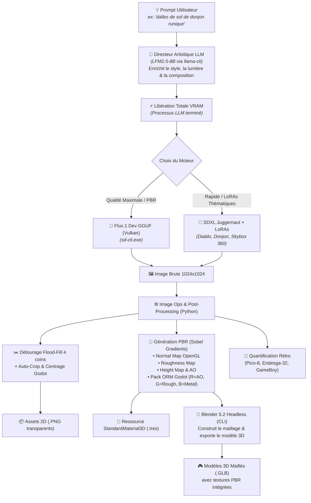
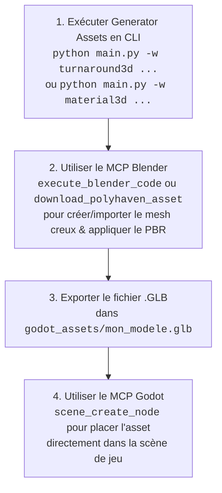

<div align="center">

# ⚔️ Generator Assets

### Moteur de Workflows IA (Headless & Modulaire) pour Assets 2D & 3D Godot Engine
**Flux.1 Dev & SDXL (Vulkan) • Matériaux PBR 3D • Modèles .GLB Blender • Skyboxes 360° • LoRAs • Upscalers ESRGAN**

[](https://www.python.org/)
[](https://godotengine.org/)
[](https://www.vulkan.org/)
[](https://blackforestlabs.ai/)
[](#-workflows-3d--pbr-godot--blender)
[](#-modèles-ia--bibliothèque-de-loras)
[](https://www.blender.org/)
[](LICENSE)

<p align="center">
  <a href="#-architecture-du-pipeline-du-prompt-au-3d-godot">Architecture</a> •
  <a href="#-modèles-ia--bibliothèque-de-loras">Modèles & LoRAs</a> •
  <a href="#-catalogue-complet-des-workflows">Catalogue des Workflows</a> •
  <a href="#-galerie-dassets-générés">Galerie Visuelle</a> •
  <a href="#-référence-complète-de-la-cli">Référence CLI</a> •
  <a href="#-guide-dintégration-godot-4">Intégration Godot 4</a> •
  <a href="#-guide-pour-les-agents-ia-de-codage-blender-mcp--godot-mcp">Guide Agents IA (MCP)</a> •
  <a href="#-installation--démarrage-rapide">Installation</a>
</p>

</div>

---

## 🏛️ Architecture du Pipeline (Du Prompt au 3D Godot)

`generator-assets` est un orchestrateur en ligne de commande (CLI) conçu pour transformer une simple idée textuelle en **véritables assets 2D et 3D prêts pour Godot 4** avec zéro interface web et une efficacité maximale sur GPU :



---

## ⚖️ Ce qui Fonctionne à 100% en Automatique vs Limitations Réelles de l'IA

Pour vous éviter toute déception, voici un état des lieux transparent de ce que le pipeline génère automatiquement en un clic, et des cas particuliers nécessitant une approche différente :

### ✅ 1. 100% Automatique & Immédiatement Prêt pour Godot 4
- **🧱 Sols, Murs & Matériaux PBR (`material3d`)** : Dalles de donjon, pavés médiévaux, roches, métaux, bois avec Normal Maps, Roughness et fichier `.tres` prêt à l'emploi.
- **🌌 Skyboxes & Panoramas 360° (`skybox`)** : Ciels d'orage, galaxies, nuages 360° et ressource `Environment.tres` pour le `WorldEnvironment` de Godot.
- **🎲 Éléments de Décors 3D (`mesh3d`)** : Dalles de sol (`--shape tile`), caisses et coffres (`--shape cube`), piliers de donjon (`--shape pillar`), orbes (`--shape sphere`).
- **🔍 Upscaling IA ESRGAN (`upscale`)** : Agrandissement 2x, 4x, 4K avec conservation parfaite de la transparence.
- **🎨 Assets 2D, Spritesheets & Pixel Art (`generate`, `spritesheet`, `pixelart`)**.

---

### ⚠️ 2. Ce qui NE fonctionne PAS directement en "1-clic magique" (Cas des Casques & Personnages)
- **Le Cas d'un Casque d'Équipement 3D (ex: `casque.png`)** :
  - **Pourquoi ?** Une image 2D vue de face ne contient ni l'intérieur de la tête, ni le dos, ni les côtés à 360°.
  - **Résultat de l'extraction automatique 3D** : Génère un **bas-relief 2.5D bombé par l'avant** (comme une médaille ou une sculpture murale). Ce n'est **pas** un casque creux dans lequel un personnage 3D peut glisser sa tête.
- **Comment créer un vrai casque creux ou un personnage 3D pour Godot ?** :
  1. **Option A (Fiche de référence)** : Utilisez le workflow `turnaround3d` qui génère la **planche orthogonale Face + Profil parfaitement alignée** pour servir de gabarit dans Blender.
  2. **Option B (Mesh de base + Texture PBR)** : Téléchargez un mesh de casque générique basse définition (sur Kenney.nl ou Godot Asset Library) et appliquez-lui les textures PBR générées par notre pipeline (`material3d`).

---

## 🤖 Modèles IA & Bibliothèque de LoRAs

Le système gère dynamiquement les architectures de modèles sans conflit mémoire :

### 1. Modèles de Base Supportés

| Modèle | Fichier | Rôle & Points Forts |
| :--- | :--- | :--- |
| **FLUX.1 [dev]** | `flux1-dev-Q6_K.gguf` | **Moteur 3D & Photoréalisme** : Compréhension textuelle chirurgicale via T5-XXL. Idéal pour les textures PBR, les détails fins et les rendus épiques. |
| **SDXL Juggernaut** | `juggernautXL_ragnarok.safetensors` | **Moteur de Styles & LoRAs** : Génération ultra-rapide (~3s/it sur RX 6950 XT). Compatible avec tous les LoRAs SDXL de CivitAI. |
| **LFM2.5 8B** | `LFM2.5-8B-A1B-Q6_K.gguf` | **Directeur Artistique** : Enrichit les prompts simples en descriptions professionnelles adaptées à la diffusion. |
| **ESRGAN** | `RealESRGAN_x4plus_anime_6B.pth` | **Super-Résolution IA** : Upscaling 2x, 4x, 4K avec préservation exacte de la transparence Alpha. |

---

### 2. Bibliothèque des LoRAs Installés (`C:\Modeles_LLM\loras\`)

Vous pouvez appliquer un ou plusieurs LoRAs sur n'importe quel workflow via le flag `-l "nom:poids"` :

| Nom du LoRA | Poids | Usage recommandé |
| :--- | :---: | :--- |
| **`game_icon_diablo_style`** | `870 Mo` | Icônes d'items, armes, potions et reliques dans un style Dark Fantasy / Diablo. |
| **`JJsDungeon_XL`** | `435 Mo` | Décors, dalles de sol, murs de pierre et environnements souterrains pour la 3D. |
| **`360RedmondResized`** | `433 Mo` | Panoramas sphériques 360° pour Skyboxes et éclairage d'environnement Godot. |
| **`space_backround-XL-7`** | `217 Mo` | Ciels spatiaux, nébuleuses cosmiques et étoiles pour la 3D. |
| **`game_icon_v1.0`** | `2.6 Go` | Icônes de jeu stylisées et objets d'inventaire aux contours nets. |

```bash
# Vérifier la liste des LoRAs et upscalers disponibles à tout moment :
python main.py --list-loras
python main.py --list-upscalers
```

---

## 🎨 Galerie d'Assets Générés

| Sol Runique PBR (Albedo) | Relief 3D (Normal Map OpenGL) | Pack ORM (AO + Roughness) | Dalle 3D GLB (`mesh3d`) |
| :---: | :---: | :---: | :---: |
|  |  |  |  |
| *Texture de couleur* | *Gradients de relief en temps réel* | *R=AO, G=Roughness, B=Metal* | *Raccord sans couture* |

| Potion Diablo (`SDXL LoRA`) | Casque ESRGAN 2048x2048 (`upscale`) | Casque Pixel Art (`pico8`) | Monture Endesga (`32 couleurs`) |
| :---: | :---: | :---: | :---: |
|  |  |  |  |
| *SDXL + LoRA Diablo* | *Super-résolution 4x nette* | *Palette 16 couleurs Pico-8* | *Palette 32 couleurs Endesga* |

---

## 📦 Catalogue Complet des Workflows

Le projet intègre **10 workflows spécialisés** sélectionnables via le paramètre `-w <nom>` :

```text
📋 Workflows Disponibles :
  • material3d   : Pack Matériau 3D PBR complet (Albedo, Normal, Roughness, Height, AO, ORM + .tres Godot)
  • mesh3d       : Modèle 3D Maillé .GLB complet avec textures PBR pour Godot (Blender Headless)
  • skybox       : Environnement Skybox 360° équirectangulaire et ressource Environment Godot 4
  • turnaround3d : Planche de modélisation 3D (Vues orthogonales Face + Profil calibrées pour Blender)
  • generate     : Asset 2D isolé (LLM -> Diffusion -> Détourage -> Centrage Godot)
  • upscale      : Super-résolution IA (ESRGAN Vulkan / Lanczos) avec préservation du canal Alpha
  • spritesheet  : Planche de sprites multi-angles (Face, Profils, Dos) avec export JSON Godot
  • variations   : Déclinaisons thématiques d'éléments (Feu, Glace, Poison, Foudre, etc.)
  • tileable     : Textures seamless / tuiles de terrain infinies pour TileMaps Godot
  • pixelart     : Conversion & quantification rétro (Pico-8, Endesga-32, GameBoy)
  • batch        : Génération par lots depuis un fichier JSON de recette
```

---

### 1. 🧱 Workflow `material3d` : Pack Matériau PBR 3D Complet
Génère toutes les cartes de textures nécessaires au rendu physique réaliste dans Godot 4 et produit le fichier ressource `.tres` prêt à l'emploi.

```bash
# Génération directe depuis un concept textuel (Flux.1) :
python main.py -w material3d "dalles de pierre gothique sombre avec runes violettes et mousse" -s 1024 -o sol_runique

# Génération depuis un prompt avec SDXL Juggernaut et LoRA Donjon :
python main.py -w material3d "sol de donjon médiéval pavé avec mousse" --sd-model "C:\Modeles_LLM\juggernautXL_ragnarok.safetensors" -l "JJsDungeon_XL:0.8" -o sol_donjon

# Générer le pack PBR à partir d'une image ou texture 2D existante :
python main.py -w material3d -i godot_assets/lit.png -o lit_pbr
```
*Sortie générée dans `godot_assets/` : `_albedo.png`, `_normal.png`, `_roughness.png`, `_height.png`, `_orm.png`, `_preview3x3.png`, `_material.tres`.*

---

### 2. 🎲 Workflow `mesh3d` : Modèle 3D Maillé `.GLB` via Blender
Prend une texture ou un concept et pilote **Blender 5.x en arrière-plan** pour générer un fichier standard **`.glb`** intégrant le maillage, les coordonnées UV, le matériau PBR et les normales.

Formes disponibles via `--shape` :
- **`tile`** : Dalle de sol ou pan de mur 3D.
- **`cube`** : Caisse, coffre, bloc de décor 3D.
- **`pillar`** : Colonne, pilier de donjon 3D.
- **`sphere`** : Orbe magique, planète 3D.
- **`card`** : Sprite 2D découpé avec épaisseur volumétrique pour props/items 3D.

```bash
# Créer une dalle 3D texturée à partir d'un albedo existant :
python main.py -w mesh3d -i godot_assets/sol_runique_albedo.png --shape tile -o sol_runique_3d_tile

# Générer un coffre 3D cubique complet depuis un prompt :
python main.py -w mesh3d "coffre ancien orné de fer forgé et runes d'or" --shape cube -o coffre_3d

# Générer un pilier de donjon :
python main.py -w mesh3d "colonne gothique sculptée avec gargouilles" --shape pillar -o colonne_3d
```

---

### 3. 🌌 Workflow `skybox` : Ciels 360° Équirectangulaires & Éclairage IBL
Génère une image panoramique sphérique (ratio 2:1) avec raccord horizontal infini et produit le fichier ressource `Environment.tres` pour le `WorldEnvironment` de Godot 3D.

```bash
# Skybox Dark Fantasy avec Flux.1 :
python main.py -w skybox "ciel nocturne dark fantasy avec nébuleuse violette et lunes d'obsidienne" -o ciel_dark

# Skybox Spatiale avec SDXL et LoRA 360 :
python main.py -w skybox "galaxie avec nébuleuse pourpre et étoiles scintillantes" --sd-model "C:\Modeles_LLM\juggernautXL_ragnarok.safetensors" -l "360RedmondResized:0.8" -o ciel_espace
```

---

### 4. 📐 Workflow `turnaround3d` : Fiches de Modélisation Blender
Génère les vues orthogonales **Face + Profil** d'un personnage ou d'un monstre, alignées sur les mêmes repères de hauteur pour servir de guide de modélisation dans le viewport de Blender.

```bash
python main.py -w turnaround3d "chevalier de l'ombre en armure complète avec cape déchirée" -s 512 -o chevalier_sheet
```

---

### 5. 🔍 Workflow `upscale` : Super-Résolution IA ESRGAN (Vulkan)
Agrandit vos images et textures 2D/3D (2x, 4x, 4K) en préservant fidèlement la netteté et le **canal de transparence Alpha**.

```bash
# Upscaling 4x d'un sprite avec modèle anime :
python main.py -w upscale -i godot_assets/casque.png --upscale-model anime --factor 4

# Upscaling d'une texture PBR :
python main.py -w upscale -i godot_assets/sol_runique_albedo.png --upscale-model ultrasharp --factor 2
```

---

### 6. 🎨 Workflow `generate` : Asset 2D Isolé & Détouré
Pipeline complet pour items d'inventaire, monstres et props : LLM Art Director ➔ Flux/SDXL ➔ Détourage flood-fill 4 coins ➔ Centrage carré et marges de respiration.

```bash
# Génération d'un item avec Flux.1 :
python main.py "épée légendaire de flammes spectrales" -t item -o epee_flammes

# Génération avec Juggernaut XL et LoRA Diablo :
python main.py "bouclier runique en acier sombre" --sd-model "C:\Modeles_LLM\juggernautXL_ragnarok.safetensors" -l "game_icon_diablo_style:0.8" -o bouclier_diablo
```

---

### 7. 📊 Workflow `spritesheet` : Planche de Sprites Multi-Angles
Génère les 4 vues directionnelles (Face, Profil Gauche, Profil Droit, Dos) et exporte un fichier de métadonnées JSON compatible avec les animations Godot `SpriteFrames`.

```bash
python main.py -w spritesheet "mage noir en robe à capuche violette" -s 256 -o mage_spritesheet
```

---

### 8. 🌈 Workflow `variations` : Déclinaisons Thématiques Élémentaires
Génère des variantes chromatiques et élémentaires cohérentes à partir d'une image ou d'un concept.

```bash
python main.py -w variations -i godot_assets/casque.png --themes "feu,glace,foudre,poison,ombre"
```

---

### 9. 🔲 Workflow `tileable` : Textures Raccordables Seamless (2D / TileMaps)
Génère des textures avec raccord torique infini et produit une image de prévisualisation en grille 3x3.

```bash
python main.py -w tileable "sol pavé médiéval avec herbe entre les pierres" -o sol_pave
```

---

### 10. 👾 Workflow `pixelart` : Quantification Rétro
Convertit n'importe quel rendu ou asset en pixel art authentique avec palettes rétro (Pico-8, Endesga-32, GameBoy).

```bash
python main.py -w pixelart "épée magique" --palette pico8 --grid-size 64
```

---

### 11. 📦 Workflow `batch` : Génération par Lots (Recettes JSON)
Permet de générer des collections complètes d'assets à partir d'un fichier JSON structuré.

```bash
python main.py -w batch --file recipes/dark_fantasy_armory.json
```

---

## 💻 Référence Complète de la CLI (`main.py`)

```text
Usage: python main.py [prompt] [options]

Paramètres Principaux :
  prompt                    Description ou concept de l'asset.
  -w, --workflow            Nom du workflow (défaut: 'generate').
  -i, --input               Chemin de l'image source pour material3d, mesh3d, upscale, pixelart, variations.
  -t, --type                Type d'asset 2D : item, character, prop, tile.
  --shape                   Forme 3D pour mesh3d : tile, cube, pillar, cylinder, sphere, card.
  -o, --output              Nom du fichier de sortie (sans extension).
  -d, --output-dir          Dossier de destination (défaut: 'godot_assets/').
  -s, --size                Résolution carrée finale en pixels (ex: 512, 1024, 2048).

LoRAs & Modèles Alternatifs :
  -l, --lora                Applique un LoRA 'nom:poids' (ex: -l 'game_icon_diablo_style:0.8'). Répétable.
  --lora-dir                Dossier des LoRAs (défaut: 'C:\Modeles_LLM\loras').
  --sd-model                Chemin vers un modèle alternatif (ex: 'C:\Modeles_LLM\juggernautXL_ragnarok.safetensors').
  --upscale-model           Modèle d'upscale ESRGAN ('anime', 'ultrasharp', 'RealESRGAN_x4plus.pth').

Options Avancées des Workflows :
  --factor                  Facteur d'agrandissement pour l'upscale (ex: 2.0, 4.0).
  --normal-strength         Intensité du relief pour la Normal Map (défaut: 3.5).
  --palette                 Palette pixel art : 'pico8', 'gameboy', 'endesga32'.
  --grid-size               Taille de grille pixel art (ex: 32, 64).
  --themes                  Liste de thèmes séparés par des virgules pour variations.
  --file, --recipe          Fichier JSON ou texte pour le workflow batch.
  --columns                 Nombre de colonnes pour la planche de sprites.
  --no-preview              Désactive la génération de la preview 3x3 tileable.

Paramètres de Rendu & IA :
  --no-llm                  Désactive l'enrichissement par LLM.
  --steps                   Nombre d'étapes de diffusion (défaut: 25).
  --guidance                Guidance pour Flux.1 (défaut: 3.5).
  --cfg-scale               CFG Scale (défaut: 1.0 pour Flux, 7.0 pour SDXL).
  --seed                    Graine aléatoire (-1 pour aléatoire).
  --tolerance               Tolérance de détourage flood-fill (défaut: 60).
  --style                   Charte stylistique par défaut injectée par le LLM.

Commandes Utilitaires :
  --interactive             Lance la console interactive avec menus numérotés.
  --check                   Vérifie la présence de tous les exécutables et modèles.
  --list-workflows          Affiche la liste complète des 10 workflows.
  --list-loras              Affiche la liste des LoRAs installés et leur taille.
  --list-upscalers          Affiche la liste des modèles ESRGAN installés.
```

---

## 🎮 Guide d'Intégration Godot 4

### 1. Application des Matériaux PBR (`.tres`)
1. Glissez-déposez le dossier `godot_assets/` dans `res://assets/` de votre projet Godot.
2. Créez un nœud **`MeshInstance3D`** (ex: un `PlaneMesh` pour le sol ou un `BoxMesh` pour un mur).
3. Dans l'inspecteur, glissez le fichier `.tres` généré (ex: `sol_runique_material.tres`) directement dans la propriété **Material** du Mesh.
4. L'albedo, le relief dynamique de la Normal Map et les reflets de rugosité sont immédiatement opérationnels.

---

### 2. Utilisation des Modèles 3D Maillés (`.glb`)
1. Glissez le fichier `.glb` généré (ex: `sol_runique_3d_tile.glb` ou `coffre_3d.glb`) directement dans votre **Arborescence de Scène 3D** ou dans le Viewport.
2. Le maillage, les UVs et les textures PBR sont **intégrés nativement dans le fichier binaire**.

---

### 3. Configuration de la Skybox 360°
1. Ajoutez un nœud **`WorldEnvironment`** dans votre scène 3D.
2. Dans la propriété **Environment**, glissez le fichier ressource généré (ex: `ciel_dark_env.tres`).
3. Votre scène bénéficie instantanément d'un ciel à 360° et d'un éclairage IBL (Image-Based Lighting) global.

---

## 🤖 Guide pour les Agents IA de Codage (Blender MCP & Godot MCP)

> **Message à l'attention de l'Agent IA qui assiste l'utilisateur :**  
> L'utilisateur ne souhaite pas modéliser manuellement dans Blender. Vous disposez des serveurs MCP (`blender` et `godot-mcp-toolkit`) pour automatiser l'intégralité du pipeline 3D.

### 📋 Pipeline Recommandé pour l'Agent IA :



### 🛠️ Actions Types de l'Agent IA :

1. **Pour les Équipements 3D Complexes (Casques, Armures, Créatures)** :
   - Lancez le workflow `turnaround3d` pour générer la fiche Face + Profil.
   - Utilisez l'outil MCP `execute_blender_code` pour exécuter un script Python `bpy` :
     - Création du maillage de base symétrique (`Mirror Modifier`).
     - Extrusion et mise en volume creuse guidée par les proportions de la fiche.
     - Branchement des textures PBR dans le shader `Principled BSDF`.
     - Exportation vers `godot_assets/<nom>.glb`.
2. **Pour les Objets & Décors Déjà Disponibles** :
   - Utilisez `search_polyhaven_assets` / `download_polyhaven_asset` ou `search_sketchfab_models` pour télécharger un maillage propre, puis appliquez-lui les textures générées par notre workflow `material3d`.
3. **Pour l'Intégration dans le Jeu Godot** :
   - Utilisez `scene_open` et `scene_create_node` du MCP Godot pour instancier le `.glb` ou appliquer le `.tres` sur un `MeshInstance3D` sans aucune intervention manuelle de l'utilisateur.

---

## ⚡ Installation & Démarrage Rapide

### 1. Cloner le Projet & Environnement Virtuel
```bash
git clone https://github.com/votre-compte/generator-assets.git
cd generator-assets

# Synchroniser l'environnement virtuel avec uv (ultra-rapide) :
uv sync
```

### 2. Vérifier les Prérequis Système
```bash
python main.py --check
```

### 3. Lancer la Console Interactive
```bash
python main.py --interactive
```

---

## 📄 Licence
Distribué sous licence **MIT**. Modèle FLUX.1 sous [FLUX.1 [dev] Non-Commercial License](https://huggingface.co/black-forest-labs/FLUX.1-dev/blob/main/LICENSE.md).
