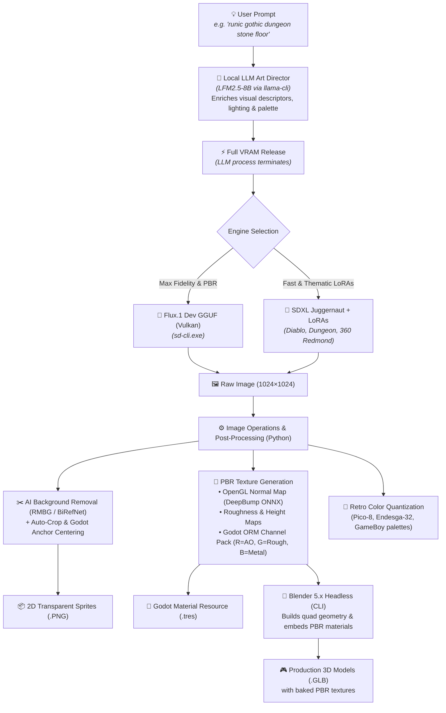
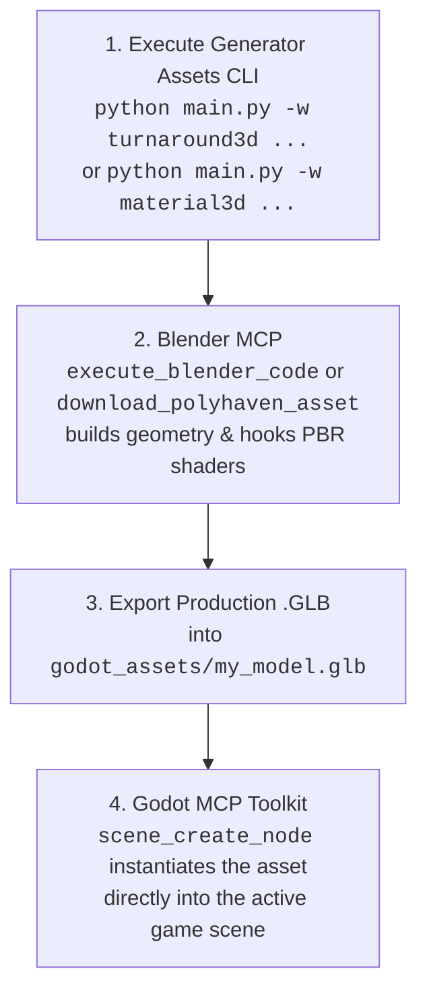

<div align="center">


# ⚔️ Generator Assets

### Modular, Headless AI Asset Pipeline for Godot Engine & Blender
**Flux.1 Dev & SDXL (Vulkan) • 3D PBR Materials • Headless Blender .GLB Meshes • 360° Skyboxes • MakeHuman / MPFB2 Characters • Procedural Audio & SFX • ESRGAN 4K**

[](https://www.python.org/)
[](https://godotengine.org/)
[](https://www.blender.org/)
[](https://www.vulkan.org/)
[](https://blackforestlabs.ai/)
[](#-3d-materials--geometry)
[](#-ai-models--lora-library)
[](LICENSE)
[](https://github.com/votre-compte/generator-assets/pulls)

<p align="center">
  <a href="#about">About</a> •
  <a href="#architecture">Architecture</a> •
  <a href="#capabilities">Capabilities</a> •
  <a href="#showcase">Showcase</a> •
  <a href="#models">Models & LoRAs</a> •
  <a href="#workflows">Workflows</a> •
  <a href="#cli">CLI Reference</a> •
  <a href="#godot">Godot 4 Guide</a> •
  <a href="#agents">AI Agents (MCP)</a> •
  <a href="#installation">Installation</a>
</p>

</div>

---

<span id="about"></span>
## 📌 About & Quick Overview

> **Repository Description (for GitHub "About"):**  
> *Headless, modular AI pipeline orchestrator generating production-ready 2D & 3D assets, PBR materials, .GLB models, and 360° skyboxes for Godot 4 & Blender via Flux.1, SDXL, and ESRGAN.*

### 🏷️ Recommended GitHub Topics / Keywords
```text
ai-game-assets, godot, godot-4, blender, blender-python, flux-dev, sdxl, pbr-textures,
game-development, deepbump, vulkan, esrgan, makehuman, mpfb2, procedural-generation,
headless-pipeline, 3d-mesh, audio-generation, pixel-art, controlnet, gguf, lora
```

`generator-assets` is a lightweight, local, and fully headless CLI pipeline orchestrator designed to transform natural language descriptions into **engine-ready 2D and 3D assets for Godot 4 and Blender**. 

Unlike heavy web-UI tools (Automatic1111, ComfyUI), this project operates with **zero Electron or web server overhead**, executes tasks sequentially with **strict VRAM management** (auto-unloading LLMs before launching diffusion models), and directly exports native engine formats: `.tres` materials, `.glb` models with embedded PBR textures, `.gdshader` files, 360° environment skies, and `.wav`/`.ogg` audio streams.

---

## ⚡ Core Value Highlights

| Feature | Description |
| :--- | :--- |
| 🎮 **Godot 4 Native First** | Generates `.tres` (`StandardMaterial3D`, `Environment`, `TileSet`, `StyleBoxTexture`), `.tscn` scenes, and `.gdshader` files out-of-the-box. |
| 🧱 **Complete PBR Map Generation** | Generates full PBR packs: Albedo, OpenGL Normal Maps (via DeepBump ONNX or Sobel), Roughness, Height, AO, and packed **ORM textures** (Red = AO, Green = Roughness, Blue = Metallic). |
| 🔨 **Headless Blender 3D Meshing** | Automatically builds 3D meshes (`.glb`) with embedded PBR textures via headless Blender CLI (`tile`, `cube`, `pillar`, `sphere`, `card`, `cutout`). |
| 👗 **MakeHuman / MPFB2 Character Suite** | Canonical humanoid 3D pipeline: seamless facial UV projections, barycentric garment retargeting (`.mhclo`), and studio Cycles validation renders. |
| 🌌 **Equirectangular 360° Skyboxes** | 2:1 panoramic skies with automated Godot 4 `WorldEnvironment` and Image-Based Lighting (IBL) configuration. |
| ⚡ **Zero VRAM Spikes** | Sequential sub-process execution: local LLM prompt enricher terminates and frees all VRAM before diffusion launches on Vulkan/GPU. |

---

<span id="architecture"></span>
## 🏛️ Pipeline Architecture



---

<span id="capabilities"></span>
## ⚖️ Capabilities & Realistic AI Boundaries

To ensure maximum productivity and avoid false expectations, here is a transparent overview of what the pipeline achieves 100% autonomously versus tasks requiring template meshes or multi-view sheets:

### ✅ 1. 100% Automated & Engine-Ready (One-Click)
- **🧱 Floors, Walls & PBR Materials (`material3d`)** : Seamless dungeon flagstones, cobblestone, mossy rock, bark, fabrics, metals with Normal, Roughness, ORM maps, and Godot `.tres`.
- **🌌 360° Skyboxes & Panoramas (`skybox`)** : Seamless equirectangular skies, space nebulae, apocalyptic clouds, and complete `WorldEnvironment.tres` setup.
- **🎲 3D Level Props (`mesh3d`)** : Floor tiles (`--shape tile`), crates/chests (`--shape cube`), pillars/columns (`--shape pillar`), orbs (`--shape sphere`), 2.5D standees (`--shape card`).
- **🔍 AI Super-Resolution (`upscale`)** : 2x, 4x, and 4K ESRGAN Vulkan upscaling with 100% Alpha channel transparency preservation.
- **✂️ Clean Cutouts & Sprites (`generate`, `rembg`)** : Clean edges with RMBG-1.4 / BiRefNet ONNX (no white halo artifacts).
- **🔊 Procedural Sound & Music (`sfx`, `audio_ambience`)** : Combat swings, magic potions, seamless background loops in `.wav` and `.ogg` formats.

---

### ⚠️ 2. What Requires Structured Approaches (Helmets, Armor & Characters)
- **The Case of a 3D Equipment Helmet (e.g. `casque.png`)** :
  - **Why ?** A single 2D front-facing image contains neither the interior hollow cavity, nor the rear geometry, nor 360° cheek guards.
  - **Direct 2.5D Extrusion Result** : Yields an embossed bas-relief or coin-like sculpture. It is **not** a hollow 3D helmet into which a character's head fits.
- **The Production-Grade Solutions Included in this Pipeline** :
  1. **Option A (Orthographic Modeling Sheet)** : Use the `turnaround3d` workflow to generate perfectly calibrated **Front + Profile orthographic views** as reference planes for Blender.
  2. **Option B (Base Mesh + PBR Retexturing)** : Download a clean base quad helmet from Kenney.nl or Godot Asset Library, then generate and project custom PBR materials using `material3d` or `outfit`.
  3. **Option C (MakeHuman / MPFB2 Canonical System)** : For human characters, use `character3d` and `makehuman_clothes` which leverage official quad helper geometries (`helper-tights`, `helper-skirt`) and barycentric binding (`.mhclo`).

---

<span id="showcase"></span>
## 🎨 Visual Showcase

### 1. PBR 3D Texture Pipeline (`material3d` & `mesh3d`)
| Runic Floor Albedo | OpenGL Normal Map | Godot ORM Channel Pack | Seamless 3x3 Tile Preview |
| :---: | :---: | :---: | :---: |
|  |  |  |  |
| *1024×1024 Base Color* | *DeepBump ONNX Relief* | *R=AO, G=Roughness, B=Metal* | *Zero-seam repeating tile* |

---

### 2. Thematic 2D Assets, Pixel Art & 4K AI Upscaling
| SDXL Diablo LoRA (`generate`) | 4K ESRGAN Super-Resolution (`upscale`) | Retro Pico-8 Pixel Art (`pixelart`) | Ancient Wood PBR (`material3d`) |
| :---: | :---: | :---: | :---: |
|  |  |  |  |
| *Dark fantasy item icon* | *Sharp 4096px with Alpha channel* | *16-color authentic palette* | *Weathered plank texture* |

---

### 3. Canonical 3D Character Suite (MakeHuman & MPFB2)
| Canonical Face Portrait | 3D Studio Cycles Render (`marc_novice`) | Runic Pillar 3D Mesh (`mesh3d`) | 360° Skybox Panorama (`skybox`) |
| :---: | :---: | :---: | :---: |
|  |  |  |  |
| *Seamless UV projection* | *Cycles 3-point studio check* | *Textured 3D .GLB mesh* | *Equirectangular 2:1 IBL sky* |

---

<span id="models"></span>
## 🤖 AI Models & LoRA Library

The architecture manages model execution dynamically without memory fragmentation:

### 1. Base Model Suite

| Model | Checkpoint File | Core Role & Strengths |
| :--- | :--- | :--- |
| **FLUX.1 [dev]** | `flux1-dev-Q6_K.gguf` | **Default Engine (3D & Photorealism)**: Unmatched prompt adherence via T5-XXL. Ideal for realistic PBR surfaces, intricate micro-details, and crisp 1024×1024 outputs. |
| **SDXL Juggernaut** | `juggernautXL_ragnarok.safetensors` | **Styles & LoRAs Engine**: Blazing fast generation (~3s/it). Automatically activated when applying style LoRAs. |
| **LFM2.5 8B** | `LFM2.5-8B-A1B-Q6_K.gguf` | **Local Art Director (LLM)**: Enriches concise prompts into professional visual diffusion descriptors. |
| **4x-UltraSharp** | `4x-UltraSharp.pth` | **Super-Resolution 4K (Default)**: 4x upscale (1024 ➔ 4096 px) preserving crisp edges and Godot Alpha transparency. |
| **RealESRGAN Anime** | `RealESRGAN_x4plus_anime_6B.pth` | **Stylized Super-Resolution**: Optimized for clean linework, cel-shading, and cartoon sprites. |

---

### 2. Pre-Installed LoRAs (`loras/` or `C:\Modeles_LLM\loras\`)

Apply any LoRA to any workflow via `-l "name:weight"`. When a LoRA is selected, the pipeline automatically switches to `SDXL Juggernaut`:

| LoRA Identifier | Size | Recommended Use Case |
| :--- | :---: | :--- |
| **`game_icon_diablo_style`** | `870 MB` | Item icons, weapons, flasks, and artifacts in a dark fantasy Diablo aesthetic. |
| **`JJsDungeon_XL`** | `435 MB` | Underground stone flagstones, dungeon walls, and mossy subterranean environments. |
| **`360RedmondResized`** | `433 MB` | Spherical 360° equirectangular panoramas for Godot environment lighting. |
| **`space_backround-XL-7`** | `217 MB` | Cosmic nebulas, deep space starfields, and planetary horizons. |
| **`game_icon_v1.0`** | `2.6 GB` | Stylized, high-contrast game inventory icons with sharp outlines. |

```bash
# Inspect available LoRAs and upscalers anytime:
python main.py --list-loras
python main.py --list-upscalers
```

---

<span id="workflows"></span>
## 📦 Complete Workflow Catalog

The engine features **26 modular workflows** selectable via `-w <workflow_name>`:

### 🧱 1. 3D & PBR Textures
- **`material3d`** : Full PBR 3D material pack (Albedo, DeepBump OpenGL Normal, Roughness, Height, AO, packed Godot ORM + ready-to-use `.tres` resource).
- **`mesh3d`** : Complete 3D mesh exported as `.GLB` via headless Blender with embedded PBR textures (`tile`, `cube`, `pillar`, `sphere`, `card`, `cutout`).
- **`voxel3d`** : Optimized 3D Voxel mesh (`.GLB`) with internal face culling and Vertex Colors for Godot 4 `GridMap`.
- **`skybox`** : 360° equirectangular panoramic environment with auto-configured Godot 4 `WorldEnvironment` `.tres`.
- **`turnaround3d`** : Calibrated orthographic Front + Side modeling sheet for Blender character sculpting.
- **`flowmap`** : Vector velocity flowmaps (Curl Noise) with dual-sample looping `.gdshader` and `.tres` material for moving water/lava.

---

### 👤 2. Humanoid 3D Characters & Wardrobe (MakeHuman / MPFB2)
- **`character3d`** : Canonical humanoid 3D pipeline: realistic skin generation, organic scars/blemishes, barycentric clothing attachment, `.blend` scene, and `.glb` export.
- **`makehuman_clothes`** : Complete wardrobe generation (Torso/Top, Pants/Bottom, Shoes/Boots) conforming to MakeHuman quad helper geometry with `.mhclo`, `.obj`, and `.mhmat` export.
- **`outfit`** : Retextures and maps custom fabric materials (burlap, weathered leather, chainmail) directly onto existing MakeHuman UV patterns without altering geometry.
- **`pose_control`** : OpenPose armature guidance (`idle`, `slash_attack`, `cast_spell`, `shield_block`, `jump`, `walk`) + Godot `.tscn` with `Marker2D` weapon attachment points.
- **`rpg_portrait`** : Character dialogue expression gallery (*Neutral, Happy, Angry, Sad, Hurt*) with Godot dialogue JSON manifest.

---

### 🎨 3. 2D Sprites, Tiles & UI
- **`generate`** : Standard isolated 2D asset (Diffusion -> RMBG cutout -> Godot anchor centering).
- **`upscale`** : ESRGAN Vulkan / Lanczos AI super-resolution with full Alpha preservation.
- **`spritesheet`** : Multi-angle character sprite sheet (Front, Sides, Back) with JSON coordinate atlas.
- **`autotile_pack`** : 47-tile Wang / Minimal 3x3 autotile atlas between two biomes with pre-configured `TileSet.tres`.
- **`tileable`** : Seamless repeating textures for infinite floors and walls.
- **`pixelart`** : Retro palette color reduction and downsampling (Pico-8, Endesga-32, GameBoy).
- **`variations`** : Generates elemental variations of an item (Fire, Ice, Poison, Lightning).
- **`ui_9slice`** : 9-Patch expandable inventory frames, dialogue boxes, and buttons with `.tres` and `.tscn` output.
- **`rembg`** : High-precision background removal using RMBG-1.4 / BiRefNet ONNX (no fringe halos).

---

### 🔊 4. Audio, Voice & VFX
- **`sfx`** : Procedural combat, item, and magic sound effects in `.wav` and `.ogg` formats.
- **`audio_ambience`** : Seamless procedural stereo ambient soundscapes (Dungeon, Forest, Storm, Space, Tavern) + `AudioBusLayout.tres`.
- **`tts_dialogue`** : Expressive character speech synthesis with emotional pitch modulation and Godot viseme lip-sync JSON.
- **`vfx_flipbook`** : 4x4 animated particle sheets (explosions, fireballs, portals) with `GPUParticles3D` scene.
- **`anim_loop`** : Seamless looping animated textures with `AnimatedTexture.tres` and `loop.gdshader`.
- **`rife_interp`** : RIFE v4 ONNX optical flow frame interpolation to boost sprite animation smoothness up to 60 FPS.

---

### 🛠️ 5. Style Consistency & Batching
- **`ip_adapter`** : Visual style locking from a reference image to generate consistent item sets + Godot `.tres` / `.gpl` palettes.
- **`batch`** : Batch generation from JSON recipes.

---

<span id="cli"></span>
## 💻 CLI Reference & Cheat Sheet

```text
Usage: python main.py [prompt] [options]

Primary Options:
  prompt                    Asset description or design concept.
  -w, --workflow            Target workflow name (default: 'generate').
  -i, --input               Input image path (for Img2Img, upscale, variations, pixelart).
  -t, --type                2D asset category: item, character, prop, tile.
  --shape                   3D shape for mesh3d: tile, cube, pillar, cylinder, sphere, card, cutout.
  -o, --output              Output file basename (without extension).
  -d, --output-dir          Destination directory (default: 'godot_assets/').
  -s, --size                Square output resolution in pixels.

AI Engines & Models:
  --sd-model                Diffusion model: 'flux', 'juggernaut', 'sdxl' or file path.
  --use-llm                 Enable local LLM prompt expansion (default: direct prompt passthrough).
  --no-llm                  Disable local LLM prompt expansion (default behavior).
  --seed                    Random seed (-1 for automatic random).
  --strength                Denoising strength for Img2Img / guided diffusion (default: 0.55).
  --segmenter               Background remover: 'auto', 'birefnet', 'rmbg', 'floodfill', 'none'.
  --pbr-engine              PBR estimator: 'auto', 'deep' (DeepBump ONNX), 'sobel'.
  -l, --lora                Apply LoRA in 'name:weight' format (e.g. -l 'game_icon_diablo_style:0.8').
  --upscale                 Automatically trigger 4K ESRGAN AI upscaling after generation.
  --upscale-model           ESRGAN model ('ultrasharp', 'anime', 'auto').

Workflow-Specific Flags:
  --pose                    OpenPose preset for pose_control (idle, slash_attack, cast_spell, shield_block, jump, walk).
  --pitch                   Voice pitch in Hz for tts_dialogue (default: 160.0).
  --fps                     Framerate for anim_loop (default: 12.0).
  --items                   Comma-separated list of items for ip_adapter (e.g. 'sword,shield,ring,helmet').
  --angle                   Flow angle in degrees for flowmap (default: 90 = downwards).
  --flow-type               Flow type for flowmap ('river', 'vortex', 'radial', 'optical').
  --turbulence              Turbulence strength for flowmap (default: 0.35).
  --margin                  Fixed 9-slice margin in pixels for ui_9slice.
  --auto-margin             Automatic margin detection for ui_9slice.
  --voxel-depth             Extrusion thickness in voxels for voxel3d.
  --voxel-scale             Voxel size in Godot units for voxel3d.
  --biome-a, --biome-b      Biome prompts/textures for autotile_pack.
  --factor                  Multiplication factor for upscaling or RIFE interpolation (2x, 4x).
  --vfx-type                Effect preset for vfx_flipbook or anim_loop ('explosion', 'fire', 'portal').
  --emotions                Comma-separated emotions for rpg_portrait and tts_dialogue.
  --duration                Duration in seconds for sfx and audio_ambience.
  --character               Target character name for outfit (default: 'marc_novice').
  --top, --shoes            Materials description for outfit workflow.

Utility Flags:
  --interactive             Launch the interactive console menu (workflows 1-26).
  --check                   Verify system requirements, paths, and model checkpoints.
  --list-workflows          Display all registered workflows.
  --list-loras              Display detected LoRAs.
  --list-upscalers          Display detected ESRGAN models.
```

---

### ⚡ Practical CLI Quick Examples

```bash
# 1. Generate 2D item icon with auto 4K AI upscaling (4096×4096 px)
uv run python main.py -w generate "royal gold shield with an engraved lion" --upscale

# 2. Generate dark fantasy potion using Diablo LoRA (auto-switches to SDXL)
uv run python main.py -w generate "dark mana potion" -l game_icon_diablo_style:0.9 --upscale

# 3. Create complete PBR stone floor tile (.tres + OpenGL Normal + ORM + Albedo)
uv run python main.py -w material3d "ancient gothic stone tile with purple runes" -s 1024 -o sol_runique

# 4. Generate 3D mesh model with embedded PBR textures via Blender
uv run python main.py -w mesh3d "ancient iron wrought treasure chest" --shape cube -o coffre_3d

# 5. Generate 360° equirectangular skybox with space LoRA
uv run python main.py -w skybox "purple cosmic nebula with dark obsidian moons" -l space_backround-XL-7:1.0

# 6. Re-texture MakeHuman character outfit with custom medieval materials
uv run python main.py -w outfit --character marc_novice --top "rustic medieval beige burlap tunic" --shoes "dark worn leather boots"

# 7. Upscale existing image directly with 4x-UltraSharp
uv run python main.py -w upscale -i godot_assets/casque.png --factor 4 --upscale-model ultrasharp
```

---

<span id="godot"></span>
## 🎮 Godot 4 Integration Guide

### 1. Applying PBR Materials (`.tres`)
1. Drag and drop the `godot_assets/` folder into your Godot project's `res://assets/`.
2. Add a **`MeshInstance3D`** node (e.g. `PlaneMesh` for ground or `BoxMesh` for walls).
3. In the Inspector, drag the generated `.tres` file (e.g. `sol_runique_material.tres`) directly into the **Material** property.
4. Albedo, dynamic OpenGL Normal relief, and ORM reflections are active immediately.

---

### 2. Using 3D Meshes (`.glb`)
1. Drag the `.glb` file (e.g. `coffre_3d.glb` or `sol_runique_3d_tile.glb`) into your **3D Scene Tree** or Viewport.
2. Geometry, UV coordinates, and embedded PBR textures load seamlessly with zero manual shader setup.

---

### 3. Setting Up 360° Skyboxes
1. Add a **`WorldEnvironment`** node to your 3D scene.
2. Drag the generated environment resource (e.g. `ciel_space_env.tres`) into the **Environment** slot.
3. Your scene instantly gains realistic 360° panoramic background visuals and Image-Based Lighting (IBL).

---

<span id="agents"></span>
## 🤖 AI Coding Agents Guide (MCP)

> **Note for AI Assistant Agents (Claude, Gemini, Antigravity):**  
> Users often do not wish to model manually in Blender or write repetitive engine setup code. You can leverage the `blender` and `godot-mcp-toolkit` MCP servers to automate the complete asset pipeline end-to-end.



### Typical Agent Actions:
1. **Humanoid Characters & Outfits** :
   - Consult the dedicated [**`GUIDE_AGENT_IA_HABILLAGE.md`**](GUIDE_AGENT_IA_HABILLAGE.md).
   - Use official **MakeHuman Community patterns (`.mhclo`)** that automatically adapt to any body morphology (**Male**, **Female**, **Child**).
   - Separate clothing into modular 3D objects (`Torso`, `Pants`, `Shoes`).
   - Retexture existing UV patterns via `scripts/retexture_uv_garment.py` to preserve 100% of geometric seams, pockets, and buttons.
2. **Complex Equipment (Helmets, Shields, Weapons)** :
   - Run `turnaround3d` to produce orthogonal orthographic reference cards.
   - Use `execute_blender_code` to extrude symmetrical quad geometry (`Mirror Modifier`) and hook up PBR maps in `Principled BSDF`.
3. **Engine Placement** :
   - Call `scene_open` and `scene_create_node` from the Godot MCP toolkit to instantiate the resulting `.glb` without requiring manual user intervention.

---

<span id="installation"></span>
## ⚡ Installation & Quickstart

### 1. Clone & Setup Virtual Environment
This project is optimized for [**uv**](https://docs.astral.sh/uv/) for near-instant package installation:

```bash
git clone https://github.com/votre-compte/generator-assets.git
cd generator-assets

# Synchronize dependencies with uv:
uv sync
```

*(Alternatively, standard pip: `python -m venv .venv && source .venv/bin/activate && pip install -r requirements.txt`)*

---

### 2. Verify System Requirements & Paths
Check that your local executables (`sd-cli.exe`, `llama-cli.exe`, Blender) and model checkpoints are detected:

```bash
python main.py --check
```

---

### 3. Launch the Interactive Console
```bash
python main.py --interactive
```

---

## 📂 Project Structure

```text
generator-assets/
├── core/                   # Pipeline core: config, CLI orchestrators, LLM enrichers
│   ├── clothes_catalog.py  # 177-model MakeHuman semantic clothes catalog
│   ├── config.py           # Model paths, VRAM management, hardware settings
│   └── pbr.py              # DeepBump ONNX and Sobel PBR map generators
├── workflows/              # 26 modular workflow implementations
│   ├── material3d.py       # PBR materials & Godot .tres export
│   ├── mesh3d.py           # Headless Blender 3D meshing
│   ├── character3d.py      # MakeHuman humanoid character pipeline
│   ├── outfit.py           # UV garment texture generator
│   └── ...                 # audio, skybox, turnaround, autotile, etc.
├── godot_assets/           # Default output directory for generated assets
├── data/                   # JSON registries & garment databases
├── scripts/                # Specialized helper utilities and build scripts
├── loras/                  # Local directory for SDXL / Flux LoRAs
├── upscalers/              # Local directory for ESRGAN .pth checkpoints
├── docs/                   # Documentation assets (banner, diagrams)
└── main.py                 # Unified CLI entrypoint & interactive shell
```

---

## 📄 License
This project is distributed under the **MIT License**.  
FLUX.1 [dev] model weights are governed by the [FLUX.1 [dev] Non-Commercial License](https://huggingface.co/black-forest-labs/FLUX.1-dev/blob/main/LICENSE.md).  
SDXL and ESRGAN models are subject to their respective open licenses.
