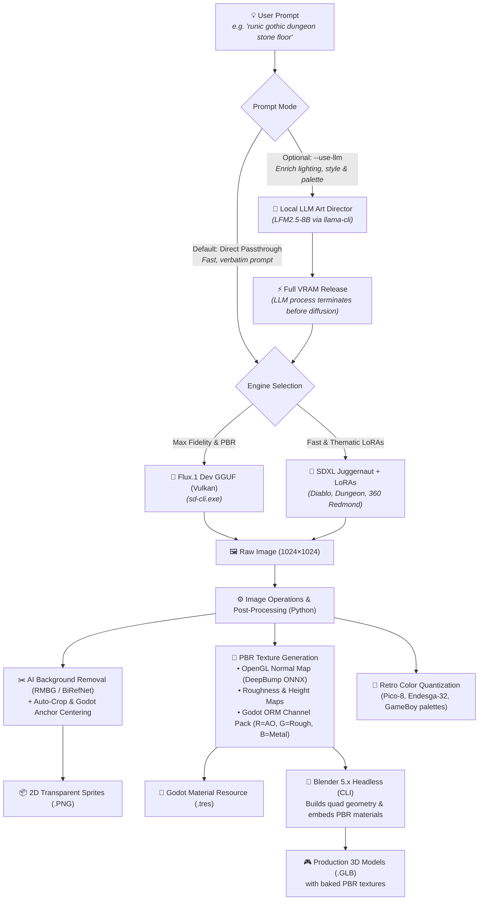
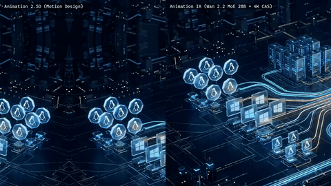
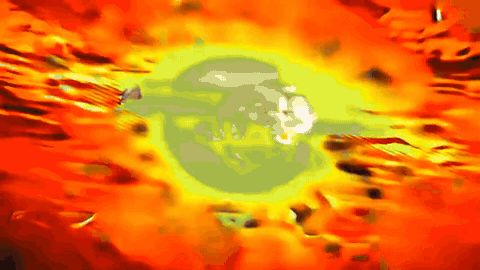
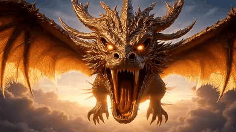
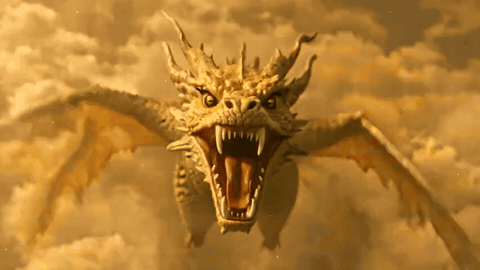
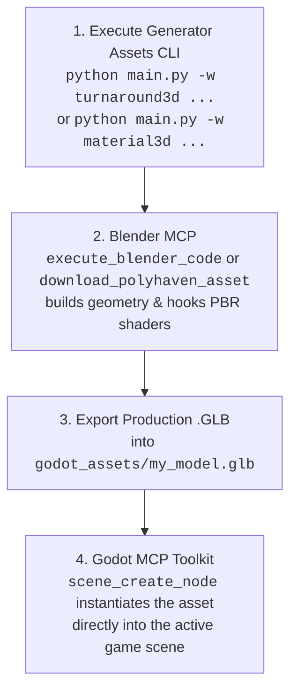
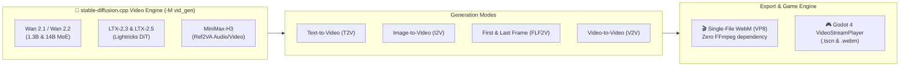

<div align="center">


# ⚔️ Generator Assets

### Modular, Headless Local AI Pipeline — Game Assets, Video Generation & Music (100% Vulkan/GGUF, No CUDA, No Cloud)
**Flux.1 Dev & SDXL (Vulkan) • AI Video Wan 2.1/2.2 • LTX-2.5 • MiniMax-H3 (4K YouTube Masters) • AI Music Loops MiniMax-Music3 (audio.cpp) • AI Image→3D TRELLIS.2 (trellis.cpp) • 3D PBR Materials • Headless Blender .GLB Meshes • 360° Skyboxes • MakeHuman / MPFB2 Characters • Procedural Audio & SFX • ESRGAN 4K**

[](https://www.python.org/)
[](https://godotengine.org/)
[](https://www.blender.org/)
[](https://www.vulkan.org/)
[](#-generation-video-native-webm)
[-1DB954.svg)](#43-music_bg--ai-music-loops-as-background-beds-minimax-music3-gguf-vulkan)
[](#-automatisation-de-la-mise-a-jour--compilation-vulkan-stable-diffusioncpp)
[](https://blackforestlabs.ai/)
[](#-3d-materials--geometry)
[](#-ai-models--lora-library)
[](LICENSE)
[](https://github.com/votre-compte/generator-assets/pulls)

<p align="center">
  <a href="#about">About</a> •
  <a href="#architecture">Architecture</a> •
  <a href="#capabilities">Capabilities</a> •
  <a href="#sd-cpp-update">stable-diffusion.cpp Vulkan Updater</a> •
  <a href="#video-generation">stable-diffusion.cpp Video Engine</a> •
  <a href="#workflows">Workflows</a> •
  <a href="#cli">CLI Reference</a> •
  <a href="#godot">Godot 4 Guide</a> •
  <a href="#agents">AI Agents (MCP)</a> •
  <a href="#installation">Installation</a>
</p>

</div>

---

<span id="about"></span>
## 📌 About & Quick Overview

> **Repository Description (for GitHub "About"):**  
> *Headless, modular local AI pipeline: 2D/3D Godot & Blender assets (Flux.1, SDXL, ESRGAN), AI video generation (Wan 2.1/2.2, LTX-2.5, MiniMax-H3) with 4K YouTube masters, and AI music loops (MiniMax-Music3 via audio.cpp) — 100% Vulkan/GGUF, no CUDA, no cloud.*

### 🏷️ Recommended GitHub Topics / Keywords
```text
ai-game-assets, godot, godot-4, blender, flux-dev, sdxl, pbr-textures, game-development,
vulkan, esrgan, makehuman, mpfb2, procedural-generation, headless-pipeline, pixel-art,
gguf, text-to-video, ai-music, music-generation, audio-generation
```

`generator-assets` is a lightweight, local, and fully headless CLI pipeline orchestrator designed to transform natural language descriptions into **engine-ready 2D and 3D assets for Godot 4 and Blender**. 

Unlike heavy web-UI tools (Automatic1111, ComfyUI), this project operates with **zero Electron or web server overhead**, executes tasks sequentially with **strict VRAM management** (auto-unloading LLMs before launching diffusion models), and directly exports native engine formats: `.tres` materials, `.glb` models with embedded PBR textures, `.gdshader` files, 360° environment skies, and `.wav`/`.ogg` audio streams.

---

## ⚡ Core Value Highlights

| Feature | Description |
| :--- | :--- |
| 🎮 **Godot 4 Native First** | Generates `.tres` (`StandardMaterial3D`, `Environment`, `TileSet`, `StyleBoxTexture`), `.tscn` scenes, and `.gdshader` files out-of-the-box. |
| 🧱 **Complete PBR Map Generation** | Generates full PBR packs: Albedo, OpenGL Normal Maps (via DeepBump ONNX or Sobel), Roughness, Height, AO, and packed **ORM textures** (Red = AO, Green = Roughness, Blue = Metallic). |
| 🔨 **Headless Blender 3D Meshing** | Automatically builds 3D meshes (`.glb`) with embedded PBR textures via headless Blender CLI (`tile`, `cube`, `pillar`, `sphere`, `card`, `cutout`). |
| 👗 **MakeHuman / MPFB2 Character Suite** | Canonical humanoid 3D pipeline: seamless facial UV projections, barycentric garment retargeting (`.mhclo`), and studio Cycles validation renders. |
| 🌌 **Equirectangular 360° Skyboxes** | 2:1 panoramic skies with automated Godot 4 `WorldEnvironment` and Image-Based Lighting (IBL) configuration. |
| 🎬 **Native AI Video (.webm)** | Direct hardware-accelerated video rendering (Wan 2.1, Wan 2.2, LTX-2.3/2.5) with WebM container export and Godot 4 `VideoStreamPlayer` scenes. |
| 🔄 **Automated sd.cpp Vulkan Compiler** | 1-click update tool: fetches official GitHub Vulkan binaries or compiles native master sources via CMake + MSVC with automatic rollback backups. |
| ⚡ **Direct by Default & Zero VRAM Spikes** | Direct, verbatim prompt execution by default for instantaneous generation. When optional LLM prompt enrichment is enabled (`--use-llm`), the LLM terminates and frees 100% of VRAM before diffusion launches. |

---

<span id="architecture"></span>
## 🏛️ Pipeline Architecture



> [!NOTE]
> **Direct Mode by Default & Optional LLM Art Director**:  
> By default, `generator-assets` uses direct prompt passthrough for instantaneous rendering with zero overhead. Passing the `--use-llm` flag invokes the **🧠 Local LLM Art Director** (`LFM2.5-8B` via `llama-cli`) to expand brief prompts into atmospheric diffusion descriptors. The LLM process fully terminates and frees 100% of its VRAM before the diffusion engine launches.

---

<span id="capabilities"></span>
## ⚖️ Capabilities & Realistic AI Boundaries

To ensure maximum productivity and avoid false expectations, here is a transparent overview of what the pipeline achieves 100% autonomously versus tasks requiring template meshes or multi-view sheets:

### ✅ 1. 100% Automated & Engine-Ready (One-Click)
- **🧱 Floors, Walls & PBR Materials (`material3d`)** : Seamless dungeon flagstones, cobblestone, mossy rock, bark, fabrics, metals with Normal, Roughness, ORM maps, and Godot `.tres`.
- **🌌 360° Skyboxes & Panoramas (`skybox`)** : Seamless equirectangular skies, space nebulae, apocalyptic clouds, and complete `WorldEnvironment.tres` setup.
- **🎲 3D Level Props (`mesh3d`)** : Floor tiles (`--shape tile`), crates/chests (`--shape cube`), pillars/columns (`--shape pillar`), orbs (`--shape sphere`), 2.5D standees (`--shape card`).
- **🔍 AI Super-Resolution (`upscale`)** : 2x, 4x, and 4K ESRGAN Vulkan upscaling with 100% Alpha channel transparency preservation.
- **✂️ Clean Cutouts & Sprites (`generate`, `rembg`)** : Clean edges with RMBG-1.4 / BiRefNet ONNX (no white halo artifacts).
- **🔊 Procedural Sound & Music (`sfx`, `audio_ambience`)** : Combat swings, magic potions, seamless background loops in `.wav` and `.ogg` formats.

---

### ⚠️ 2. What Requires Structured Approaches (Helmets, Armor & Characters)
- **The Case of a 3D Equipment Helmet (e.g. `casque.png`)** :
  - **Why ?** A single 2D front-facing image contains neither the interior hollow cavity, nor the rear geometry, nor 360° cheek guards.
  - **Direct 2.5D Extrusion Result** : Yields an embossed bas-relief or coin-like sculpture. It is **not** a hollow 3D helmet into which a character's head fits.
- **The Production-Grade Solutions Included in this Pipeline** :
  1. **Option A (Orthographic Modeling Sheet)** : Use the `turnaround3d` workflow to generate perfectly calibrated **Front + Profile orthographic views** as reference planes for Blender.
  2. **Option B (Base Mesh + PBR Retexturing)** : Download a clean base quad helmet from Kenney.nl or Godot Asset Library, then generate and project custom PBR materials using `material3d` or `outfit`.
  3. **Option C (MakeHuman / MPFB2 Canonical System)** : For human characters, use `character3d` and `makehuman_clothes` which leverage official quad helper geometries (`helper-tights`, `helper-skirt`) and barycentric binding (`.mhclo`).

---

<span id="showcase"></span>
## 🎨 Visual Showcase

### 1. PBR 3D Texture Pipeline (`material3d` & `mesh3d`)
| Runic Floor Albedo | OpenGL Normal Map | Godot ORM Channel Pack | Seamless 3x3 Tile Preview |
| :---: | :---: | :---: | :---: |
|  |  |  |  |
| *1024×1024 Base Color* | *DeepBump ONNX Relief* | *R=AO, G=Roughness, B=Metal* | *Zero-seam repeating tile* |

---

### 2. Thematic 2D Assets, Pixel Art & 4K AI Upscaling
| SDXL Diablo LoRA (`generate`) | 4K ESRGAN Super-Resolution (`upscale`) | Retro Pico-8 Pixel Art (`pixelart`) | Ancient Wood PBR (`material3d`) |
| :---: | :---: | :---: | :---: |
|  |  |  |  |
| *Dark fantasy item icon* | *Sharp 4096px with Alpha channel* | *16-color authentic palette* | *Weathered plank texture* |

---

### 3. Canonical 3D Character Suite (MakeHuman & MPFB2)
| Canonical Face Portrait | 3D Studio Cycles Render (`marc_novice`) | Runic Pillar 3D Mesh (`mesh3d`) | 360° Skybox Panorama (`skybox`) |
| :---: | :---: | :---: | :---: |
|  |  |  |  |
| *Seamless UV projection* | *Cycles 3-point studio check* | *Textured 3D .GLB mesh* | *Equirectangular 2:1 IBL sky* |

---

### 4. AI Music Loops Showcase (`music_bg`) — 🎧
| Waveforms (seamless loops, 48 kHz stereo) |
| :---: |
|  |

> ℹ️ GitHub has no embedded audio player: the files are **downloadable** (×3 preview MP3s / waveform MP4s with sound / raw WAVs in [`docs/exemples/musique/`](docs/exemples/musique/) and [`docs/exemples/videos/`](docs/exemples/videos/)).

| 🎵 Boucle tech n°1 — 95 BPM ⭐ | 🎵 Boucle tech n°2 — 78 BPM | 🎵 Boucle tech n°3 — 71 BPM |
| :---: | :---: | :---: |
| [MP3 ×3](docs/exemples/musique/boucle_tech_cand1_95bpm.mp3) • [MP4 waveform](docs/exemples/videos/musique_cand1_95bpm_waveform.mp4) | [MP3 ×3](docs/exemples/musique/boucle_tech_cand2_78bpm.mp3) • [MP4 waveform](docs/exemples/videos/musique_cand2_78bpm_waveform.mp4) | [MP3 ×3](docs/exemples/musique/boucle_tech_cand3_71bpm.mp3) • [MP4 waveform](docs/exemples/videos/musique_cand3_71bpm_waveform.mp4) |
| *Seam Δ0.1 dB — promoted as `tech_loop_minimal_bed.wav` (-30 LUFS voice-over bed)* | *Seam Δ0.3 dB — deeper, slower groove* | *Seam Δ11.7 dB — kept as raw material* |

*Generated 100% locally with MiniMax-Music3 GGUF on audio.cpp (Vulkan, AMD RX 6950 XT) — `lyrics=[Instrumental]`, no vocals. Each preview plays the seamless loop **three times in a row** at -16 LUFS (listening level); production beds ship at -30 LUFS behind voice-over with an ffmpeg `sidechaincompress` ducking recipe.*

---

### 5. AI Video Showcase (`video` pipeline) — 🎬
All clips generated 100% locally on AMD RX 6950 XT (Vulkan/GGUF, no CUDA). **GIF previews animate inline** (muted); the linked **MP4s carry full quality + sound** (download & play — GitHub has no inline player for committed videos).

| 🎬 Wan 2.2 MoE I2V — flagship scene | 🎬 2.5D Parallax vs Wan 2.2 AI — split-screen |
| :---: | :---: |
|  |  |
| *Wan 2.2 I2V A14B → Real-ESRGAN 4K + FidelityFX CAS • 4.9 s @ 30 fps — [MP4](docs/exemples/videos/video_wan22_i2v_scene01_1080p.mp4)* | *Static 2.5D parallax (left) vs true AI animation (right) • 5.5 s @ 30 fps — [MP4](docs/exemples/videos/video_comparatif_2.5d_vs_wan22.mp4)* |

| 🎬 Cinematic 2-Plan Film + Audio Mix | 🎬 LTX-2.5 with Native Stereo Audio | 🎬 ESRGAN 4K Super-Resolution |
| :---: | :---: | :---: |
|  |  |  |
| *Two chained shots + RIFE 60 fps + procedural cinematic score — [MP4](docs/exemples/videos/video_film_2plans_dragon_master.mp4)* | *LTX-2.5 Distilled (8 steps) with native synchronized stereo sound — [MP4](docs/exemples/videos/video_ltx25_dragon_audio.mp4)* | *Real-ESRGAN + 4x-UltraSharp Vulkan upscaling to 4K — [MP4](docs/exemples/videos/video_esrgan_4k_dragon.mp4)* |

---

<span id="models"></span>
## 🤖 AI Models & LoRA Library

The architecture manages model execution dynamically without memory fragmentation:

### 1. Base Model Suite

| Model | Checkpoint File | Core Role & Strengths |
| :--- | :--- | :--- |
| **FLUX.1 [dev]** | `flux1-dev-Q6_K.gguf` | **Default Engine (3D & Photorealism)**: Unmatched prompt adherence via T5-XXL. Ideal for realistic PBR surfaces, intricate micro-details, and crisp 1024×1024 outputs. |
| **SDXL Juggernaut** | `juggernautXL_ragnarok.safetensors` | **Styles & LoRAs Engine**: Blazing fast generation (~3s/it). Automatically activated when applying style LoRAs. |
| **LFM2.5 8B** | `LFM2.5-8B-A1B-Q6_K.gguf` | **Local Art Director (LLM)**: Enriches concise prompts into professional visual diffusion descriptors. |
| **4x-UltraSharp** | `4x-UltraSharp.pth` | **Super-Resolution 4K (Default)**: 4x upscale (1024 ➔ 4096 px) preserving crisp edges and Godot Alpha transparency. |
| **RealESRGAN Anime** | `RealESRGAN_x4plus_anime_6B.pth` | **Stylized Super-Resolution**: Optimized for clean linework, cel-shading, and cartoon sprites. |

---

### 2. Pre-Installed LoRAs (`loras/` or `C:\Modeles_LLM\loras\`)

Apply any LoRA to any workflow via `-l "name:weight"`. When a LoRA is selected, the pipeline automatically switches to `SDXL Juggernaut`:

| LoRA Identifier | Size | Recommended Use Case |
| :--- | :---: | :--- |
| **`game_icon_diablo_style`** | `870 MB` | Item icons, weapons, flasks, and artifacts in a dark fantasy Diablo aesthetic. |
| **`JJsDungeon_XL`** | `435 MB` | Underground stone flagstones, dungeon walls, and mossy subterranean environments. |
| **`360RedmondResized`** | `433 MB` | Spherical 360° equirectangular panoramas for Godot environment lighting. |
| **`space_backround-XL-7`** | `217 MB` | Cosmic nebulas, deep space starfields, and planetary horizons. |
| **`game_icon_v1.0`** | `2.6 GB` | Stylized, high-contrast game inventory icons with sharp outlines. |

```bash
# Inspect available LoRAs and upscalers anytime:
python main.py --list-loras
python main.py --list-upscalers
```

---

<span id="workflows"></span>
## 📦 Complete Workflow Catalog

The engine features **28+ modular workflows** organized into 5 functional categories. Each workflow operates as an autonomous pipeline that produces production-ready assets:

```text
📋 Quick Category Map:
  • 3D Geometry & PBR Textures     : material3d, mesh3d, mesh_ia, voxel3d, skybox, turnaround3d, flowmap
  • Humanoid 3D Characters & Outfits: character3d, makehuman_clothes, outfit, pose_control, rpg_portrait
  • 2D Sprites, Tiles & UI         : generate, spritesheet, autotile_pack, tileable, pixelart, variations, ui_9slice, rembg
  • Audio, Voice, VFX & Video      : sfx, audio_ambience, music_bg, voix_off, chanson, musique_adn, retrait_voix, tts_dialogue, vfx_flipbook, anim_loop, rife_interp, video
  • Style Consistency & Utilities  : ip_adapter, upscale, batch
```

---

### 🧱 1. 3D Geometry & PBR Textures

#### 1.1. `material3d` — Production PBR Texture Pack
* **Process**:
  1. Accepts either a textual concept (e.g., *"dungeon stone runes"*) or an existing 2D texture (`-i texture.png`).
  2. If prompt-based, generates a 1024×1024 diffuse albedo texture via Flux.1 Dev Vulkan.
  3. Feeds the albedo into DeepBump ONNX neural network to estimate physically accurate OpenGL normal, roughness, displacement height, and ambient occlusion maps (falls back to Sobel spatial gradients if `--pbr-engine sobel`).
  4. Packs AO (Red), Roughness (Green), and Metallic (Blue) into a unified Godot-standard ORM texture.
  5. Computes a 3×3 repeating grid to verify seamless tiling borders.
  6. Automatically writes a native Godot 4 `StandardMaterial3D` (`.tres`) linking all maps with correct UV channels.
* **Inputs**: `prompt` or `-i, --input`, `-s, --size` (512, 1024, 2048), `--pbr-engine` (`auto`, `deep`, `sobel`), `--normal-strength` (default: 3.5).
* **Engines**: Flux.1 Dev GGUF, DeepBump ONNX, PIL, NumPy.
* **Outputs**: `_albedo.png`, `_normal.png`, `_roughness.png`, `_height.png`, `_ao.png`, `_orm.png`, `_material.tres`, `_preview3x3.png`.
* **Example**:
  ```bash
  uv run python main.py -w material3d "ancient gothic stone tile with purple runes and moss" -s 1024 -o runic_stone
  ```

#### 1.2. `mesh3d` — Textured 3D Meshes (.GLB) via Headless Blender
* **Process**:
  1. Executes the `material3d` pipeline first to produce a complete PBR texture pack (Albedo, Normal, ORM, Height).
  2. Launches Blender 5.x in headless CLI mode (`--background --python-expr`) without opening any GUI window.
  3. Constructs parametric 3D quad geometry according to `--shape` (`tile` = beveled floor slab, `cube` = chest/crate with chamfered edges, `pillar` = octagonal dungeon column, `sphere` = magic orb, `card` = 2.5D standee, `cutout` = extruded silhouette).
  4. Automatically constructs a `Principled BSDF` material node graph with normal mapping and roughness reflections hooked up to the generated textures.
  5. Packs all textures directly into a binary `.glb` container optimized for Godot 4 `MeshInstance3D`.
* **Inputs**: `prompt` or `-i, --input`, `--shape` (`tile`, `cube`, `pillar`, `sphere`, `card`, `cutout`), `-s, --size`.
* **Engines**: Flux.1 Dev GGUF, DeepBump ONNX, Blender 5.x CLI (`bpy`).
* **Outputs**: `_3d_<shape>.glb` (self-contained with embedded textures), plus all underlying PBR map files.
* **Example**:
  ```bash
  uv run python main.py -w mesh3d "ornate ancient iron wrought chest" --shape cube -o chest_3d
  ```

#### 1.3. `voxel3d` — Discretized 3D Voxel Meshes (.GLB)
* **Process**:
  1. Accepts an input 2D sprite or generates a high-contrast item sprite with clean silhouette.
  2. Discretizes the 2D image into a 3D occupancy volume grid (NumPy array of shape `[grid_size, grid_size, voxel_depth]`).
  3. Computes voxel relief depth based on perceived luminance and silhouette boundaries.
  4. Executes aggressive internal face culling: scans adjacent voxel neighbors and strips all occluded interior quad faces, drastically reducing polycount.
  5. Launches Blender headless to build the optimized mesh, assigns sRGB Vertex Colors to vertices, and exports a lightweight `.glb` ready for Godot 4 `GridMap`.
* **Inputs**: `-i, --input` or `prompt`, `--grid-size` (e.g., 16, 32, 64), `--voxel-depth` (default: 4), `--voxel-scale` (default: 0.05).
* **Engines**: PIL, NumPy 3D Volume Array, Blender Headless CLI (`bpy`).
* **Outputs**: `_voxel.glb` with optimized vertex colors.
* **Example**:
  ```bash
  uv run python main.py -w voxel3d -i godot_assets/cheval.png --grid-size 32 --voxel-depth 4 -o horse_voxel
  ```

#### 1.4. `skybox` — 360° Equirectangular Panoramic Environments
* **Process**:
  1. Accepts a celestial or environment description (space nebula, stormy sky, fantasy dungeon vault).
  2. Injects equirectangular spherical horizon anchors into the prompt with seamless horizontal wrap conditioning.
  3. Renders a 2:1 widescreen spherical texture (e.g. 2048×1024 or 4096×2048) with Flux.1 Dev or SDXL + 360 LoRAs.
  4. Automatically formats and exports a Godot 4 `Environment.tres` resource configured with `PanoramaSkyMaterial`, `BackgroundSky` mode, tone mapping, and ambient Image-Based Lighting (IBL).
* **Inputs**: `prompt`, `-s, --size` / `--width` & `--height` (default: 2048×1024), `-l, --lora` (e.g., `360RedmondResized:1.0`).
* **Engines**: Flux.1 Dev / SDXL Vulkan, Godot Resource Serializer.
* **Outputs**: `_sky.png`, `_sky_env.tres`.
* **Example**:
  ```bash
  uv run python main.py -w skybox "purple cosmic galaxy nebula with glowing starlight" -o space_skybox
  ```

#### 1.5. `turnaround3d` — Calibrated Orthogonal Modeling Sheets
* **Process**:
  1. Formulates synchronized prompts for orthogonal Front (T-pose / A-pose) and Right-Side profile views.
  2. Enforces a fixed random seed and anatomical anchor constraints so character height, head proportions, and limb ratios match identically between perspectives.
  3. Removes background artifacts and crops each view to a calibrated bounding box.
  4. Assembles a unified side-by-side modeling card with horizontal alignment guideline overlays (crown, eyes, chin, shoulders, waist, knees, ground) for direct viewport loading in Blender.
* **Inputs**: `prompt`, `-s, --size` (default: 512 per view), `--seed`.
* **Engines**: Flux.1 Dev / SDXL, PIL canvas compositing.
* **Outputs**: `_front.png`, `_side.png`, `_model_sheet.png`.
* **Example**:
  ```bash
  uv run python main.py -w turnaround3d "dwarven warrior with heavy runic plate armor" -o dwarf_sheet
  ```

#### 1.6. `flowmap` — Vector Velocity Flowmaps & Water/Lava Shaders
* **Process**:
  1. Calculates a 2D directional vector field based on `--angle` (degrees) and adds procedural Curl Noise turbulence.
  2. Encodes directional velocity into RGB color space: Red = X vector, Green = Y vector, Blue = flow magnitude.
  3. Generates a seamless repeating flowmap texture.
  4. Writes a custom Godot 4 `.gdshader` script utilizing dual-sample phase-shifted time offsets to eliminate texture pulsing or visible resetting.
  5. Exports a pre-configured `ShaderMaterial` (`.tres`) ready to drop onto water planes, rivers, or lava channels in 2D or 3D.
* **Inputs**: `prompt`, `--angle` (degrees, default: 90 = downwards), `--flow-type` (`river`, `vortex`, `radial`, `optical`), `--turbulence` (0.0 to 1.0), `--mode-2d`.
* **Engines**: NumPy procedural vector field generator, Godot shader compiler.
* **Outputs**: `_flowmap.png`, `_water.gdshader`, `_material.tres`.
* **Example**:
  ```bash
  uv run python main.py -w flowmap "molten volcanic lava river" --angle 45 --turbulence 0.4 -o lava_flow
  ```

#### 1.7. `mesh_ia` — AI Volumetric 3D Objects from Image or Prompt (TRELLIS.2 GGUF, Vulkan)
* **Process**:
  1. **Source image — two linked paths** (chained on our own `generate` workflow):
     - **From a prompt** (no `-i`): `mesh_ia` **automatically chains the `generate` workflow** — Flux.1 Vulkan renders the prompt as a 1024² image, then RMBG/BiRefNet cleanly cuts out and centers the object. The resulting transparent PNG is the ideal TRELLIS input (a pre-matted image keeps its alpha, so no BiRefNet cutout is needed inside trellis).
     - **From an existing image** (`-i`): any sprite/icon produced by our 2D workflows (`generate`, `variations`, `spritesheet` cell, `upscale` output, `pixelart`…) or an external photo. If it still has a background, trellis's built-in BiRefNet handles it (`--bg-removal auto`, default; `--dump-bg` writes the cutout for inspection).
     - **Tips for a good source**: one single object, centered, plain or transparent background, object fully visible (not cropped), ~512-1024 px. To iterate on the 2D image alone first: `uv run python main.py -w generate "..." -t prop`, then pass `-i` once satisfied — same engine, same look.
  2. Runs **TRELLIS.2-4B** (4B flow-matching transformer, Microsoft, MIT) through `trellis.cpp` — a C++/GGML runtime with Vulkan backend, same philosophy as sd-cli/audio.cpp (zero PyTorch, no CUDA). Stages: DINOv3 conditioning → sparse-structure flow → shape SLAT flow → FlexiDualGrid mesh decode (hole filling) → texture SLAT flow + PBR decode → QEM decimation + xatlas UV atlas.
  3. **Optional game-ready decimation** (`--faces-cible N`, default: off — the full-quality master is kept): headless Blender Decimate (collapse, UV/SHARP-delimited, PBR textures preserved) exports an additional `<nom>_<res>_jeu.glb` at ~N faces for Godot runtime (measured: 144k → 30k faces, 5.3 → 1.5 MB). **How to pick N — it depends on camera distance and instance count, not visual quality** (textures are untouched): `30000` = close-up hero item (held weapon, equipped helmet) • `10000` = standard scene prop seen at 2-10 m • `2000-3000` = repeated clutter (×50 instances) • keep `≥8000` for highly curved silhouettes (horns, drapes). Ballpark: trellis masters (144k-293k faces) are sculpt-level sources; a whole desktop scene budget is ~1-3M triangles, so 5-30k per prop leaves headroom.
  4. Renders **4 orbital studio views** of the deliverable GLB via headless Blender (EEVEE) and assembles a **2×3 control sheet** (source, 4 views, PBR atlas).
  5. Unlike `mesh3d` (parametric extrusions), produces a **true closed volume inferred by AI** — helmets, statues, creatures, complex props — with PBR textures (basecolor/metallic/roughness) ready for Godot 4 `MeshInstance3D`.
* **Inputs**: `prompt` or `-i, --input`, `--res` (`512` = iteration ~11 min • `1024` = master ~55 min • `1536` = untested, default 512), `--faces-cible` (optional decimation target, e.g. 30000; default 0 = no reduction), `--seed`.
* **Engines**: trellis.cpp v0.6.0 (Vulkan) + TRELLIS.2-4B GGUF f16 (10 files, ~16.4 GB, `C:\Modeles_LLM\trellis2-gguf`), Blender 5.x headless (decimation + control renders).
* **Outputs** (`output/mesh_ia/<nom>/`): `<nom>_<res>.glb` (master, PBR atlas embedded), `<nom>_<res>_jeu.glb` (only with `--faces-cible`), `<nom>_<res>_base.png` (atlas preview), `<nom>_<res>_planche.png` (control sheet), `_vue0-3.png` (orbital renders), `.ply`, `<nom>_<res>_infos.json` (durations, face counts, paths, seed).
* **Measured generation durations (AMD RX 6950 XT, Vulkan, f16 GGUF)** :

  | Stage | res 512 | res 1024 |
  | :--- | :--- | :--- |
  | TRELLIS.2 generation | **8 min 53 s – 10 min 44 s** (potion / helmet) | **55 min 10 s** (helmet, LR→HR cascade) |
  | Optional decimation `--faces-cible` | ~40 s | ~1-2 min |
  | Blender control renders + sheet | ~1 min | ~1-2 min |
  | **Total** | **~10-12 min** | **~57-60 min** |

  Practical rule: iterate at `--res 512`, master at `--res 1024`. RDNA2 has no Vulkan "matrix cores" (~4-6× slower than the project's Strix Halo benchmarks). Every run logs a per-stage duration recap and writes `<nom>_<res>_infos.json`.
* **Example**:
  ```bash
  # From a plain prompt — generate + mesh_ia chained automatically (image → 3D) :
  uv run python main.py -w mesh_ia "obsidian-carved dragon skull, dark fantasy game prop" --res 1024 --faces-cible 30000
  # Two-step variant — iterate on the 2D image first (same engine), then convert :
  uv run python main.py -w generate "ancient bronze war horn" -t prop -o corne_guerre
  uv run python main.py -w mesh_ia -i godot_assets/corne_guerre.png --res 512
  # From an existing image (fast iteration) :
  uv run python main.py -w mesh_ia -i godot_assets/casque.png --res 512 -o casque
  ```
* **Status (2026-09-06)**: ✅ **Validated by user** on the repo's helmet (the README's "impossible via 2.5D extrusion" case study): res 512 = 10 min 44 s (144k faces, atlas 1024²), res 1024 = 55 min 10 s (293k faces, atlas 2048²) on RX 6950 XT. Licence 100 % MIT/Apache. Docs: `C:\trellis\README.md`, MEMORY_BANK §1.14.

---

### 👤 2. Humanoid 3D Characters & Wardrobe (MakeHuman / MPFB2)

#### 2.1. `character3d` — Canonical Humanoid Pipeline
* **Process**:
  1. Generates photorealistic skin albedo and projects facial details (scars, dark circles, eye color) onto the MakeHuman hm08 standard UV layout without 2D cutting seams.
  2. Resolves barycentric vertex bindings for official quad garments (`.mhclo`), matching the target character's age, gender, and muscle sliders.
  3. Instantiates an MPFB2 avatar in headless Blender, attaches hair, eyes, and eyebrows, and configures Principled BSDF materials with Subsurface Scattering (SSS).
  4. Exports the editable `.blend` project, a game-ready `.glb` file, and produces a 3-point studio Cycles validation render.
* **Inputs**: `--portrait` (reference image), `--recipe-script` (MPFB python recipe), `--name` (character identifier).
* **Engines**: MakeHuman / MPFB2 headless, Blender Cycles, NumPy UV alignment.
* **Outputs**: `_face_diffuse.png`, `.blend`, `.glb`, `_beauty_render.png`.
* **Example**:
  ```bash
  uv run python scripts/character_pipeline.py --portrait "godot_assets/exact_face_portrait.png" --recipe-script "poc_3d/create_marc_mpfb2.py" --name marc_novice
  ```

#### 2.2. `makehuman_clothes` — Modular Quad Wardrobe Generator
* **Process**:
  1. Takes a thematic clothing concept (e.g. *"medieval leather rogue armor"*).
  2. Generates pure seamless raw material PBR textures (leather, linen, iron rings) with 4K ESRGAN Vulkan upscaling.
  3. Leverages official MakeHuman helper quad geometries (`helper-tights`, `helper-skirt`) to maintain natural draping, open sleeves, and high boots.
  4. Automatically compiles `.mhclo` (barycentric coordinates), `.obj` (3D geometry), `.mhmat` (material descriptor), and `.thumb` (preview icon) files directly into `%APPDATA%/.../mpfb/data/clothes/`.
  5. Creates a test `.blend` scene with an avatar dressed in the new wardrobe with Cycles lighting.
* **Inputs**: `prompt` (clothing theme), `--parts` (`torso,pants,shoes`), `--mpfb-dir` (custom target path).
* **Engines**: Flux.1 Dev, ESRGAN 4K, MakeHuman barycentric binding compiler, Blender 5.x.
* **Outputs**: `.mhclo`, `.obj`, `.mhmat`, `.thumb` files per clothing item, plus test `.blend`.
* **Example**:
  ```bash
  uv run python main.py -w makehuman_clothes "dark worn leather ranger armor" --parts "torso,pants,shoes" -o dark_ranger
  ```

#### 2.3. `outfit` — Automated UV Garment Retexturing
* **Process**:
  1. Inspects existing clothing meshes attached to a character in a Blender scene.
  2. Reads the original MakeHuman sewing pattern UV layouts (preserving 100% of seams, pockets, folds, and button placements).
  3. Generates seamless fabric/leather textures (Albedo, Normal, Roughness) via diffusion.
  4. Calls headless Blender to create independent material slots, applies the textures to the garment quad meshes, and updates the `.blend` file.
  5. Re-exports the production `.glb` model and renders an updated 3-point lighting beauty check.
* **Inputs**: `--character` (e.g. `marc_novice`), `--top` (description of top fabric), `--shoes` (description of footwear material).
* **Engines**: Flux.1 Dev Vulkan, Blender Headless CLI (`bpy`), PBR texture synthesis.
* **Outputs**: `godot_assets/textures/<character>/*`, updated `<character>.blend`, updated `<character>.glb`, `<character>_beauty_render.png`.
* **Example**:
  ```bash
  uv run python main.py -w outfit --character marc_novice --top "rough medieval beige burlap tunic" --shoes "dark worn leather boots"
  ```

#### 2.4. `pose_control` — OpenPose Skeleton Guidance & Rigged Godot Scenes
* **Process**:
  1. Queries the 18-point COCO OpenPose coordinate library for the chosen action pose (`idle`, `slash_attack`, `cast_spell`, `shield_block`, `jump`, `walk`).
  2. Renders the OpenPose colored bone skeleton stick-figure card.
  3. Uses the skeleton to guide character diffusion, locking the limbs and torso into the exact target posture.
  4. Removes the background cleanly via RMBG / BiRefNet.
  5. Computes dynamic 2D weapon and effect attachment points (hands, head, feet) from the pose keypoints.
  6. Automatically compiles a Godot 4 `.tscn` scene with a `Sprite2D` and hierarchical `Marker2D` nodes ready for attaching weapons or VFX.
* **Inputs**: `prompt`, `--pose` (`idle`, `slash_attack`, `cast_spell`, `shield_block`, `jump`, `walk`), `-s, --size`.
* **Engines**: OpenPose COCO 18-point mapper, Flux.1 / SDXL, Godot Scene Builder.
* **Outputs**: `_openpose_skeleton.png`, `_character.png`, `_character.tscn`, `_rig.json`.
* **Example**:
  ```bash
  uv run python main.py -w pose_control "shadow knight with a glowing sword" --pose slash_attack -o knight_slash
  ```

#### 2.5. `rpg_portrait` — Multi-Emotion Dialogue Character Sets
* **Process**:
  1. Takes a base character description or portrait image.
  2. Iterates across specified emotional states (*Neutral, Happy, Angry, Sad, Hurt, Surprised*), injecting calibrated emotional micro-descriptors while locking identity seeds.
  3. Removes background halos to isolate the character portraits.
  4. Combines the resulting portraits into a single reference contact sheet (`_portrait_grid.png`).
  5. Writes a Godot dialogue JSON manifest containing paths, emotional tags, and metadata ready for Dialogic or custom dialogue managers.
* **Inputs**: `prompt` or `-i, --input`, `--emotions` (default: `neutral,happy,angry,sad,hurt`), `-s, --size`.
* **Engines**: Flux.1 / SDXL Vulkan, BiRefNet / RMBG ONNX, JSON Manifest Generator.
* **Outputs**: individual emotion `.png` files, `_portrait_grid.png`, `_dialogue_manifest.json`.
* **Example**:
  ```bash
  uv run python main.py -w rpg_portrait "dark sorceress with golden eyes" --emotions "neutral,happy,angry,sad,hurt" -o sorceress
  ```

#### 2.6. 👗 MakeHuman 3D Wardrobe Suite & Bilingual Semantic AI Router
* **Bilingual Semantic Router (177 3D Models)** (`core/clothes_catalog.py`):
  - Automatically indexes **177 MakeHuman 3D community assets** into [`data/clothes_catalog.json`](data/clothes_catalog.json) (monk robes, capes, plate armor, overalls, boots, beards, hairstyles).
  - The `aiguiller_modele_vetement(prompt, category, gender)` function semantically pairs natural language prompts in **English or French** (e.g. *"rustic medieval peasant tunic"*, *"monk robe"*, *"viking beard"*, *"heavy leather boots"*) with the ideal 3D base model.
  ```bash
  uv run python core/clothes_catalog.py
  ```
* **AI Retexturing on Canonical UV Sewing Patterns** (`scripts/retexture_uv_garment.py`):
  - Retextures official MakeHuman UV patterns directly (e.g. `male_worksuit01_diffuse.png`, `shoes01_diffuse.png`) to preserve 100% of underlying geometry, pocket seams, and button coordinates while converting blue denim to weathered burlap or aged leather with normal maps.
  ```bash
  uv run python scripts/retexture_uv_garment.py
  ```
* **External 3D Mesh to MakeClothes Compiler** (`scripts/makeclothes_from_mesh.py`):
  - Converts arbitrary quad meshes (`.obj`, `.glb`, `.fbx`) generated from 3D AI tools or sculpted in Blender into official MakeHuman `.mhclo` garments with automatic barycentric vertex binding.
  ```bash
  uv run python scripts/makeclothes_from_mesh.py --mesh "assets/models/cape.obj" --name "traveler_cape" --category "clothes"
  ```
* **Community Asset Pack Installer** (`scripts/install_asset_packs.py`):
  - Extracts and deploys MakeHuman Community zip archives directly into the active MPFB directory and updates the catalog.
  ```bash
  uv run python scripts/install_asset_packs.py
  ```

#### 2.7. 🗺️ MakeHuman Skin Synthesis & Anatomical Calibration
* **Complete MPFB Skin Pack Pipeline**:
  - Generates 2048×2048 diffuse skin maps (`diffuse.png`), PBR normal maps (`normal.png`), MakeHuman material definitions (`.mhmat`) with calibrated Subsurface Scattering (SSS) parameters, and UI thumbnail previews (`.thumb`).
* **Dedicated Scripts**:
  - `scripts/build_clean_marc_skin.py`: Generates seamless, homogeneous skin textures with dedicated colorimetry (e.g., cold winter complexion for Marc).
  - `scripts/align_marc_portrait_to_uv.py`: Projects 2D anatomical facial features (eyes, eyebrows, scars, lips) accurately onto standard MakeHuman hm08 UV layouts without seam tearing.
* **Deployment**:
  - Installs skin assets automatically into `%APPDATA%/Blender Foundation/Blender/5.2/mpfb/data/skins/<skin_name>/` and syncs them with Godot asset targets.

---

### 🎨 3. 2D Sprites, Tiles & UI

#### 3.1. `generate` — Standard Isolated 2D Game Asset
* **Process**:
  1. Accepts an item, character, prop, or tile concept.
  2. Optional prompt expansion via local LLM (`--use-llm`) or direct passthrough (default).
  3. Renders the asset on solid contrast background via Flux.1 Dev or SDXL with optional LoRAs (`-l`).
  4. Automatically removes background via flood-fill or AI neural segmentation (`--segmenter birefnet`).
  5. Crops tight bounding box and centers the asset with Godot bottom-center (characters) or exact-center (items) anchor offsets.
  6. Optionally triggers 4K AI ESRGAN upscaling (`--upscale`).
* **Inputs**: `prompt`, `-t, --type` (`item`, `character`, `prop`, `tile`), `-i, --input` (Img2Img), `--upscale`, `-l, --lora`.
* **Engines**: Flux.1 / SDXL, RMBG-1.4 / BiRefNet ONNX, Real-ESRGAN Vulkan.
* **Outputs**: Clean isolated transparent `.png`.
* **Example**:
  ```bash
  uv run python main.py -w generate "legendary royal gold shield with an engraved lion" --upscale
  ```

#### 3.2. `spritesheet` — Multi-Angle Character Sprite Sheet
* **Process**:
  1. Formulates 4 sequential perspective prompts (Front, Right-Side, Back, Left-Side) with consistent character identity anchors.
  2. Generates all 4 angles on isolated backgrounds.
  3. Performs background removal and automatic dimensional alignment across all frames.
  4. Stitches the frames into a clean horizontal or grid spritesheet atlas.
  5. Generates a Godot JSON frame atlas specifying UV rectangles for `SpriteFrames` / `AnimatedSprite2D`.
* **Inputs**: `prompt`, `-s, --size` (cell size, default: 256), `--columns` (default: 4), `--tolerance`.
* **Engines**: Flux.1 / SDXL, PIL grid compositor, JSON atlas generator.
* **Outputs**: `_spritesheet.png`, individual angle `.png` files, `_atlas.json`.
* **Example**:
  ```bash
  uv run python main.py -w spritesheet "undead skeleton warrior with rusted blade" --columns 4 -o skeleton_walk
  ```

#### 3.3. `autotile_pack` — 47-Tile Minimal 3x3 Wang Autotile Atlas
* **Process**:
  1. Generates or loads textures for Biome A (foreground, e.g. green grass) and Biome B (background, e.g. dark dirt).
  2. Programmatically constructs the 47 canonical tiles required by Wang / Minimal 3x3 autotiling: inner corners, outer corners, single edges, islands, and center fills.
  3. Compiles all 47 tiles into an organized 8-column atlas texture.
  4. Automatically constructs a Godot 4 `TileSet.tres` resource with terrain sets, terrain layers, and 3x3 minimal peering bits pre-configured for instant painted tiles.
* **Inputs**: `--biome-a` (prompt or image), `--biome-b` (prompt or image), `-s, --size` (tile resolution, e.g., 64, 128), `--columns` (default: 8).
* **Engines**: Flux.1 Dev, NumPy / PIL bitmask synthesis, Godot TileSet compiler.
* **Outputs**: `_atlas.png`, `_tileset.tres`.
* **Example**:
  ```bash
  uv run python main.py -w autotile_pack --biome-a "lush green grass" --biome-b "dark cracked dirt" --size 64 -o grass_to_dirt
  ```

#### 3.4. `tileable` — Infinite Seamless Repeating Textures
* **Process**:
  1. Takes a terrain or material prompt.
  2. Injects circular padding boundary conditions into the diffusion process so opposite edges (left/right, top/bottom) seamlessly match.
  3. Renders the square tile texture.
  4. Renders a 3×3 tiled verification preview to confirm absence of visible seams or repeating artifacts.
* **Inputs**: `prompt`, `-s, --size` (default: 512), `--no-preview` (optional).
* **Engines**: Flux.1 / SDXL with circular padding kernel, PIL 3x3 tiling verifier.
* **Outputs**: `_tile.png`, `_preview3x3.png`.
* **Example**:
  ```bash
  uv run python main.py -w tileable "mossy dark dungeon cobblestone pattern" -s 512 -o mossy_cobblestone
  ```

#### 3.5. `pixelart` — Retro Palette Color Quantization & Downsampling
* **Process**:
  1. Takes an existing image or generates a new sprite with clean outlines.
  2. Downsamples the image to a low-resolution pixel grid (`--grid-size`, e.g. 32×32, 64×64).
  3. Quantizes each pixel color to the nearest match in a chosen historical hardware palette (Pico-8 16-color, Endesga-32, GameBoy 4-color) using Euclidean distance in Lab color space.
  4. Upscales the resulting pixel art using Nearest-Neighbor interpolation to ensure razor-sharp pixels on modern displays.
* **Inputs**: `-i, --input` or `prompt`, `--palette` (`pico8`, `endesga32`, `gameboy`), `--grid-size` (default: 64), `-s, --size` (export display size).
* **Engines**: PIL ImageOps, NumPy color quantization.
* **Outputs**: `_pixelart_<palette>.png`.
* **Example**:
  ```bash
  uv run python main.py -w pixelart -i godot_assets/casque.png --palette pico8 --grid-size 64 -o helmet_retro
  ```

#### 3.6. `variations` — Thematic Elemental Asset Variations
* **Process**:
  1. Takes a base item/concept (e.g. *"magic sword"*).
  2. Iterates across specified themes (e.g. Fire, Ice, Poison, Lightning, Void).
  3. Performs guided diffusion with theme-specific descriptors and color harmonies.
  4. Removes backgrounds and centers each variant.
* **Inputs**: `prompt` or `-i, --input`, `--themes` (comma-separated list, e.g. `fire,ice,poison,lightning`), `-s, --size`.
* **Engines**: Flux.1 / SDXL Img2Img, RMBG segmentation.
* **Outputs**: Individual variant `.png` files named `<base>_<theme>.png`.
* **Example**:
  ```bash
  uv run python main.py -w variations -i godot_assets/potion_diablo.png --themes "fire,frost,poison,shadow" -o potion_elemental
  ```

#### 3.7. `ui_9slice` — Expandable 9-Patch Frames & Buttons
* **Process**:
  1. Generates an ornamental UI dialog frame, inventory slot, or button border (or loads `-i`).
  2. Performs automatic border detection (`--auto-margin`) or uses a specified pixel margin (`--margin`) to split the frame into 9 slices.
  3. Generates a Godot 4 `StyleBoxTexture` (`.tres`) with top, bottom, left, right margins configured with repeat/stretch axes.
  4. Generates an example Godot 4 `NinePatchRect` scene (`.tscn`).
  5. Exports a stretched test preview demonstrating distortion-free scaling.
* **Inputs**: `prompt` or `-i, --input`, `--margin` (default: 32), `--auto-margin`.
* **Engines**: PIL 9-slice analyzer, Godot Resource Serializer.
* **Outputs**: `.png`, `_stylebox.tres`, `_ninepatch.tscn`, `_preview_stretched.png`.
* **Example**:
  ```bash
  uv run python main.py -w ui_9slice "ornate fantasy golden dialog box with ruby corners" --margin 32 -o gold_dialog
  ```

#### 3.8. `rembg` — High-Precision Neural Background Removal
* **Process**:
  1. Loads an existing 2D asset image with complex edges (hair, fur, semi-transparent glass, weapons).
  2. Runs ONNX neural segmentation (RMBG-1.4 or BiRefNet).
  3. Computes a continuous alpha matte, completely removing solid or noisy backgrounds without white fringes.
  4. Automatically centers the sprite and tightens transparent margins.
* **Inputs**: `-i, --input` (required), `--segmenter` (`birefnet`, `rmbg`), `-s, --size` (optional resize).
* **Engines**: BiRefNet ONNX / RMBG-1.4 ONNX, NumPy, PIL.
* **Outputs**: `_rembg.png`.
* **Example**:
  ```bash
  uv run python main.py -w rembg -i godot_assets/cheval.png -o horse_transparent
  ```

---

### 🔊 4. Audio, Voice & VFX

#### 4.1. `sfx` — Procedural Sound Effects Synthesis
* **Process**:
  1. Accepts a sound effect category or description (`sword_slash`, `magic_potion`, `explosion`, `coin_pickup`, `spell_cast`).
  2. Synthesizes multi-oscillator audio waveforms (sine, saw, noise bursts, resonant low-pass filter sweeps, pitch envelopes) at 44.1 kHz 16-bit PCM.
  3. Applies dynamic range compression, normalization, and smooth attack/release envelopes to eliminate clipping and pop artifacts.
  4. Exports both lossless WAV and compressed OGG Vorbis formats optimized for Godot's `AudioStreamPlayer`.
* **Inputs**: `prompt` (sound category or concept), `--duration` (in seconds, default: 1.5).
* **Engines**: NumPy audio synthesizer, SoundFile encoder.
* **Outputs**: `_sfx.wav`, `_sfx.ogg`.
* **Example**:
  ```bash
  uv run python main.py -w sfx "heavy sword slash metal impact" --duration 1.2 -o sword_strike
  ```

#### 4.2. `audio_ambience` — Procedural Seamless Looping Ambient Soundscapes
* **Process**:
  1. Accepts an environmental theme (`dungeon`, `forest`, `storm`, `space`, `tavern`, `campfire`).
  2. Synthesizes multi-layered procedural audio tracks (e.g. for dungeon: subterranean rumble, resonant water drops, wind gusts, dark binaural drones).
  3. Applies seamless circular crossfading so the beginning and end of the audio loop match phase without any clicks or gaps.
  4. Generates a Godot 4 `AudioBusLayout.tres` resource featuring configured Reverb and low-shelf filter buses.
  5. Exports an `AudioStreamPlayer` scene (`.tscn`) pre-configured with autoplay and loop flags.
* **Inputs**: `prompt` (ambience preset or description), `--duration` (seconds, default: 8.0).
* **Engines**: NumPy procedural audio synthesizer, SoundFile encoder, Godot bus serializer.
* **Outputs**: `_ambience.wav`, `_ambience.ogg`, `_bus_layout.tres`, `_player.tscn`.
* **Example**:
  ```bash
  uv run python main.py -w audio_ambience "dark subterranean dungeon with distant water drops" --duration 8.0 -o dungeon_ambience
  ```

#### 4.3. `music_bg` — AI Music Loops as Background Beds (MiniMax-Music3 / ACE-Step 1.5 GGUF Vulkan)

* **Process**:
  1. Generates several music candidates from an English style description via **ACE-Step 1.5 Turbo bf16 GGUF** (default — user-validated as the better-sounding engine on 2026-09-05, ~36× faster, MIT licence, native 48 kHz) or **MiniMax-Music3 GGUF** (`--moteur music3`) running on **audio.cpp** with the **Vulkan** backend (AMD GPU accelerated, CPU fallback) — same GGUF/Vulkan philosophy as `sd-cli` and `llama.cpp`. Fully instrumental conditioning (`lyrics=[Instrumental]` / empty lyrics for ACE-Step, explicit per-candidate seeds). ACE-Step can also take **imposed BPM / key / time signature** (`--force-bpm`, `--tonalite`, `--mesure`) enforced by its LM planner — bar-aligned loops by construction instead of post-hoc BPM estimation.
  2. Builds a **seamless loop** from each candidate: BPM estimation by onset-envelope autocorrelation, then **best-loop-point search** — among all windows of a whole number of bars (≥ target duration), picks the one whose head/tail energies match across 50–500 ms windows (the model composes song structures with intros/breaks/outros even in 23 s). Ends snapped to zero crossings + 20 ms equal-power micro-crossfade. Ambient mode: 1 s equal-power crossfade.
  3. Applies **voice-over bed post-processing**: 80 Hz high-pass + −3 dB presence dip at 2.8 kHz so the loop stays discrete behind a (male) voice-over.
  4. Validates each candidate (seam continuity, clipping, LUFS) and **finalizes every candidate**: bed normalized to −30 LUFS (ffmpeg 2-pass loudnorm), MP3, plus an `ECOUTE_cand<N>_boucle_x3.mp3` listening preview (loop ×3 at −16 LUFS). Best seam promoted to `output/music_bg/` root.
  5. Writes a ready-to-use **ffmpeg ducking recipe** (`sidechaincompress` + `amix`) that loops the bed to the voice duration and automatically attenuates it whenever the voice speaks. Optional Music Flamingo QA (`--analyse`).
* **Inputs**: `prompt` (English music description), `--moteur` (`acestep` default|`music3`), `--variante` (`turbo` default|`xl-turbo` 4B|`xl-sft` 4B+CFG, ACE-Step only), `--duration` (loop seconds, default 12), `--candidats` (default 3), `--lufs` (bed target, default −30), `--loop-mode` (`percussive`|`ambient`), `--music-backend` (`vulkan`|`cpu`), `--force-bpm`/`--tonalite`/`--mesure` (ACE-Step only), `--seed`, `--analyse` (Music Flamingo QA).
* **Engines**: audio.cpp v0.7.2 (`audiocpp_cli`, Vulkan) + ACE-Step 1.5 Turbo bf16 GGUF (~9.4 Gio monolithic package incl. LM planner + text encoder + VAE, `C:\Modeles_LLM\ACE-Step1.5-GGUF`, ~42 s per 28 s generation on RX 6950 XT) or MiniMax-Music3-GGUF Q4_0/Q8_0 (~8.5 GB, `C:\Modeles_LLM\MiniMax-Music3-GGUF`, ~25 min per 23 s generation), NumPy/SciPy DSP, ffmpeg 9 (`C:\ffmpeg\dist\bin\ffmpeg.exe`), optional llama.cpp + Music Flamingo GGUF.
* **Outputs** (`output/music_bg/`): `<name>_full.wav` (48 kHz PCM16 loop), `<name>_bed.wav` (−30 LUFS bed), `<name>.ogg`, `<name>_preview.mp3`, `recette_mixage_voix.txt` (ducking command), `candidats/` (every candidate: raw WAV + loop + bed + MP3), `ECOUTE_cand<N>_boucle_x3.mp3` (listening previews).
* **Helpers**: `scripts/download_music3_gguf.py` (engine + models), `scripts/download_acestep15_gguf.py [turbo|xl-turbo|xl-sft|tout]` (ACE-Step 1.5, XL via ModelScope mirror), `scripts/telecharger_gros_fichier_parallele.py <url> <dest>` (parallel segmented downloader — bypasses HF CDN single-connection throttling, ~10× faster), `scripts/generer_chanson_acestep.py paroles.txt` (**full songs with lyrics**, 50+ languages, structure tags), `scripts/download_music_flamingo.py` (optional QA model), `scripts/generer_boucles_music_bg_batch.py N [moteur]` (**resilient batch** — one candidate per process, resumes from existing files, survives AMD GPU driver resets), `scripts/finaliser_boucles_music_bg.py` (re-finalize raw WAVs), `scripts/ecoute_candidat_music_bg.py N` (listening preview).
* **Example**:
  ```bash
  # Default = ACE-Step 1.5 (free BPM, estimated in post-processing) :
  uv run python main.py -w music_bg "subtle minimal techno groove, soft pulsing analog synth bass, muffled kick, no vocals" --duration 20 --candidats 3 -o tech_loop_minimal
  # BPM/key imposed on the ACE-Step planner :
  uv run python main.py -w music_bg "subtle minimal techno groove, soft pulsing analog synth bass, muffled kick, no vocals" --duration 20 --candidats 3 --force-bpm 126 -o tech_loop_minimal_126
  # XL 4B variant (larger DiT, ~2.2x slower, packages on ModelScope :
  # uv run python scripts/download_acestep15_gguf.py xl-turbo) :
  uv run python main.py -w music_bg "subtle minimal techno groove, soft pulsing analog synth bass, muffled kick, no vocals" --duration 20 --candidats 3 --variante xl-turbo -o tech_loop_minimal_xlturbo
  # Legacy MiniMax-Music3 engine (~25 min/candidate) :
  uv run python main.py -w music_bg "subtle minimal techno groove, soft pulsing analog synth bass, muffled kick, no vocals" --duration 20 --candidats 3 --moteur music3 -o tech_loop_minimal_music3
  # Resilient batch (recommended for large volumes) :
  uv run python -u scripts/generer_boucles_music_bg_batch.py 10
  ```
* **Status (2026-09-06)**: ✅ **ACE-Step 1.5 promoted to default engine** after an A/B comparison on the same tech prompt (3 candidates each): user found it clearly better-sounding, seams ≤ 3 dB (0.4 dB on the promoted loop), ~42 s per 28 s generation on Vulkan (vs ~25 min for Music3), native 48 kHz. ✅ **XL Turbo 4B variant validated** (`--variante xl-turbo`, ~92 s per 28 s candidate, seams 2.0 dB on the promoted loop — "rythmé très propre"). ✅ **Full songs with French lyrics validated** (2 complete 4 min songs from the user's Vent-Gris universe, structure tags respected, xl-turbo, ~15 min per 4 min song). ✅ Music3 generator also validated (3 tech loops 20-22 s, seam ≤ 0.3 dB). ⚠️ **Not yet tested**: Music Flamingo QA (`--analyse`), ducking recipe on a real voice-over, `--loop-mode ambient`, `--force-bpm`/`--tonalite`/`--mesure`, `xl-sft` variant, edit routes (repaint/cover/lego/extract). Known pitfalls (ACE-Step's long fade-out → loop search restricted to the stable-energy zone; HF CDN throttling → parallel downloader; soundfile OGG stack overflow → use ffmpeg; AMD GPU watchdog resets → resilient batch) documented in `docs/MEMORY_BANK.md` §1.11.
* **Licence**: MiniMax-Music3 community licence (MIT-style, commercial OK below $20M revenue; disclose AI-generated music in the video description: *« Musique : générée par IA (MiniMax-Music3) »*). ACE-Step 1.5: **MIT** (no attribution constraint).

#### 4.4. `tts_dialogue` — Emotional Character Voice & Lip-Sync
* **Process**:
  1. Accepts a character name, a list of emotions (`neutral,happy,angry,sad,hurt`), and voice pitch tuning.
  2. Generates spoken voice lines with intonation, timbre, and cadence modified according to each emotional state.
  3. Extracts real-time phonetic visemes (A, E, I, O, U, consonants, silence) mapped with precise timecodes.
  4. Exports individual `.wav` and `.ogg` audio files for each emotion line.
  5. Generates a consolidated dialogue manifest (`.json`) ready for Godot 4 dialogue engines (Dialogic, DialogueManager) to animate 2D or 3D mouths.
* **Inputs**: `prompt` (character name), `--emotions` (comma-separated), `--pitch` (fundamental pitch in Hz, default: 160.0).
* **Engines**: Kokoro TTS / Python audio synthesizer, viseme alignment engine.
* **Outputs**: `<emotion>.wav`, `<emotion>.ogg`, `_dialogue_manifest.json`.
* **Example**:
  ```bash
  uv run python main.py -w tts_dialogue "dark_sorceress" --emotions "neutral,happy,angry,hurt" --pitch 180 -o sorceress_voice
  ```

#### 4.5. `vfx_flipbook` — 4x4 Animated Particle Sheets (.tscn)
* **Process**:
  1. Takes an effect concept (`explosion`, `fire`, `lightning`, `portal`, `slash`, `aura`).
  2. Generates a 4×4 grid (16 chronological animation frames) of the evolving particle simulation with alpha transparency.
  3. Writes a Godot 4 `StandardMaterial3D` or `CanvasItemMaterial` with `particles_anim_h_frames = 4` and `particles_anim_v_frames = 4`.
  4. Writes a `ParticleProcessMaterial.tres` with velocity, lifetime, and color ramp settings.
  5. Writes a complete `GPUParticles3D` / `GPUParticles2D` scene (`.tscn`) ready to instantiate in your game level.
* **Inputs**: `prompt`, `--vfx-type` (`explosion`, `fire`, `lightning`, `portal`, `slash`, `aura`), `--mode-2d`.
* **Engines**: Flux.1 Dev / SDXL, PIL grid compositor, Godot particle resource generator.
* **Outputs**: `_flipbook.png`, `_vfx_material.tres`, `_particles_process.tres`, `_vfx.tscn`.
* **Example**:
  ```bash
  uv run python main.py -w vfx_flipbook "purple arcane void explosion" --vfx-type explosion -o arcane_explosion
  ```

#### 4.6. `anim_loop` — Seamless Animated Loop Shaders
* **Process**:
  1. Accepts an effect or texture animation prompt (portal vortex, flowing waterfall, flickering fire).
  2. Synthesizes a periodic keyframe sequence where frame N connects seamlessly back to frame 0.
  3. Stitches the frames into an animation atlas spritesheet.
  4. Exports a custom Godot 4 `.gdshader` with time-offset dual sampling to eliminate looping seams.
  5. Exports a pre-configured `ShaderMaterial` (`.tres`) and `AnimatedTexture` (`.tres`) for UI and CanvasItem nodes.
* **Inputs**: `prompt`, `--frames` (default: 16), `--fps` (default: 12.0), `--columns` (default: 4), `--mode-2d`.
* **Engines**: Periodic circular phase generator, PIL atlas builder, Godot shader writer.
* **Outputs**: `_spritesheet.png`, `_loop.gdshader`, `_loop_material.tres`, `_animated_tex.tres`.
* **Example**:
  ```bash
  uv run python main.py -w anim_loop "swirling cosmic void portal" --frames 16 --fps 12 -o void_portal
  ```

#### 4.7. `rife_interp` — AI Frame Rate Multiplication (60 FPS)
* **Process**:
  1. Takes an existing linear spritesheet (e.g. a 4-frame walk cycle or 8-frame attack).
  2. Slices the sheet into separate discrete sequential image frames.
  3. Employs RIFE v4 ONNX optical flow neural network to interpolate intermediate in-between motion frames (2x or 4x multiplication).
  4. Preserves 100% of alpha transparency across interpolated frames.
  5. Reassembles the new smooth sequence into a continuous high-framerate spritesheet.
* **Inputs**: `-i, --input` (source spritesheet path), `--columns` (number of frames), `--factor` (2 or 4).
* **Engines**: RIFE v4 ONNX optical flow model, PIL frame sequencer.
* **Outputs**: `_rife_<factor>x.png`.
* **Example**:
  ```bash
  uv run python main.py -w rife_interp -i godot_assets/spritesheet.png --columns 4 --factor 2 -o anim_60fps
  ```

#### 4.8. `video` — Native Hardware-Accelerated Video Generation (.webm)
* **Process**:
  1. Harnesses `stable-diffusion.cpp` native video inference mode (`-M vid_gen`) with full hardware acceleration under Vulkan.
  2. Supports 4 generation paradigms:
     - **T2V (Text-to-Video)** : Generates animated video clips from a descriptive prompt (cascading waterfalls, flickering campfire, drifting nebulae).
     - **I2V (Image-to-Video)** : Animates an existing still image (`-i, --input`) with natural fluid motion.
     - **FLF2V (First & Last Frame)** : Interpolates seamless motion between a starting keyframe (`--input`) and an ending keyframe (`--end-img`).
     - **V2V (Video-to-Video)** : Applies video style transfer using a directory of guidance frames (`--control-video`).
  3. Supports state-of-the-art video models: **Wan 2.1 / Wan 2.2** (1.3B, 14B MoE High/Low noise), **LTX-2.3 & LTX-2.5** (Lightricks DiT, Gemma 3/4 text encoders, audio VAE), and **MiniMax-H3**.
  4. Encodes and packages video directly into a single lightweight `.webm` container (VP8 / `libwebm`) without external FFmpeg dependencies.
  5. Automatically writes a ready-to-use Godot 4 `VideoStreamPlayer` scene (`.tscn`) configured with loop and autoplay parameters.
* **Inputs**: `prompt`, `-i, --input` (init image), `--end-img` (final image), `--control-video` (frame directory), `--frames` (default: 33), `--fps` (default: 24), `--flow-shift` (default: 3.0), `-o, --output`.
* **Engines**: stable-diffusion.cpp Vulkan (`-M vid_gen`), Wan 2.1 / Wan 2.2 / LTX-2.5 GGUF/Safetensors, libwebm.
* **Outputs**: `_vid.webm`, `_player.tscn` (Godot 4 VideoStreamPlayer scene).
* **Example**:
  ```bash
  # Text-to-Video (T2V)
  uv run python main.py -w video "mystical glowing waterfall in ancient overgrown jungle" --frames 33 --fps 24 -o waterfall

  # Image-to-Video (I2V)
  uv run python main.py -w video -i godot_assets/heros_portrait.png -p "character breathing and blinking with atmospheric fog" --frames 25 -o heros_idle
  ```

* **📥 SOTA Video Model Download Guide (`C:\Modeles_LLM`)** :
  All video models are stored in `C:\Modeles_LLM\` (and its `upscalers\` subfolder).  
  *(See the exhaustive guide with direct links and HuggingFace sources in [`docs/guide_telechargement_modeles_video.md`](docs/guide_telechargement_modeles_video.md))*

  | Model & Role | Required Files (`C:\Modeles_LLM`) | Size | Automated Download Command |
  | :--- | :--- | :--- | :--- |
  | **LTX-2.5 Distilled** 👑<br>*(15B Audio + Video)* | `LTX-2.5-Distilled-Q4_K_M.gguf`<br>`gemma4-12b-with-proj-ltx-2.5-Q5_K_M.gguf`<br>`ltx-2.5-video-vae-conv-bf16.safetensors`<br>`ltx-2.5-audio-vae-bf16.safetensors` | ~25.7 GB | `python scripts/download_ltx25.py`<br>`python scripts/download_gemma4_gguf.py`<br>`python scripts/download_ltx25_vaes.py` |
  | **Wan 2.1 14B & 1.3B**<br>*(3D Geometry & Isometry)* | `wan2.1-t2v-14b-Q4_K_M.gguf`<br>`umt5-xxl-encoder-Q4_K_M.gguf`<br>`wan_2.1_vae.safetensors` | ~13.8 GB | `.\scripts\download_video_models.ps1 -Model 14b` |
  | **Wan 2.2 MoE (T2V)**<br>*(Absolute Photorealism Dual-DiT)* | `Wan2.2-T2V-A14B-LowNoise-Q4_K_M.gguf`<br>`Wan2.2-T2V-A14B-HighNoise-Q4_K_M.gguf`<br>`umt5-xxl-encoder-Q4_K_M.gguf` | ~23.1 GB | `python scripts/download_wan22_official.py` |
  | **Wan 2.2 MoE (I2V)** 👑<br>*(Image-to-Video Animation)* | `Wan2.2-I2V-A14B-LowNoise-Q4_K_M.gguf`<br>`Wan2.2-I2V-A14B-HighNoise-Q4_K_M.gguf`<br>`clip_vision_h.safetensors` | ~19.3 GB | `python scripts/download_wan22_i2v_models.py` |
  | **MiniMax-H3**<br>*(Hailuo 32B DiT + Sound)* | `MiniMax-H3-Q4_K_M.gguf`<br>`Qwen3-VL-32B-Instruct-Q4_K_M.gguf` | ~27.8 GB | `python scripts/download_minimax_h3.py` |
  | **4K Super-Resolution**<br>*(YouTube Sharpness ESRGAN)* | `upscalers/4x-UltraSharp.pth` | 64 MB | Included in the repo or via HuggingFace `Kim2091/4x-UltraSharp` |

  > [!TIP]
  > **One-command global download**: fetch the entire video suite with automatic resume on network cuts:
  > ```powershell
  > python scripts/download_all_sota_models.py
  > ```

* **🔍 Recommended Workflow: Fast 480p/512p Preview ➔ AI 4K Super-Resolution Master** :
  To combine iteration speed with surgical broadcast-level sharpness, the production pipeline splits into 2 steps:
  1. **Ultra-Fast Native Preview**: generate natively at 768×512 (LTX-2.5) or 832×480 (Wan 2.1) to validate motion, framing and aesthetics in 1-3 minutes.
  2. **AI 4K Super-Resolution (`scripts/upscale_video_ai.py`)**: frame-by-frame processing on Vulkan via the `4x-UltraSharp.pth` neural network, **AMD FidelityFX CAS 0.75** filter, native audio track preservation, and delivery as a **4K Ultra HD master (3840×2160 @ 50 Mbps)** through the AMD AMF hardware encoder (`h264_amf`).

  ```bash
  # 1. Native sequence generation (e.g. LTX-2.5 in 8 distilled steps with audio)
  python scripts/generate_ansible_nexus.py --model ltx25

  # 2. Or direct upscaling of any existing WebM/MP4 file into a 4K master :
  python scripts/upscale_video_ai.py output/clip_brut.webm -o output/clip_4k_master.mp4 --cas 0.75 --bitrate 50M
  ```

* **📺 Ultimate Sharpness Lever for YouTube Publishing (Why 4K Is Mandatory)** :
  > [!IMPORTANT]
  > **The 1080p YouTube compression trap**: upload a Full HD 1080p file and YouTube automatically applies its most destructive compression profile (**AVC1 codec capped at ~4-6 Mbps**), turning thin grid lines, dark textures and light flows into macro-block mush.  
  > **The 4K UHD Master solution (3840×2160)**: publish a 4K-mastered video (via our `4x-UltraSharp` AI Super-Resolution + AMD CAS 0.75) and YouTube is **technically forced to activate its premium VP09 or AV01 profile (25-45 Mbps bitrate)**. Result: even viewers on a 1080p screen or smartphone get the high-fidelity VP09 oversampling with perfect sharpness and micro-contrast!

* **⏱️ Standard Scene Duration: 5.5 seconds (165 frames @ 30 FPS)** :
  For cutaway shots, teasers and illustration scenes, the standardized cadence is **5.5 seconds (165 frames @ 30 fps)**.
  Two strategies are available depending on the architecture:
  - **Strategy 1: Multi-Shot I2V Chaining (Recommended)**: split into 2-3 successive short shots (e.g. 2 shots of 82 frames or 3 shots of 55 frames). Each shot stays in the comfort VRAM zone (<11 GB) without $O(N^2)$ attention saturation or temporal texture softening. 100% fluid chaining by reinjecting the last frame of shot N as the source image (`-i`) of shot N+1.
  - **Strategy 2: Direct Native LTX-2.5 Generation**: for fast continuous scenes with synchronized procedural sound design.

* **👑 Validated Royal Hybrid Workflow: 4K Master Image (Gemini/Upscale) ➔ Wan 2.2 MoE I2V ➔ 4K UHD Master** :
  To combine absolute semantic precision (company logos, brands, complex isometric architectures) with living physical dynamics without any human hallucination:
  1. **Master Image**: high-fidelity reference image (e.g. Gemini Imagen 3 with Linux Tux and Windows logos) upscaled locally.
  2. **MoE DiT Animation (`scripts/animate_ansible_nexus_wan22_i2v.py`)**: image injection via `--clip_vision clip_vision_h.safetensors` and `--vae wan_2.1_vae.safetensors` into the Wan 2.2 MoE Dual-DiT architecture (`HighNoise` for camera cinematics + `LowNoise` for micro-reflections and sharpness).
  3. **4K Conformance & Mastering**: fluid interpolation to 5.5 seconds (165 frames @ 30 FPS) and Ultra HD Super-Resolution (3840×2160 @ 50 Mbps) with the **AMD FidelityFX CAS 0.75** filter.

  ```bash
  # Launch Image-to-Video animation on any 4K source image :
  python scripts/animate_ansible_nexus_wan22_i2v.py --input C:\tmp\scene_01.png --frames 17

  # Automatically generate the 50/50 Split-Screen comparison against a 2.5D animation :
  python scripts/create_comparison_2.5d_vs_wan22.py
  ```

  > [!TIP]
  > **2.5D vs Generative AI Match**: while 2.5D animation resorts to artificial mirror effects at screen edges and freezes light textures, **Wan 2.2 MoE I2V computes a true continuous 3D space without doubling**, animates the actual data-packet pulsation in fiber optics and makes the central nexus radiate volumetrically.

* **🎬 Continuous Multi-Shot I2V Chaining (`scripts/chain_video.py`)** :
  1. **Shot 1 (T2V)**: generate the opening from a descriptive prompt (e.g. 33-frame establishing shot).
  2. **Transition extraction**: automatic capture of the final frame (frame N-1) as PNG via OpenCV.
  3. **Shot 2 (I2V)**: generate the next shot by injecting the captured frame as the starting image (`-i`) with a travelling or zoom prompt.
  4. **Zero-jolt assembly**: automatic concatenation skipping the first duplicated frame for perfect continuity.
  5. **AI 4K Mastering**: AI 4K Super-Resolution pass on the final assembled sequence.

  ```bash
  # Launch multi-shot chaining with fluid transitions :
  uv run python scripts/chain_video.py
  ```

* **👑 Comparison of the 4 SOTA Video Flagships (Empirically Validated on AMD RX 6950 XT)** :
  *(See the full guide in [`docs/comparatif_modeles_video_ai.md`](docs/comparatif_modeles_video_ai.md) and the overnight report [`output/overnight/overnight_summary.md`](output/overnight/overnight_summary.md))*

  | SOTA Model | Architecture & Size | Optimal Steps | DiT Speed | Stereo Audio | Dragon Visual Quality | Conformant 4K / 1080p Master |
  | :--- | :--- | :--- | :--- | :--- | :--- | :--- |
  | **LTX-2.5 Distilled** 👑 | Spatio-Temporal DiT (15B) + Gemma 4 12B | **8 steps** (distilled) | ⚡ **9.98s / step** (3.8 min total) | 🔊 **YES (AAC 48 kHz)** | 🟢 Perfect heroic 3D (gold scales, horns, wings) | [`01_ltx25_dragon_4k_ultrasharp.mp4`](output/overnight/esrgan_4k/01_ltx25_dragon_4k_ultrasharp.mp4) |
  | **Wan 2.1 14B** | Monolithic DiT (14B) + UMT5-XXL | **8-10 steps** (CFG 6.0) | 🐢 **312s / step** (~6 min total) | ❌ (silent) | 🟢 Ultra-precise isometric geometry, 3D structure | [`02_wan21_14steps_dragon_1080p.mp4`](output/overnight/02_wan21_14steps_dragon_1080p.mp4) |
  | **Wan 2.2 MoE** | Dual-DiT MoE (2x 14B = 28B) + UMT5-XXL | **8 MoE steps** (4 High + 4 Low) | ⏳ **~350s / step** (~11 min total) | ❌ (silent) | 👑 **Absolute photoreal sharpness** (micro-details, gaze) | [`wan22_moe_dragon_4k_ultrasharp.mp4`](output/overnight/esrgan_4k/wan22_moe_dragon_4k_ultrasharp.mp4) |
  | **MiniMax-H3** | FL2VA DiT (15B) + Qwen3-VL 32B | **12 steps** (CFG 1.0) | 🚀 **16.96s / step** (6.6 min total) | 🔊 **YES (AAC 32 kHz)** | 🟢 Titanic wyvern (flaming crest, massive wings) | [`04_minimax_h3_20steps_dragon_1080p.mp4`](output/overnight/04_minimax_h3_20steps_dragon_1080p.mp4) |

---

#### 4.9. `voix_off` — Expressive AI Voice-Over with Voice Cloning (qwen3-tts / VoxCPM2 / Fish S2-Pro GGUF Vulkan)

* **Process**:
  1. Takes the text to read — inline or from a `.txt` file — and an optional **voice reference** (`--voix-ref`, any WAV/MP3/M4A recording, 10-60 s).
  2. **Reference quality gate** (lesson from 2026-09-06): converts to mono 48 kHz, measures the level, and if the mean level is below **−26 dB** automatically normalizes to **−18 LUFS / −1.5 dBTP** (linear loudnorm — no audible compression on flat speech dynamics).
  3. If the engine requires a transcript (qwen3-tts ICL mode, Fish inline cloning), transcribes the reference automatically with **qwen3-asr 0.6B** (cached next to the reference).
  4. Generates the voice-over on **audio.cpp Vulkan**: **qwen3-tts 1.7B** (default with a reference, expression via `--instruct` style/emotion instruction, Apache-2.0, 24 kHz), **VoxCPM2** (default without reference — zero-shot or **transcript-free cloning**, Apache-2.0, 48 kHz), or **Fish S2-Pro** (free-form inline expression tags `[whisper]`, `[excited]`, `[pause]`… directly in the text, 44.1 kHz, ⚠️ research license — commercial use requires a Fish Audio license).
  5. Finalizes the track to **−16 LUFS** (YouTube dialogue standard, 2-pass loudnorm, 48 kHz PCM16) + a 192k MP3 listening preview.
* **Inputs**: `prompt` (text or `.txt` path), `--voix-ref`, `--moteur` (`qwen3`|`voxcpm2`|`fish`; auto if omitted — qwen3 with a reference, voxcpm2 without), `--instruct` (qwen3 expression instruction), `--lufs-voix` (default −16), `--music-backend` (`vulkan`|`cpu`), `--seed`.
* **Engines**: audio.cpp v0.7.2 (`audiocpp_cli`, Vulkan) + Qwen3-TTS-12Hz-1.7B-Base q8_0 (2.51 Gio) / VoxCPM2 q8_0 (2.75 Gio) / Fish-Audio-S2-Pro q8_0 (5.88 Gio) + Qwen3-ASR-0.6B q8_0 (1.07 Gio) — all in `C:\Modeles_LLM`, ffmpeg 9.
* **Outputs** (`output/voix_off/<name>/`): `voix_off_brut.wav` (raw engine output), `voix_off_brut_final.wav` (−16 LUFS 48 kHz) + `voix_off_brut_final.mp3` (listening), prepared reference WAV + transcript cache (reused across runs).
* **Example**:
  ```bash
  # Cloned voice (reference = any recording) + expression instruction :
  uv run python main.py -w voix_off "Trois heures du matin, le serveur principal s'effondre." \
      --voix-ref "C:\musique\Enregistrement.m4a" --instruct "energetic YouTube narrator tone" -o incident_nuit
  # Long text from a file, inline Fish expression tags :
  uv run python main.py -w voix_off script_ep03.txt --moteur fish \
      --voix-ref "C:\musique\Enregistrement.m4a" -o episode_03
  # Native voice without cloning (VoxCPM2, Apache-2.0) :
  uv run python main.py -w voix_off "Bienvenue sur la chaîne !" -o intro_courte
  ```
* **Status (2026-09-06)**: ✅ End-to-end validated with a real French voice reference on qwen3-tts (RTF 0.64 Vulkan) and Fish S2-Pro — auto level-gate (a −39 LUFS phone recording was auto-normalized), auto ASR transcript, cloning and −16 LUFS finalization all verified. ✅ **User listening validation: all 3 engines judged good** (*« franchement les 3 sont bien »*) — production choice therefore follows the license: **qwen3-tts / VoxCPM2 (Apache-2.0) production-safe**, Fish S2-Pro kept as quality reference (commercial use requires a Fish Audio license). Tie-breakers if needed: voxcpm2 = native 48 kHz, qwen3 = `--instruct` expression steering, fish = richest inline tags. Known engine constraints: qwen3-tts **Base** requires both reference audio AND transcript (hence the ASR step) and outputs 24 kHz mono; VoxCPM2 clones **without** transcript; Fish requires the transcript only when a reference is provided.
* **Helpers**: `scripts/download_tts_gguf.py` planned — meanwhile download the q8_0 GGUFs from `audio-cpp/audio.cpp-gguf` (Qwen3-TTS-12Hz-1.7B-Base-GGUF, VoxCPM2-GGUF, Fish-Audio-S2-Pro-GGUF, Qwen3-ASR-0.6B-GGUF) via `scripts/telecharger_gros_fichier_parallele.py <url> <dest>`.

---

#### 4.10. `chanson` — Full Songs WITH LYRICS (ACE-Step 1.5 xl-turbo Vulkan)
* **Process**:
  1. Takes the lyrics — inline or from a `.txt` file — with structure tags (`[Intro]`, `[Verse]`, `[Chorus]`, `[Bridge]`, `[Outro]`) that the LM planner orchestrates.
  2. Generates the complete sung song on **ACE-Step 1.5 xl-turbo** (validated variant for vocal quality), French by default (`--langue`), 8 distilled steps, Vulkan with automatic CPU fallback.
  3. Exports WAV + MP3 224k. ⚠️ Clean any citation/annotation from the lyrics — otherwise it gets sung.
* **Inputs**: `prompt` (lyrics text or `.txt` path), `--style-musique` (EN style description, default: the user-validated Vent-Gris dark folk direction), `--duration` (default 180 s), `--variante` (default `xl-turbo`), `--langue` (default `fr`), `--seed`.
* **Engines**: audio.cpp (Vulkan) + ACE-Step 1.5 xl-turbo bf16 GGUF (14.2 Gio) — ~15 min for a 4-minute song (RTF ~3.5-3.9).
* **Outputs** (`output/music_chanson/`): `<name>.wav` + `<name>.mp3`.
* **Example**:
  ```bash
  # 4-minute song from a lyrics file :
  uv run python main.py -w chanson paroles_vers_le_nord.txt --duration 240 -o vers_le_nord
  ```
* **Status (2026-09-06)**: ✅ User-validated capability (« La Symphonie du Silence », « Le Neuvième Fils » — *« c'est incroyable »*) as script `scripts/generer_chanson_acestep.py`; workflow `chanson` wraps the exact validated recipe (same defaults). One Vulkan driver reset was survived by the auto CPU fallback during validation.

#### 4.11. `musique_adn` — New Music with a Reference's DNA (auto BPM + key, imposed on the planner)
* **Process**:
  1. Analyzes the reference audio (`-i <MP3/WAV>`): BPM by onset-envelope autocorrelation + key by Krumhansl chroma correlation (or force it with `--tonalite`).
  2. Builds a SOBER style description (your `prompt` in English) + the detected numbers, and **imposes BPM + key + a sober instrumental suffix on the ACE-Step 1.5 planner** — bar-aligned by construction.
  3. Optional lyrics via `--lyrics <fichier.txt>` (a chanson instead of an instrumental — the instrumental suffix is then omitted, unlike the legacy script).
* **Inputs**: `prompt` (EN style description — keep it sober, see pitfalls), `-i` reference audio (required), `--duration` (default 60 s), `--tonalite` (override), `--negatif`, `--lyrics` (.txt), `--variante` (default `xl-turbo`), `--langue`, `--seed`.
* **Engines**: audio.cpp (Vulkan) + ACE-Step 1.5 xl-turbo.
* **Outputs** (`output/music_chanson/`): `<name>.wav` + `<name>.mp3` (log shows the detected BPM/key).
* **Example**:
  ```bash
  uv run python main.py -w musique_adn "German gothic rock 1990, dark wave, hypnotic tribal groove, deep pulsing bass, chiming chorus guitars" \
      -i "C:\musique\reference.mp3" --duration 45 -o inspire_ref
  ```
* **Status (2026-09-06)**: ✅ User-validated recipe (`llb_xl_adn.mp3` — rendered BPM 83.3 vs 83.3 source). ⚠️ Honest card in `docs/MEMORY_BANK.md` §1.11: every "improvement" attempted beyond the sober recipe was rejected (major key → pop feel, "dominant bass" → 73% bass, punk push → 163 BPM). Rules: always check/impose MINOR for dark rock, sober descriptions, no superlatives.
* **⚠️ NOT yet user-validated (no workflow until then — AGENTS.md rule)**: SA3 `init_audio` essence mode (tested, quality judged insufficient) and the ACE-Step `cover` route (generated once, never listening-validated). CLI recipes documented in `docs/MEMORY_BANK.md` §1.11.

#### 4.12. `retrait_voix` — Vocal Removal & Stem Separation (HTDemucs GGUF Vulkan)
* **Process**:
  1. Takes any song (`-i <MP3/WAV>`, any sample rate) and auto-resamples to **44.1 kHz stereo** (HTDemucs requirement).
  2. Separates it into 4 stems on **audio.cpp Vulkan** (drums, bass, other, vocals) — ~1 min for a 4-minute track.
  3. Builds the **vocal-free instrumental** by summing drums+bass+other (`amix normalize=0` — levels preserved, no compression).
  4. Exports instrumental WAV + MP3, and keeps all 4 stems (including the isolated `vocals.wav` — useful for vocal-timeline mapping and future dubbing experiments).
* **Inputs**: `-i` song (required), `-o` output name, `--music-backend` (default `vulkan`).
* **Engines**: audio.cpp v0.7.2 (family `htdemucs`) + `htdemucs-f16.gguf` (only **84 Mo**, `C:\Modeles_LLM\HTDemucs-GGUF`).
* **Outputs** (`output/retrait_voix/<name>/`): `instrumental.wav` + `instrumental.mp3` (vocal-free), `stems/` (drums, bass, other, vocals), `source_44k.wav`.
* **Example**:
  ```bash
  uv run python main.py -w retrait_voix -i "C:\musique\morceau.mp3" -o mon_instrumental
  ```
* **Status (2026-09-06)**: ✅ **User-validated** (*« retrait de la voix : OK validé »*) on a full 4:07 track. Known pitfalls baked in: HTDemucs requires 44.1 kHz (auto-handled) and stem writing requires `--out-dir` (multi-output). Note: the related "cover" route (AI reinterpretation of a track) was **tested and definitively rejected** by the user — see `docs/MEMORY_BANK.md` §1.11.

---

### 🛠️ 5. Style Consistency, Upscaling & Batching

#### 5.1. `ip_adapter` — Art Style Locking & Godot Palettes
* **Process**:
  1. Takes a reference image representing your game's visual identity, palette, and materials.
  2. Extracts dominant color palettes, luminance ranges, and shading rules.
  3. Iterates across a requested list of items (e.g., `sword,shield,ring,helmet`) conditioning each generation on the reference image features.
  4. Assembles an interactive Consistency Board image comparing the reference against all derived items.
  5. Exports the extracted color scheme into a Godot 4 `.tres` palette, Aseprite `.gpl`, and JSON palette.
* **Inputs**: `-i, --input` (reference image), `--items` (comma-separated list of items), `-s, --size`.
* **Engines**: Style analysis extractor, Flux.1 / SDXL, Godot palette exporter.
* **Outputs**: Item `.png` files, `_consistency_board.png`, `.tres`, `.gpl`, `.json`.
* **Example**:
  ```bash
  uv run python main.py -w ip_adapter -i godot_assets/potion_diablo.png --items "sword,shield,ring,helmet" -o diablo_set
  ```

#### 5.2. `upscale` — 4K AI Super-Resolution (ESRGAN Vulkan)
* **Process**:
  1. Loads any 2D sprite, texture, or render.
  2. Passes the RGB channels through Real-ESRGAN Vulkan neural network (4x-UltraSharp or RealESRGAN Anime 6B) for super-sharp edge reconstruction.
  3. Separately processes and bilinearly scales the Alpha transparency channel, merging it back to guarantee zero alpha halos or border corruption.
* **Inputs**: `-i, --input` (source image), `--factor` (e.g., 2, 4), `--upscale-model` (`ultrasharp`, `anime`, `auto`).
* **Engines**: Real-ESRGAN Vulkan (`4x-UltraSharp.pth`, `RealESRGAN_x4plus_anime_6B.pth`).
* **Outputs**: `_upscaled_<WxH>.png`.
* **Example**:
  ```bash
  uv run python main.py -w upscale -i godot_assets/casque.png --factor 4 --upscale-model ultrasharp
  ```

#### 5.3. `batch` — Automated Batch Recipe Execution
* **Process**:
  1. Loads a JSON recipe file or text prompt list.
  2. Parses target workflows, prompts, and custom overrides per task.
  3. Sequentially executes each generation task while actively releasing VRAM between jobs.
  4. Produces a consolidated report of all exported assets.
* **Inputs**: `--file` / `--recipe` (JSON recipe path or newline-delimited text file).
* **Engines**: WorkflowRegistry dispatcher, JSON recipe parser.
* **Outputs**: Complete batch of generated game assets.
* **Example**:
  ```bash
  uv run python main.py -w batch --file recipes/dungeon_pack.json
  ```

---

<span id="cli"></span>
## 💻 CLI Reference & Cheat Sheet

```text
Usage: python main.py [prompt] [options]

Primary Options:
  prompt                    Asset description or design concept.
  -w, --workflow            Target workflow name (default: 'generate').
  -i, --input               Input image path (for Img2Img, upscale, variations, pixelart).
  -t, --type                2D asset category: item, character, prop, tile.
  --shape                   3D shape for mesh3d: tile, cube, pillar, cylinder, sphere, card, cutout.
  -o, --output              Output file basename (without extension).
  -d, --output-dir          Destination directory (default: 'godot_assets/').
  -s, --size                Square output resolution in pixels.

AI Engines & Models:
  --sd-model                Diffusion model: 'flux', 'juggernaut', 'sdxl' or file path.
  --use-llm                 Enable local LLM prompt expansion (default: direct prompt passthrough).
  --no-llm                  Disable local LLM prompt expansion (default behavior).
  --seed                    Random seed (-1 for automatic random).
  --strength                Denoising strength for Img2Img / guided diffusion (default: 0.55).
  --segmenter               Background remover: 'auto', 'birefnet', 'rmbg', 'floodfill', 'none'.
  --pbr-engine              PBR estimator: 'auto', 'deep' (DeepBump ONNX), 'sobel'.
  -l, --lora                Apply LoRA in 'name:weight' format (e.g. -l 'game_icon_diablo_style:0.8').
  --upscale                 Automatically trigger 4K ESRGAN AI upscaling after generation.
  --upscale-model           ESRGAN model ('ultrasharp', 'anime', 'auto').

Workflow-Specific Flags:
  --pose                    OpenPose preset for pose_control (idle, slash_attack, cast_spell, shield_block, jump, walk).
  --pitch                   Voice pitch in Hz for tts_dialogue (default: 160.0).
  --fps                     Framerate for anim_loop (default: 12.0).
  --items                   Comma-separated list of items for ip_adapter (e.g. 'sword,shield,ring,helmet').
  --angle                   Flow angle in degrees for flowmap (default: 90 = downwards).
  --flow-type               Flow type for flowmap ('river', 'vortex', 'radial', 'optical').
  --turbulence              Turbulence strength for flowmap (default: 0.35).
  --margin                  Fixed 9-slice margin in pixels for ui_9slice.
  --auto-margin             Automatic margin detection for ui_9slice.
  --voxel-depth             Extrusion thickness in voxels for voxel3d.
  --voxel-scale             Voxel size in Godot units for voxel3d.
  --biome-a, --biome-b      Biome prompts/textures for autotile_pack.
  --factor                  Multiplication factor for upscaling or RIFE interpolation (2x, 4x).
  --vfx-type                Effect preset for vfx_flipbook or anim_loop ('explosion', 'fire', 'portal').
  --emotions                Comma-separated emotions for rpg_portrait and tts_dialogue.
  --duration                Duration in seconds for sfx, audio_ambience and music_bg loop.
  --lufs                    Bed loudness target in LUFS for music_bg (default: -30).
  --loop-mode               Loop strategy for music_bg: 'percussive' (BPM-aligned, default) or 'ambient'.
  --music-backend           audio.cpp backend for music_bg: 'vulkan' (default), 'cpu' or 'auto'.
  --candidats               Number of music_bg candidates to generate and rank (default: 3).
  --lyrics                  Lyrics/structure conditioning for music_bg (default: '[Instrumental]').
  --analyse                 Enable optional Music Flamingo QA on the selected music_bg bed.
  --character               Target character name for outfit (default: 'marc_novice').
  --top, --shoes            Materials description for outfit workflow.

Utility Flags:
  --interactive             Launch the interactive console menu (all 36 workflows).
  --check                   Verify system requirements, paths, and model checkpoints.
  --list-workflows          Display all registered workflows.
  --list-loras              Display detected LoRAs.
  --list-upscalers          Display detected ESRGAN models.
```

---

### ⚡ Practical CLI Quick Examples

```bash
# 1. Generate 2D item icon with auto 4K AI upscaling (4096×4096 px)
uv run python main.py -w generate "royal gold shield with an engraved lion" --upscale

# 2. Generate dark fantasy potion using Diablo LoRA (auto-switches to SDXL)
uv run python main.py -w generate "dark mana potion" -l game_icon_diablo_style:0.9 --upscale

# 3. Create complete PBR stone floor tile (.tres + OpenGL Normal + ORM + Albedo)
uv run python main.py -w material3d "ancient gothic stone tile with purple runes" -s 1024 -o sol_runique

# 4. Generate 3D mesh model with embedded PBR textures via Blender
uv run python main.py -w mesh3d "ancient iron wrought treasure chest" --shape cube -o coffre_3d

# 5. Generate 360° equirectangular skybox with space LoRA
uv run python main.py -w skybox "purple cosmic nebula with dark obsidian moons" -l space_backround-XL-7:1.0

# 6. Re-texture MakeHuman character outfit with custom medieval materials
uv run python main.py -w outfit --character marc_novice --top "rustic medieval beige burlap tunic" --shoes "dark worn leather boots"

# 7. Upscale existing image directly with 4x-UltraSharp
uv run python main.py -w upscale -i godot_assets/casque.png --factor 4 --upscale-model ultrasharp
```

---

<span id="godot"></span>
## 🎮 Godot 4 Integration Guide

### 1. Applying PBR Materials (`.tres`)
1. Drag and drop the `godot_assets/` folder into your Godot project's `res://assets/`.
2. Add a **`MeshInstance3D`** node (e.g. `PlaneMesh` for ground or `BoxMesh` for walls).
3. In the Inspector, drag the generated `.tres` file (e.g. `sol_runique_material.tres`) directly into the **Material** property.
4. Albedo, dynamic OpenGL Normal relief, and ORM reflections are active immediately.

---

### 2. Using 3D Meshes (`.glb`)
1. Drag the `.glb` file (e.g. `coffre_3d.glb` or `sol_runique_3d_tile.glb`) into your **3D Scene Tree** or Viewport.
2. Geometry, UV coordinates, and embedded PBR textures load seamlessly with zero manual shader setup.

---

### 3. Setting Up 360° Skyboxes
1. Add a **`WorldEnvironment`** node to your 3D scene.
2. Drag the generated environment resource (e.g. `ciel_space_env.tres`) into the **Environment** slot.
3. Your scene instantly gains realistic 360° panoramic background visuals and Image-Based Lighting (IBL).

---

<span id="agents"></span>
## 🤖 AI Coding Agents Guide (MCP)

> **Note for AI Assistant Agents (Claude, Gemini, Antigravity):**  
> Users often do not wish to model manually in Blender or write repetitive engine setup code. You can leverage the `blender` and `godot-mcp-toolkit` MCP servers to automate the complete asset pipeline end-to-end.



### Typical Agent Actions:
1. **Humanoid Characters & Outfits** :
   - Consult the dedicated [**`GUIDE_AGENT_IA_HABILLAGE.md`**](GUIDE_AGENT_IA_HABILLAGE.md).
   - Use official **MakeHuman Community patterns (`.mhclo`)** that automatically adapt to any body morphology (**Male**, **Female**, **Child**).
   - Separate clothing into modular 3D objects (`Torso`, `Pants`, `Shoes`).
   - Retexture existing UV patterns via `scripts/retexture_uv_garment.py` to preserve 100% of geometric seams, pockets, and buttons.
2. **Complex Equipment (Helmets, Shields, Weapons)** :
   - Run `turnaround3d` to produce orthogonal orthographic reference cards.
   - Use `execute_blender_code` to extrude symmetrical quad geometry (`Mirror Modifier`) and hook up PBR maps in `Principled BSDF`.
3. **Engine Placement** :
   - Call `scene_open` and `scene_create_node` from the Godot MCP toolkit to instantiate the resulting `.glb` without requiring manual user intervention.

---

<span id="installation"></span>
## ⚡ Installation & Quickstart

### 1. Clone & Setup Virtual Environment
This project is optimized for [**uv**](https://docs.astral.sh/uv/) for near-instant package installation:

```bash
git clone https://github.com/votre-compte/generator-assets.git
cd generator-assets

# Synchronize dependencies with uv:
uv sync
```

*(Alternatively, standard pip: `python -m venv .venv && source .venv/bin/activate && pip install -r requirements.txt`)*

---

### 2. Verify System Requirements & Paths
Check that your local executables (`sd-cli.exe`, `llama-cli.exe`, Blender) and model checkpoints are detected:

```bash
python main.py --check
```

---

### 3. Launch the Interactive Console
```bash
python main.py --interactive
```

---

<span id="sd-cpp-update"></span>
## 🔄 Vulkan Update & Build Automation (stable-diffusion.cpp)

The generative core of `generator-assets` relies directly on [**stable-diffusion.cpp**](https://github.com/leejet/stable-diffusion.cpp) developed by `@leejet`. Unlike heavy Python/PyTorch-based solutions (ComfyUI, Automatic1111), `stable-diffusion.cpp` is an ultra-optimized pure C/C++ implementation built on `ggml` that runs directly on GPU through **Vulkan** with a minimal memory footprint and zero server overhead.

To keep this engine at peak performance and benefit from the latest features (Wan 2.1/2.2 video generation, LTX-2.5, Flux.2), a dedicated automation and build program is integrated into the repository.

### 🛠️ Operating Modes

The script [`scripts/update_sd_cpp.py`](scripts/update_sd_cpp.py) and its PowerShell launcher [`scripts/update_sd_cpp.ps1`](scripts/update_sd_cpp.ps1) offer two complementary approaches:

| Mode | Option | Description | Estimated Time |
| :--- | :--- | :--- | :--- |
| **🔍 Check** | `--check` | Compares the local version (`sd-cli.exe --version`) with the latest official GitHub release and the latest `master` commit. | ~1 second |
| **🚀 Fast Download** | `--download` | Directly downloads the official pre-compiled Windows x64 Vulkan binaries (`sd-*-bin-win-vulkan-x64.zip`) from GitHub Releases, creates a timestamped backup and deploys into `C:\SD`. | ~5 seconds |
| **⚙️ Native Vulkan Build** | `--build` | Clones/updates the Git repository with recursive submodules, configures CMake with the Vulkan SDK and builds natively with Visual Studio (MSVC) in multi-threaded Release mode. | ~2 to 5 minutes |
| **⏪ Restore** | `--rollback` | Instantly restores the latest archived backup from `C:\SD\backups\` in case of incompatibility or regression. | ~2 seconds |

---

### 💻 Command-Line Usage

#### 1. Via PowerShell (Recommended on Windows)
```powershell
# 1. Check whether an update is available
.\scripts\update_sd_cpp.ps1 -Check

# 2. Fast update via the official Vulkan release
.\scripts\update_sd_cpp.ps1 -Download

# 3. Full native build from Git sources with Vulkan
.\scripts\update_sd_cpp.ps1 -Build -Clean

# 4. If needed: restore the previous version
.\scripts\update_sd_cpp.ps1 -Rollback
```

#### 2. Via the Unified `main.py` CLI
```bash
# Check
uv run python main.py --update-sd check

# Download the latest Vulkan release
uv run python main.py --update-sd download

# Native build from sources
uv run python main.py --update-sd build

# Restore the backup
uv run python main.py --update-sd rollback
```

#### 3. Via the Dedicated Python Script
```bash
uv run python scripts/update_sd_cpp.py --check
uv run python scripts/update_sd_cpp.py --download
uv run python scripts/update_sd_cpp.py --build --jobs 16
uv run python scripts/update_sd_cpp.py --list-backups
```

#### 4. From the Interactive Console
Run `uv run python main.py --interactive` then pick:
`[33] 🔄 Vulkan Update & Build Manager (stable-diffusion.cpp)`.

---

### 🛡️ Safety & Automatic Backup System

Every update operation (whether by download or build) automatically creates a timestamped backup archive of all executables (`sd-cli.exe`, `sd-server.exe`) and dynamic libraries (`ggml-vulkan.dll`, `stable-diffusion.dll`, `webm.dll`, etc.) into:
```text
C:\SD\backups\backup_YYYYMMDD_HHMMSS\
```
You can list backups with `--list-backups` and roll back to the previous state at any time via `--rollback`.

---

### 🦙 llama.cpp Vulkan Automation & Build

The optional text enrichment / art-direction module (`--use-llm`) relies on [**llama.cpp**](https://github.com/ggml-org/llama.cpp). To guarantee instant LLM inference on GPU without requiring proprietary NVIDIA CUDA drivers, `llama.cpp` runs with the **Vulkan** backend (`ggml-vulkan.dll`), fully harnessing **AMD Radeon (RX 6000 / 7000 / 8000)**, **Intel Arc** and **NVIDIA GeForce** GPUs.

The script [`scripts/update_llama_cpp.py`](scripts/update_llama_cpp.py) and its launcher [`scripts/update_llama_cpp.ps1`](scripts/update_llama_cpp.ps1) handle updates and native builds:

#### 1. llama.cpp usage commands:
```powershell
# Version check (local vs remote)
.\scripts\update_llama_cpp.ps1 -Check

# Fast download of the latest official Vulkan release (e.g. b10797)
.\scripts\update_llama_cpp.ps1 -Download

# Full native build with Vulkan (CMake + MSVC)
.\scripts\update_llama_cpp.ps1 -Build -Clean

# Restore the previous backup
.\scripts\update_llama_cpp.ps1 -Rollback
```

#### 2. Via the Unified CLI:
```bash
uv run python main.py --update-llama check
uv run python main.py --update-llama download
uv run python main.py --update-llama build
uv run python main.py --update-llama rollback
```

---

### ⚡ Complete Vulkan Suite: Unified Manager (SD + LLaMA + GPU)

To administer your entire Vulkan AI ecosystem in a single command, the script [`scripts/update_vulkan_stack.py`](scripts/update_vulkan_stack.py) and its launcher [`scripts/update_vulkan_stack.ps1`](scripts/update_vulkan_stack.ps1) simultaneously orchestrate:
1. **Vulkan hardware diagnostics** (AMD Radeon / NVIDIA / Intel GPU detection, API and driver version).
2. Inspection or update of **stable-diffusion.cpp** (`C:\SD`).
3. Inspection or update of **llama.cpp** (`C:\llama.cpp`).

```powershell
# Full GPU diagnostic and check of both engines
.\scripts\update_vulkan_stack.ps1 -Check

# Synchronized update of the 2 engines via official Vulkan releases
.\scripts\update_vulkan_stack.ps1 -Download

# Full native rebuild of the 2 engines with Vulkan
.\scripts\update_vulkan_stack.ps1 -Build -Clean

# Global backup restoration
.\scripts\update_vulkan_stack.ps1 -Rollback
```

Or directly from the main CLI:
```bash
uv run python main.py --update-vulkan check
uv run python main.py --update-vulkan download
uv run python main.py --update-vulkan build
```

---

<span id="video-generation"></span>
## 🎬 Major New stable-diffusion.cpp Capabilities (Video Engine & 2026 Architectures)

The recent `stable-diffusion.cpp` update brings a major evolution: **full native C/C++ video generation support** along with the latest generative model architectures.



### 1. 🎥 Native Video Generation Engine (`-M vid_gen`)

* **Advanced Video Synthesis Modes** :
  - **T2V (Text-to-Video)**: generates animated video sequences directly from a text description (e.g. waterfalls, torch flames, nebulae, moving characters).
  - **I2V (Image-to-Video)**: brings an existing still image to life (`--init-img` or `-i`) preserving structure and style with natural motion.
  - **FLF2V (First & Last Frame to Video)**: generates a continuous, fluid video transition linking a start image (`--init-img`) and an end image (`--end-img`).
  - **V2V (Video-to-Video Control)**: style transfer and temporal guidance driven by a directory of video frames (`--control-video`).
* **Standalone WebM Container Export** :
  - The `sd-cli.exe` executable natively embeds `libwebm` and `libwebp` (VP8 compression). It directly produces compact, lightweight `.webm` files without depending on an FFmpeg installation.
  - Also compatible with animated WebP and numbered image sequences (`%03d.png`).

---

### 2. 🧠 Supported Latest-Generation Video Models

| Model Family | Variants | Strengths & Specifics |
| :--- | :--- | :--- |
| **Alibaba Wan 2.1 & 2.2** | `1.3B`, `14B`, `Wan 2.2 MoE` | Cutting-edge DiT architecture. The 1.3B version runs on consumer GPUs (8 GB VRAM). Wan 2.2 supports dual High-Noise / Low-Noise diffusion (`--high-noise-diffusion-model`). Wan VACE guidance support (`--vace-strength`). |
| **Lightricks LTX-2.3 & 2.5** | `LTX-2.3`, `LTX-2.5` | Ultra-fast transformers designed for real-time video. Use the Google Gemma 3 and Gemma 4 encoders. Support the audio VAE (`--audio-vae`), connector embeddings and the latent spatial upscaler. |
| **MiniMax-H3** | `Day-1 Support` | Ref2VA multimodal architecture enabling combined conditioning by image, video and WAV soundtrack (`--ref-video`, `--ref-audio`, `--ref-video-audio`). |
| **HunyuanVideo 1.5 & LingBot** | `HunyuanVideo`, `LingBot-Video` | Large-format video diffusion models with high temporal coherence. |

---

### 3. ⚡ Hardware & Vulkan Optimizations

* **Flash Attention (`--diffusion-fa`)** :
  Drastically optimizes attention matrix computation for DiT (Diffusion Transformer) models, cutting VRAM requirements by 30% to 50% and speeding up rendering.
* **Temporal VAE Tiling (`--temporal-tiling`)** :
  Splits video VAE decoding into spatio-temporal tiles (`--extra-tiling-args temporal_tile_frames=4,temporal_tile_overlap=3`). Enables decoding long videos without video memory overflow.
* **Adjustable Flow Shift (`--flow-shift`)**:
  Precise sampling control for Flow Matching-based models (Wan 2.1, SD3.5).
* **Hybrid CPU Offload (`--offload-to-cpu`)**:
  Dynamically swaps inactive tensors into system RAM, allowing 14B models to run even with modest VRAM.
* **Native FP8 Vulkan Compute**:
  Direct execution of matrix multiplications in FP8 on Vulkan-compatible GPU tensor cores without costly upfront conversion.

---

### 4. 🎨 New Image Architectures (2025/2026)

Beyond video, `stable-diffusion.cpp` has extended compatibility to latest-generation image architectures:
* **FLUX.2-dev & FLUX.2-klein**: new Black Forest Labs flagships with improved prompt adherence and text rendering.
* **Qwen-Image & Qwen-Image-Edit (2509 series)**: precise contextual retouching and natural-language-guided image editing.
* **Z-Image, Krea2, Ideogram4, Lens, PiD**: models specialized in graphic design, illustration and typographic rendering.
* **Embedded Web Server (`sd-server.exe`)**: ready-to-use interactive web UI and server API.

---

### 🎮 Using the Video Workflow in Generator Assets

You can directly leverage these new capabilities through the unified `video` workflow:

```bash
# 1. Text-to-Video cinematic generation at 832x480 (24 FPS, 33 frames)
uv run python main.py -w video "cinematic waterfall cascading into glowing purple crystal pool in fantasy jungle" --frames 33 --fps 24 -o waterfall

# 2. Animating an existing asset or portrait Image-to-Video (I2V)
uv run python main.py -w video -i godot_assets/heros_portrait.png -p "character breathing, gentle wind blowing through hair and fog" --frames 25 -o heros_idle

# 3. Fluid transition between two images First-and-Last-Frame (FLF2V)
uv run python main.py -w video -i godot_assets/sol_herbe.png --end-img godot_assets/sol_lave.png -p "ground slowly cracking and transforming into molten lava" --frames 33 -o transition_sol
```

Each generation produces:
1. The standalone video file: `godot_assets/<nom>.webm`.
2. A ready-to-use Godot 4 scene: `godot_assets/<nom>_player.tscn` configured with a `VideoStreamPlayer` node for immediate in-game integration.

---

### 🏆 5. Cinema Flagship Models & Autonomous Overnight Rendering

For uncompromising cinematic visual quality, the suite integrates the SOTA flagship models and a hardware-accelerated video rendering pipeline:

#### 👑 5.1. LTX-2.5 Distilled (15B Audio + Video SOTA Validated)
* **Hybrid Vulkan / CPU Architecture (`diffusion=vulkan0,te=cpu,vae=cpu`)** :
  * **DiT Diffusion (15B)**: 14.05 GB VRAM on the AMD Radeon RX 6950 XT (100% stable).
  * **Gemma 4 Text Encoder (12B)**: runs in CPU RAM via AVX2 instructions (Q5_K_M precision).
  * **Stereo Audio VAE**: simultaneous decoding of the native 48 kHz PCM stereo soundtrack.
* **Record Performance** :
  * DiT sampling (8 distilled Lightricks steps): **1 min 24s flat** on the Vulkan GPU (~10.5s/step)!
  * **3.5× faster than Wan 2.1** thanks to CFG 1.0 (a single pass per step).
  * Render validated in superior production (fangs, horns, wings and gold scales).
* **Dedicated Script** (`scripts/generate_ltx25_8steps.py`) :
  ```bash
  python scripts/generate_ltx25_8steps.py
  ```

#### 👑 5.2. Wan 2.1 14B (Reference Monolithic Model)
* **Hybrid Vulkan/CPU Memory Architecture (`diffusion=vulkan0,te=cpu`)** :
  - **Diffusion Transformer (14B)**: 100% allocated in GDDR6 VRAM on the AMD Radeon RX 6950 XT (14.05 GB max).
  - **T5XXL Encoder**: runs in system RAM (6.66 GB) in pure FP32 precision. Completely eliminates numeric overflows (black frames / CFG blowout).
  - **VAE Decoder**: 242 MB in VRAM with native spatial and temporal tiling.
* **Dedicated Cinema Generation** (`scripts/generate_14b_cinema.py`) :
  ```bash
  python scripts/generate_14b_cinema.py <steps> <frames>
  ```

#### 🌙 Batch Overnight Rendering Pipeline (`scripts/run_overnight_batch.py`)
Chains a suite of complex cinematic generations overnight without human intervention:
* Queue of prompts and models (Wan 2.1 14B, Wan 2.2 MoE, MiniMax-H3, LTX-2.5).
* Sequential processing with automatic memory release between each shot.
* Automatic high-resolution preview frame extraction (`_preview.png`).
* Automatic conformance to **YouTube Full HD 1080p (1920×1080 @ 60 FPS, CBR 20 Mbps)** via the AMD AMF hardware encoder (`h264_amf`).
```bash
python scripts/run_overnight_batch.py
```

#### 📺 Hardware YouTube Full HD Conformance (`scripts/conform_youtube_hd.py`)
Instantly turns raw WebM/VP8 files into Full HD 1080p MP4 videos ready to upload to YouTube:
* Ultra-fast AMD AMF hardware encoding (`h264_amf`).
* Lossless-sharp Lanczos 1080p scaling interpolation.
* Renders in under 1 second per clip.
```bash
python scripts/conform_youtube_hd.py input.webm output_1080p.mp4
```

---

## 📂 Project Structure

```text
generator-assets/
├── core/                   # Pipeline core: config, CLI orchestrators, LLM enrichers
│   ├── clothes_catalog.py  # 177-model MakeHuman semantic clothes catalog
│   ├── config.py           # Model paths, VRAM management, hardware settings
│   └── pbr.py              # DeepBump ONNX and Sobel PBR map generators
├── workflows/              # 26 modular workflow implementations
│   ├── material3d.py       # PBR materials & Godot .tres export
│   ├── mesh3d.py           # Headless Blender 3D meshing
│   ├── character3d.py      # MakeHuman humanoid character pipeline
│   ├── outfit.py           # UV garment texture generator
│   └── ...                 # audio, skybox, turnaround, autotile, etc.
├── godot_assets/           # Default output directory for generated assets
├── data/                   # JSON registries & garment databases
├── scripts/                # Specialized helper utilities and build scripts
├── loras/                  # Local directory for SDXL / Flux LoRAs
├── upscalers/              # Local directory for ESRGAN .pth checkpoints
├── docs/                   # Documentation assets (banner, diagrams)
└── main.py                 # Unified CLI entrypoint & interactive shell
```

---

## 📄 License
This project is distributed under the **MIT License**.  
FLUX.1 [dev] model weights are governed by the [FLUX.1 [dev] Non-Commercial License](https://huggingface.co/black-forest-labs/FLUX.1-dev/blob/main/LICENSE.md).  
SDXL and ESRGAN models are subject to their respective open licenses.
