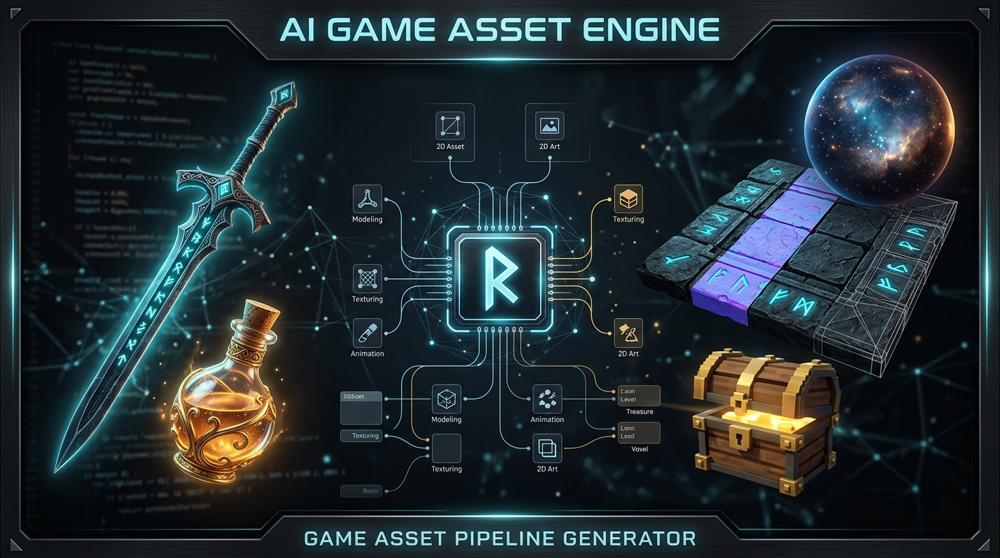
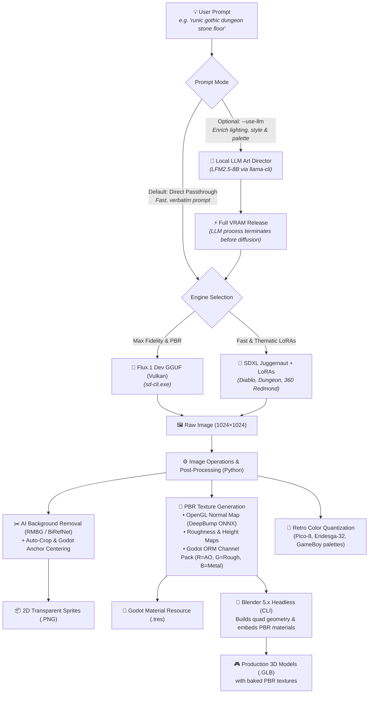
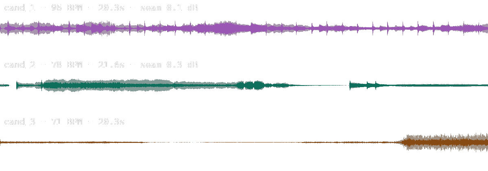
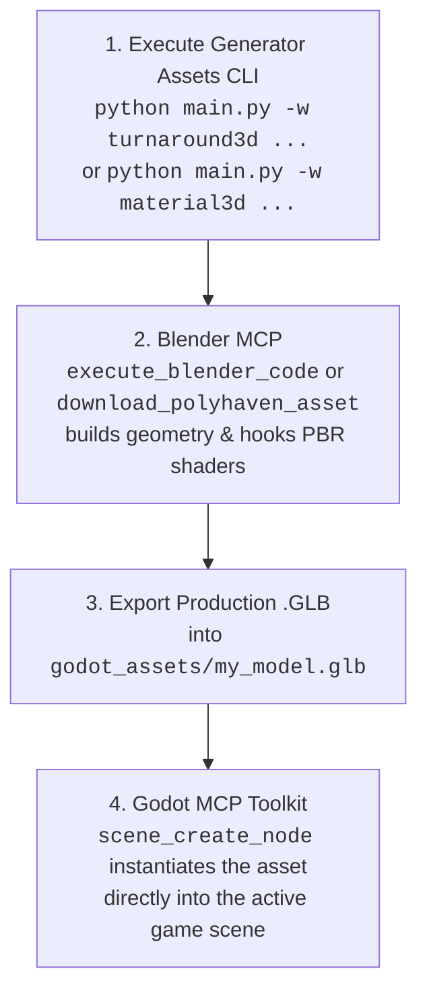
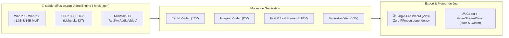

<div align="center">



# ⚔️ Generator Assets

### Modular, Headless Local AI Pipeline — Game Assets, Video Generation & Music (100% Vulkan/GGUF, No CUDA, No Cloud)
**Flux.1 Dev & SDXL (Vulkan) • AI Video Wan 2.1/2.2 • LTX-2.5 • MiniMax-H3 (4K YouTube Masters) • AI Music Loops MiniMax-Music3 (audio.cpp) • 3D PBR Materials • Headless Blender .GLB Meshes • 360° Skyboxes • MakeHuman / MPFB2 Characters • Procedural Audio & SFX • ESRGAN 4K**

[](https://www.python.org/)
[](https://godotengine.org/)
[](https://www.blender.org/)
[](https://www.vulkan.org/)
[](#-generation-video-native-webm)
[-1DB954.svg)](#43-music_bg--ai-music-loops-as-background-beds-minimax-music3-gguf-vulkan)
[](#-automatisation-de-la-mise-a-jour--compilation-vulkan-stable-diffusioncpp)
[](https://blackforestlabs.ai/)
[](#-3d-materials--geometry)
[](#-ai-models--lora-library)
[](LICENSE)
[](https://github.com/votre-compte/generator-assets/pulls)

<p align="center">
  <a href="#about">About</a> •
  <a href="#architecture">Architecture</a> •
  <a href="#capabilities">Capabilities</a> •
  <a href="#sd-cpp-update">sd.cpp Vulkan Updater</a> •
  <a href="#video-generation">Nouveautés stable-diffusion.cpp (Vidéo)</a> •
  <a href="#workflows">Workflows</a> •
  <a href="#cli">CLI Reference</a> •
  <a href="#godot">Godot 4 Guide</a> •
  <a href="#agents">AI Agents (MCP)</a> •
  <a href="#installation">Installation</a>
</p>

</div>

---

<span id="about"></span>
## 📌 About & Quick Overview

> **Repository Description (for GitHub "About"):**  
> *Headless, modular local AI pipeline: 2D/3D Godot & Blender assets (Flux.1, SDXL, ESRGAN), AI video generation (Wan 2.1/2.2, LTX-2.5, MiniMax-H3) with 4K YouTube masters, and AI music loops (MiniMax-Music3 via audio.cpp) — 100% Vulkan/GGUF, no CUDA, no cloud.*

### 🏷️ Recommended GitHub Topics / Keywords
```text
ai-game-assets, godot, godot-4, blender, flux-dev, sdxl, pbr-textures, game-development,
vulkan, esrgan, makehuman, mpfb2, procedural-generation, headless-pipeline, pixel-art,
gguf, text-to-video, ai-music, music-generation, audio-generation
```

`generator-assets` is a lightweight, local, and fully headless CLI pipeline orchestrator designed to transform natural language descriptions into **engine-ready 2D and 3D assets for Godot 4 and Blender**. 

Unlike heavy web-UI tools (Automatic1111, ComfyUI), this project operates with **zero Electron or web server overhead**, executes tasks sequentially with **strict VRAM management** (auto-unloading LLMs before launching diffusion models), and directly exports native engine formats: `.tres` materials, `.glb` models with embedded PBR textures, `.gdshader` files, 360° environment skies, and `.wav`/`.ogg` audio streams.

---

## ⚡ Core Value Highlights

| Feature | Description |
| :--- | :--- |
| 🎮 **Godot 4 Native First** | Generates `.tres` (`StandardMaterial3D`, `Environment`, `TileSet`, `StyleBoxTexture`), `.tscn` scenes, and `.gdshader` files out-of-the-box. |
| 🧱 **Complete PBR Map Generation** | Generates full PBR packs: Albedo, OpenGL Normal Maps (via DeepBump ONNX or Sobel), Roughness, Height, AO, and packed **ORM textures** (Red = AO, Green = Roughness, Blue = Metallic). |
| 🔨 **Headless Blender 3D Meshing** | Automatically builds 3D meshes (`.glb`) with embedded PBR textures via headless Blender CLI (`tile`, `cube`, `pillar`, `sphere`, `card`, `cutout`). |
| 👗 **MakeHuman / MPFB2 Character Suite** | Canonical humanoid 3D pipeline: seamless facial UV projections, barycentric garment retargeting (`.mhclo`), and studio Cycles validation renders. |
| 🌌 **Equirectangular 360° Skyboxes** | 2:1 panoramic skies with automated Godot 4 `WorldEnvironment` and Image-Based Lighting (IBL) configuration. |
| 🎬 **Native AI Video (.webm)** | Direct hardware-accelerated video rendering (Wan 2.1, Wan 2.2, LTX-2.3/2.5) with WebM container export and Godot 4 `VideoStreamPlayer` scenes. |
| 🔄 **Automated sd.cpp Vulkan Compiler** | 1-click update tool: fetches official GitHub Vulkan binaries or compiles native master sources via CMake + MSVC with automatic rollback backups. |
| ⚡ **Direct by Default & Zero VRAM Spikes** | Direct, verbatim prompt execution by default for instantaneous generation. When optional LLM prompt enrichment is enabled (`--use-llm`), the LLM terminates and frees 100% of VRAM before diffusion launches. |

---

<span id="architecture"></span>
## 🏛️ Pipeline Architecture



> [!NOTE]
> **Direct Mode by Default & Optional LLM Art Director**:  
> By default, `generator-assets` uses direct prompt passthrough for instantaneous rendering with zero overhead. Passing the `--use-llm` flag invokes the **🧠 Local LLM Art Director** (`LFM2.5-8B` via `llama-cli`) to expand brief prompts into atmospheric diffusion descriptors. The LLM process fully terminates and frees 100% of its VRAM before the diffusion engine launches.

---

<span id="capabilities"></span>
## ⚖️ Capabilities & Realistic AI Boundaries

To ensure maximum productivity and avoid false expectations, here is a transparent overview of what the pipeline achieves 100% autonomously versus tasks requiring template meshes or multi-view sheets:

### ✅ 1. 100% Automated & Engine-Ready (One-Click)
- **🧱 Floors, Walls & PBR Materials (`material3d`)** : Seamless dungeon flagstones, cobblestone, mossy rock, bark, fabrics, metals with Normal, Roughness, ORM maps, and Godot `.tres`.
- **🌌 360° Skyboxes & Panoramas (`skybox`)** : Seamless equirectangular skies, space nebulae, apocalyptic clouds, and complete `WorldEnvironment.tres` setup.
- **🎲 3D Level Props (`mesh3d`)** : Floor tiles (`--shape tile`), crates/chests (`--shape cube`), pillars/columns (`--shape pillar`), orbs (`--shape sphere`), 2.5D standees (`--shape card`).
- **🔍 AI Super-Resolution (`upscale`)** : 2x, 4x, and 4K ESRGAN Vulkan upscaling with 100% Alpha channel transparency preservation.
- **✂️ Clean Cutouts & Sprites (`generate`, `rembg`)** : Clean edges with RMBG-1.4 / BiRefNet ONNX (no white halo artifacts).
- **🔊 Procedural Sound & Music (`sfx`, `audio_ambience`)** : Combat swings, magic potions, seamless background loops in `.wav` and `.ogg` formats.

---

### ⚠️ 2. What Requires Structured Approaches (Helmets, Armor & Characters)
- **The Case of a 3D Equipment Helmet (e.g. `casque.png`)** :
  - **Why ?** A single 2D front-facing image contains neither the interior hollow cavity, nor the rear geometry, nor 360° cheek guards.
  - **Direct 2.5D Extrusion Result** : Yields an embossed bas-relief or coin-like sculpture. It is **not** a hollow 3D helmet into which a character's head fits.
- **The Production-Grade Solutions Included in this Pipeline** :
  1. **Option A (Orthographic Modeling Sheet)** : Use the `turnaround3d` workflow to generate perfectly calibrated **Front + Profile orthographic views** as reference planes for Blender.
  2. **Option B (Base Mesh + PBR Retexturing)** : Download a clean base quad helmet from Kenney.nl or Godot Asset Library, then generate and project custom PBR materials using `material3d` or `outfit`.
  3. **Option C (MakeHuman / MPFB2 Canonical System)** : For human characters, use `character3d` and `makehuman_clothes` which leverage official quad helper geometries (`helper-tights`, `helper-skirt`) and barycentric binding (`.mhclo`).

---

<span id="showcase"></span>
## 🎨 Visual Showcase

### 1. PBR 3D Texture Pipeline (`material3d` & `mesh3d`)
| Runic Floor Albedo | OpenGL Normal Map | Godot ORM Channel Pack | Seamless 3x3 Tile Preview |
| :---: | :---: | :---: | :---: |
|  |  |  |  |
| *1024×1024 Base Color* | *DeepBump ONNX Relief* | *R=AO, G=Roughness, B=Metal* | *Zero-seam repeating tile* |

---

### 2. Thematic 2D Assets, Pixel Art & 4K AI Upscaling
| SDXL Diablo LoRA (`generate`) | 4K ESRGAN Super-Resolution (`upscale`) | Retro Pico-8 Pixel Art (`pixelart`) | Ancient Wood PBR (`material3d`) |
| :---: | :---: | :---: | :---: |
|  |  |  |  |
| *Dark fantasy item icon* | *Sharp 4096px with Alpha channel* | *16-color authentic palette* | *Weathered plank texture* |

---

### 3. Canonical 3D Character Suite (MakeHuman & MPFB2)
| Canonical Face Portrait | 3D Studio Cycles Render (`marc_novice`) | Runic Pillar 3D Mesh (`mesh3d`) | 360° Skybox Panorama (`skybox`) |
| :---: | :---: | :---: | :---: |
|  |  |  |  |
| *Seamless UV projection* | *Cycles 3-point studio check* | *Textured 3D .GLB mesh* | *Equirectangular 2:1 IBL sky* |

---

### 4. AI Music Loops Showcase (`music_bg`) — 🎧 *cliquez pour écouter*
| Waveforms (seamless loops, 48 kHz stereo) |
| :---: |
|  |

| 🎵 Boucle tech n°1 — 95 BPM ⭐ | 🎵 Boucle tech n°2 — 78 BPM | 🎵 Boucle tech n°3 — 71 BPM |
| :---: | :---: | :---: |
| [](docs/exemples/musique/boucle_tech_cand1_95bpm.mp3) | [](docs/exemples/musique/boucle_tech_cand2_78bpm.mp3) | [](docs/exemples/musique/boucle_tech_cand3_71bpm.mp3) |
| *Seam Δ0.1 dB — promoted as `tech_loop_minimal_bed.wav` (-30 LUFS voice-over bed)* | *Seam Δ0.3 dB — deeper, slower groove* | *Seam Δ11.7 dB — kept as raw material* |

*Generated 100% locally with MiniMax-Music3 GGUF on audio.cpp (Vulkan, AMD RX 6950 XT) — `lyrics=[Instrumental]`, no vocals. Each preview plays the seamless loop **three times in a row** at -16 LUFS (listening level); production beds ship at -30 LUFS behind voice-over with an ffmpeg `sidechaincompress` ducking recipe.*

---

### 5. AI Video Showcase (`video` pipeline) — 🎬 *cliquez pour lire*
All clips generated 100% locally on AMD RX 6950 XT (Vulkan/GGUF, no CUDA) — re-encoded to 1080p web-friendly H.264 for the showcase; production masters are 4K (up to 50 Mbps AMD AMF).

| 🎬 Wan 2.2 MoE I2V — flagship scene | 🎬 2.5D Parallax vs Wan 2.2 AI — split-screen |
| :---: | :---: |
|  |  |
| *Wan 2.2 I2V A14B → Real-ESRGAN 4K + FidelityFX CAS • 4.9 s @ 30 fps* | *Static 2.5D parallax (left) vs true AI animation (right) • 5.5 s @ 30 fps* |

| 🎬 Cinematic 2-Plan Film + Audio Mix | 🎬 LTX-2.5 with Native Stereo Audio | 🎬 ESRGAN 4K Super-Resolution |
| :---: | :---: | :---: |
|  |  |  |
| *Two chained shots + RIFE 60 fps + procedural cinematic score* | *LTX-2.5 Distilled (8 steps) with native synchronized stereo sound* | *Real-ESRGAN + 4x-UltraSharp Vulkan upscaling to 4K* |

---

<span id="models"></span>
## 🤖 AI Models & LoRA Library

The architecture manages model execution dynamically without memory fragmentation:

### 1. Base Model Suite

| Model | Checkpoint File | Core Role & Strengths |
| :--- | :--- | :--- |
| **FLUX.1 [dev]** | `flux1-dev-Q6_K.gguf` | **Default Engine (3D & Photorealism)**: Unmatched prompt adherence via T5-XXL. Ideal for realistic PBR surfaces, intricate micro-details, and crisp 1024×1024 outputs. |
| **SDXL Juggernaut** | `juggernautXL_ragnarok.safetensors` | **Styles & LoRAs Engine**: Blazing fast generation (~3s/it). Automatically activated when applying style LoRAs. |
| **LFM2.5 8B** | `LFM2.5-8B-A1B-Q6_K.gguf` | **Local Art Director (LLM)**: Enriches concise prompts into professional visual diffusion descriptors. |
| **4x-UltraSharp** | `4x-UltraSharp.pth` | **Super-Resolution 4K (Default)**: 4x upscale (1024 ➔ 4096 px) preserving crisp edges and Godot Alpha transparency. |
| **RealESRGAN Anime** | `RealESRGAN_x4plus_anime_6B.pth` | **Stylized Super-Resolution**: Optimized for clean linework, cel-shading, and cartoon sprites. |

---

### 2. Pre-Installed LoRAs (`loras/` or `C:\Modeles_LLM\loras\`)

Apply any LoRA to any workflow via `-l "name:weight"`. When a LoRA is selected, the pipeline automatically switches to `SDXL Juggernaut`:

| LoRA Identifier | Size | Recommended Use Case |
| :--- | :---: | :--- |
| **`game_icon_diablo_style`** | `870 MB` | Item icons, weapons, flasks, and artifacts in a dark fantasy Diablo aesthetic. |
| **`JJsDungeon_XL`** | `435 MB` | Underground stone flagstones, dungeon walls, and mossy subterranean environments. |
| **`360RedmondResized`** | `433 MB` | Spherical 360° equirectangular panoramas for Godot environment lighting. |
| **`space_backround-XL-7`** | `217 MB` | Cosmic nebulas, deep space starfields, and planetary horizons. |
| **`game_icon_v1.0`** | `2.6 GB` | Stylized, high-contrast game inventory icons with sharp outlines. |

```bash
# Inspect available LoRAs and upscalers anytime:
python main.py --list-loras
python main.py --list-upscalers
```

---

<span id="workflows"></span>
## 📦 Complete Workflow Catalog

The engine features **27+ modular workflows** organized into 5 functional categories. Each workflow operates as an autonomous pipeline that produces production-ready assets:

```text
📋 Quick Category Map:
  • 3D Geometry & PBR Textures     : material3d, mesh3d, voxel3d, skybox, turnaround3d, flowmap
  • Humanoid 3D Characters & Outfits: character3d, makehuman_clothes, outfit, pose_control, rpg_portrait
  • 2D Sprites, Tiles & UI         : generate, spritesheet, autotile_pack, tileable, pixelart, variations, ui_9slice, rembg
  • Audio, Voice, VFX & Video      : sfx, audio_ambience, music_bg, tts_dialogue, vfx_flipbook, anim_loop, rife_interp, video
  • Style Consistency & Utilities  : ip_adapter, upscale, batch
```

---

### 🧱 1. 3D Geometry & PBR Textures

#### 1.1. `material3d` — Production PBR Texture Pack
* **Process**:
  1. Accepts either a textual concept (e.g., *"dungeon stone runes"*) or an existing 2D texture (`-i texture.png`).
  2. If prompt-based, generates a 1024×1024 diffuse albedo texture via Flux.1 Dev Vulkan.
  3. Feeds the albedo into DeepBump ONNX neural network to estimate physically accurate OpenGL normal, roughness, displacement height, and ambient occlusion maps (falls back to Sobel spatial gradients if `--pbr-engine sobel`).
  4. Packs AO (Red), Roughness (Green), and Metallic (Blue) into a unified Godot-standard ORM texture.
  5. Computes a 3×3 repeating grid to verify seamless tiling borders.
  6. Automatically writes a native Godot 4 `StandardMaterial3D` (`.tres`) linking all maps with correct UV channels.
* **Inputs**: `prompt` or `-i, --input`, `-s, --size` (512, 1024, 2048), `--pbr-engine` (`auto`, `deep`, `sobel`), `--normal-strength` (default: 3.5).
* **Engines**: Flux.1 Dev GGUF, DeepBump ONNX, PIL, NumPy.
* **Outputs**: `_albedo.png`, `_normal.png`, `_roughness.png`, `_height.png`, `_ao.png`, `_orm.png`, `_material.tres`, `_preview3x3.png`.
* **Example**:
  ```bash
  uv run python main.py -w material3d "ancient gothic stone tile with purple runes and moss" -s 1024 -o runic_stone
  ```

#### 1.2. `mesh3d` — Textured 3D Meshes (.GLB) via Headless Blender
* **Process**:
  1. Executes the `material3d` pipeline first to produce a complete PBR texture pack (Albedo, Normal, ORM, Height).
  2. Launches Blender 5.x in headless CLI mode (`--background --python-expr`) without opening any GUI window.
  3. Constructs parametric 3D quad geometry according to `--shape` (`tile` = beveled floor slab, `cube` = chest/crate with chamfered edges, `pillar` = octagonal dungeon column, `sphere` = magic orb, `card` = 2.5D standee, `cutout` = extruded silhouette).
  4. Automatically constructs a `Principled BSDF` material node graph with normal mapping and roughness reflections hooked up to the generated textures.
  5. Packs all textures directly into a binary `.glb` container optimized for Godot 4 `MeshInstance3D`.
* **Inputs**: `prompt` or `-i, --input`, `--shape` (`tile`, `cube`, `pillar`, `sphere`, `card`, `cutout`), `-s, --size`.
* **Engines**: Flux.1 Dev GGUF, DeepBump ONNX, Blender 5.x CLI (`bpy`).
* **Outputs**: `_3d_<shape>.glb` (self-contained with embedded textures), plus all underlying PBR map files.
* **Example**:
  ```bash
  uv run python main.py -w mesh3d "ornate ancient iron wrought chest" --shape cube -o chest_3d
  ```

#### 1.3. `voxel3d` — Discretized 3D Voxel Meshes (.GLB)
* **Process**:
  1. Accepts an input 2D sprite or generates a high-contrast item sprite with clean silhouette.
  2. Discretizes the 2D image into a 3D occupancy volume grid (NumPy array of shape `[grid_size, grid_size, voxel_depth]`).
  3. Computes voxel relief depth based on perceived luminance and silhouette boundaries.
  4. Executes aggressive internal face culling: scans adjacent voxel neighbors and strips all occluded interior quad faces, drastically reducing polycount.
  5. Launches Blender headless to build the optimized mesh, assigns sRGB Vertex Colors to vertices, and exports a lightweight `.glb` ready for Godot 4 `GridMap`.
* **Inputs**: `-i, --input` or `prompt`, `--grid-size` (e.g., 16, 32, 64), `--voxel-depth` (default: 4), `--voxel-scale` (default: 0.05).
* **Engines**: PIL, NumPy 3D Volume Array, Blender Headless CLI (`bpy`).
* **Outputs**: `_voxel.glb` with optimized vertex colors.
* **Example**:
  ```bash
  uv run python main.py -w voxel3d -i godot_assets/cheval.png --grid-size 32 --voxel-depth 4 -o horse_voxel
  ```

#### 1.4. `skybox` — 360° Equirectangular Panoramic Environments
* **Process**:
  1. Accepts a celestial or environment description (space nebula, stormy sky, fantasy dungeon vault).
  2. Injects equirectangular spherical horizon anchors into the prompt with seamless horizontal wrap conditioning.
  3. Renders a 2:1 widescreen spherical texture (e.g. 2048×1024 or 4096×2048) with Flux.1 Dev or SDXL + 360 LoRAs.
  4. Automatically formats and exports a Godot 4 `Environment.tres` resource configured with `PanoramaSkyMaterial`, `BackgroundSky` mode, tone mapping, and ambient Image-Based Lighting (IBL).
* **Inputs**: `prompt`, `-s, --size` / `--width` & `--height` (default: 2048×1024), `-l, --lora` (e.g., `360RedmondResized:1.0`).
* **Engines**: Flux.1 Dev / SDXL Vulkan, Godot Resource Serializer.
* **Outputs**: `_sky.png`, `_sky_env.tres`.
* **Example**:
  ```bash
  uv run python main.py -w skybox "purple cosmic galaxy nebula with glowing starlight" -o space_skybox
  ```

#### 1.5. `turnaround3d` — Calibrated Orthogonal Modeling Sheets
* **Process**:
  1. Formulates synchronized prompts for orthogonal Front (T-pose / A-pose) and Right-Side profile views.
  2. Enforces a fixed random seed and anatomical anchor constraints so character height, head proportions, and limb ratios match identically between perspectives.
  3. Removes background artifacts and crops each view to a calibrated bounding box.
  4. Assembles a unified side-by-side modeling card with horizontal alignment guideline overlays (crown, eyes, chin, shoulders, waist, knees, ground) for direct viewport loading in Blender.
* **Inputs**: `prompt`, `-s, --size` (default: 512 per view), `--seed`.
* **Engines**: Flux.1 Dev / SDXL, PIL canvas compositing.
* **Outputs**: `_front.png`, `_side.png`, `_model_sheet.png`.
* **Example**:
  ```bash
  uv run python main.py -w turnaround3d "dwarven warrior with heavy runic plate armor" -o dwarf_sheet
  ```

#### 1.6. `flowmap` — Vector Velocity Flowmaps & Water/Lava Shaders
* **Process**:
  1. Calculates a 2D directional vector field based on `--angle` (degrees) and adds procedural Curl Noise turbulence.
  2. Encodes directional velocity into RGB color space: Red = X vector, Green = Y vector, Blue = flow magnitude.
  3. Generates a seamless repeating flowmap texture.
  4. Writes a custom Godot 4 `.gdshader` script utilizing dual-sample phase-shifted time offsets to eliminate texture pulsing or visible resetting.
  5. Exports a pre-configured `ShaderMaterial` (`.tres`) ready to drop onto water planes, rivers, or lava channels in 2D or 3D.
* **Inputs**: `prompt`, `--angle` (degrees, default: 90 = downwards), `--flow-type` (`river`, `vortex`, `radial`, `optical`), `--turbulence` (0.0 to 1.0), `--mode-2d`.
* **Engines**: NumPy procedural vector field generator, Godot shader compiler.
* **Outputs**: `_flowmap.png`, `_water.gdshader`, `_material.tres`.
* **Example**:
  ```bash
  uv run python main.py -w flowmap "molten volcanic lava river" --angle 45 --turbulence 0.4 -o lava_flow
  ```

---

### 👤 2. Humanoid 3D Characters & Wardrobe (MakeHuman / MPFB2)

#### 2.1. `character3d` — Canonical Humanoid Pipeline
* **Process**:
  1. Generates photorealistic skin albedo and projects facial details (scars, dark circles, eye color) onto the MakeHuman hm08 standard UV layout without 2D cutting seams.
  2. Resolves barycentric vertex bindings for official quad garments (`.mhclo`), matching the target character's age, gender, and muscle sliders.
  3. Instantiates an MPFB2 avatar in headless Blender, attaches hair, eyes, and eyebrows, and configures Principled BSDF materials with Subsurface Scattering (SSS).
  4. Exports the editable `.blend` project, a game-ready `.glb` file, and produces a 3-point studio Cycles validation render.
* **Inputs**: `--portrait` (reference image), `--recipe-script` (MPFB python recipe), `--name` (character identifier).
* **Engines**: MakeHuman / MPFB2 headless, Blender Cycles, NumPy UV alignment.
* **Outputs**: `_face_diffuse.png`, `.blend`, `.glb`, `_beauty_render.png`.
* **Example**:
  ```bash
  uv run python scripts/character_pipeline.py --portrait "godot_assets/exact_face_portrait.png" --recipe-script "poc_3d/create_marc_mpfb2.py" --name marc_novice
  ```

#### 2.2. `makehuman_clothes` — Modular Quad Wardrobe Generator
* **Process**:
  1. Takes a thematic clothing concept (e.g. *"medieval leather rogue armor"*).
  2. Generates pure seamless raw material PBR textures (leather, linen, iron rings) with 4K ESRGAN Vulkan upscaling.
  3. Leverages official MakeHuman helper quad geometries (`helper-tights`, `helper-skirt`) to maintain natural draping, open sleeves, and high boots.
  4. Automatically compiles `.mhclo` (barycentric coordinates), `.obj` (3D geometry), `.mhmat` (material descriptor), and `.thumb` (preview icon) files directly into `%APPDATA%/.../mpfb/data/clothes/`.
  5. Creates a test `.blend` scene with an avatar dressed in the new wardrobe with Cycles lighting.
* **Inputs**: `prompt` (clothing theme), `--parts` (`torso,pants,shoes`), `--mpfb-dir` (custom target path).
* **Engines**: Flux.1 Dev, ESRGAN 4K, MakeHuman barycentric binding compiler, Blender 5.x.
* **Outputs**: `.mhclo`, `.obj`, `.mhmat`, `.thumb` files per clothing item, plus test `.blend`.
* **Example**:
  ```bash
  uv run python main.py -w makehuman_clothes "dark worn leather ranger armor" --parts "torso,pants,shoes" -o dark_ranger
  ```

#### 2.3. `outfit` — Automated UV Garment Retexturing
* **Process**:
  1. Inspects existing clothing meshes attached to a character in a Blender scene.
  2. Reads the original MakeHuman sewing pattern UV layouts (preserving 100% of seams, pockets, folds, and button placements).
  3. Generates seamless fabric/leather textures (Albedo, Normal, Roughness) via diffusion.
  4. Calls headless Blender to create independent material slots, applies the textures to the garment quad meshes, and updates the `.blend` file.
  5. Re-exports the production `.glb` model and renders an updated 3-point lighting beauty check.
* **Inputs**: `--character` (e.g. `marc_novice`), `--top` (description of top fabric), `--shoes` (description of footwear material).
* **Engines**: Flux.1 Dev Vulkan, Blender Headless CLI (`bpy`), PBR texture synthesis.
* **Outputs**: `godot_assets/textures/<character>/*`, updated `<character>.blend`, updated `<character>.glb`, `<character>_beauty_render.png`.
* **Example**:
  ```bash
  uv run python main.py -w outfit --character marc_novice --top "rough medieval beige burlap tunic" --shoes "dark worn leather boots"
  ```

#### 2.4. `pose_control` — OpenPose Skeleton Guidance & Rigged Godot Scenes
* **Process**:
  1. Queries the 18-point COCO OpenPose coordinate library for the chosen action pose (`idle`, `slash_attack`, `cast_spell`, `shield_block`, `jump`, `walk`).
  2. Renders the OpenPose colored bone skeleton stick-figure card.
  3. Uses the skeleton to guide character diffusion, locking the limbs and torso into the exact target posture.
  4. Removes the background cleanly via RMBG / BiRefNet.
  5. Computes dynamic 2D weapon and effect attachment points (hands, head, feet) from the pose keypoints.
  6. Automatically compiles a Godot 4 `.tscn` scene with a `Sprite2D` and hierarchical `Marker2D` nodes ready for attaching weapons or VFX.
* **Inputs**: `prompt`, `--pose` (`idle`, `slash_attack`, `cast_spell`, `shield_block`, `jump`, `walk`), `-s, --size`.
* **Engines**: OpenPose COCO 18-point mapper, Flux.1 / SDXL, Godot Scene Builder.
* **Outputs**: `_openpose_skeleton.png`, `_character.png`, `_character.tscn`, `_rig.json`.
* **Example**:
  ```bash
  uv run python main.py -w pose_control "shadow knight with a glowing sword" --pose slash_attack -o knight_slash
  ```

#### 2.5. `rpg_portrait` — Multi-Emotion Dialogue Character Sets
* **Process**:
  1. Takes a base character description or portrait image.
  2. Iterates across specified emotional states (*Neutral, Happy, Angry, Sad, Hurt, Surprised*), injecting calibrated emotional micro-descriptors while locking identity seeds.
  3. Removes background halos to isolate the character portraits.
  4. Combines the resulting portraits into a single reference contact sheet (`_portrait_grid.png`).
  5. Writes a Godot dialogue JSON manifest containing paths, emotional tags, and metadata ready for Dialogic or custom dialogue managers.
* **Inputs**: `prompt` or `-i, --input`, `--emotions` (default: `neutral,happy,angry,sad,hurt`), `-s, --size`.
* **Engines**: Flux.1 / SDXL Vulkan, BiRefNet / RMBG ONNX, JSON Manifest Generator.
* **Outputs**: individual emotion `.png` files, `_portrait_grid.png`, `_dialogue_manifest.json`.
* **Example**:
  ```bash
  uv run python main.py -w rpg_portrait "dark sorceress with golden eyes" --emotions "neutral,happy,angry,sad,hurt" -o sorceress
  ```

#### 2.6. 👗 MakeHuman 3D Wardrobe Suite & Bilingual Semantic AI Router
* **Bilingual Semantic Router (177 3D Models)** (`core/clothes_catalog.py`):
  - Automatically indexes **177 MakeHuman 3D community assets** into [`data/clothes_catalog.json`](data/clothes_catalog.json) (monk robes, capes, plate armor, overalls, boots, beards, hairstyles).
  - The `aiguiller_modele_vetement(prompt, category, gender)` function semantically pairs natural language prompts in **English or French** (e.g. *"rustic medieval peasant tunic"*, *"monk robe"*, *"viking beard"*, *"heavy leather boots"*) with the ideal 3D base model.
  ```bash
  uv run python core/clothes_catalog.py
  ```
* **AI Retexturing on Canonical UV Sewing Patterns** (`scripts/retexture_uv_garment.py`):
  - Retextures official MakeHuman UV patterns directly (e.g. `male_worksuit01_diffuse.png`, `shoes01_diffuse.png`) to preserve 100% of underlying geometry, pocket seams, and button coordinates while converting blue denim to weathered burlap or aged leather with normal maps.
  ```bash
  uv run python scripts/retexture_uv_garment.py
  ```
* **External 3D Mesh to MakeClothes Compiler** (`scripts/makeclothes_from_mesh.py`):
  - Converts arbitrary quad meshes (`.obj`, `.glb`, `.fbx`) generated from 3D AI tools or sculpted in Blender into official MakeHuman `.mhclo` garments with automatic barycentric vertex binding.
  ```bash
  uv run python scripts/makeclothes_from_mesh.py --mesh "assets/models/cape.obj" --name "traveler_cape" --category "clothes"
  ```
* **Community Asset Pack Installer** (`scripts/install_asset_packs.py`):
  - Extracts and deploys MakeHuman Community zip archives directly into the active MPFB directory and updates the catalog.
  ```bash
  uv run python scripts/install_asset_packs.py
  ```

#### 2.7. 🗺️ MakeHuman Skin Synthesis & Anatomical Calibration
* **Complete MPFB Skin Pack Pipeline**:
  - Generates 2048×2048 diffuse skin maps (`diffuse.png`), PBR normal maps (`normal.png`), MakeHuman material definitions (`.mhmat`) with calibrated Subsurface Scattering (SSS) parameters, and UI thumbnail previews (`.thumb`).
* **Dedicated Scripts**:
  - `scripts/build_clean_marc_skin.py`: Generates seamless, homogeneous skin textures with dedicated colorimetry (e.g., cold winter complexion for Marc).
  - `scripts/align_marc_portrait_to_uv.py`: Projects 2D anatomical facial features (eyes, eyebrows, scars, lips) accurately onto standard MakeHuman hm08 UV layouts without seam tearing.
* **Deployment**:
  - Installs skin assets automatically into `%APPDATA%/Blender Foundation/Blender/5.2/mpfb/data/skins/<skin_name>/` and syncs them with Godot asset targets.

---

### 🎨 3. 2D Sprites, Tiles & UI

#### 3.1. `generate` — Standard Isolated 2D Game Asset
* **Process**:
  1. Accepts an item, character, prop, or tile concept.
  2. Optional prompt expansion via local LLM (`--use-llm`) or direct passthrough (default).
  3. Renders the asset on solid contrast background via Flux.1 Dev or SDXL with optional LoRAs (`-l`).
  4. Automatically removes background via flood-fill or AI neural segmentation (`--segmenter birefnet`).
  5. Crops tight bounding box and centers the asset with Godot bottom-center (characters) or exact-center (items) anchor offsets.
  6. Optionally triggers 4K AI ESRGAN upscaling (`--upscale`).
* **Inputs**: `prompt`, `-t, --type` (`item`, `character`, `prop`, `tile`), `-i, --input` (Img2Img), `--upscale`, `-l, --lora`.
* **Engines**: Flux.1 / SDXL, RMBG-1.4 / BiRefNet ONNX, Real-ESRGAN Vulkan.
* **Outputs**: Clean isolated transparent `.png`.
* **Example**:
  ```bash
  uv run python main.py -w generate "legendary royal gold shield with an engraved lion" --upscale
  ```

#### 3.2. `spritesheet` — Multi-Angle Character Sprite Sheet
* **Process**:
  1. Formulates 4 sequential perspective prompts (Front, Right-Side, Back, Left-Side) with consistent character identity anchors.
  2. Generates all 4 angles on isolated backgrounds.
  3. Performs background removal and automatic dimensional alignment across all frames.
  4. Stitches the frames into a clean horizontal or grid spritesheet atlas.
  5. Generates a Godot JSON frame atlas specifying UV rectangles for `SpriteFrames` / `AnimatedSprite2D`.
* **Inputs**: `prompt`, `-s, --size` (cell size, default: 256), `--columns` (default: 4), `--tolerance`.
* **Engines**: Flux.1 / SDXL, PIL grid compositor, JSON atlas generator.
* **Outputs**: `_spritesheet.png`, individual angle `.png` files, `_atlas.json`.
* **Example**:
  ```bash
  uv run python main.py -w spritesheet "undead skeleton warrior with rusted blade" --columns 4 -o skeleton_walk
  ```

#### 3.3. `autotile_pack` — 47-Tile Minimal 3x3 Wang Autotile Atlas
* **Process**:
  1. Generates or loads textures for Biome A (foreground, e.g. green grass) and Biome B (background, e.g. dark dirt).
  2. Programmatically constructs the 47 canonical tiles required by Wang / Minimal 3x3 autotiling: inner corners, outer corners, single edges, islands, and center fills.
  3. Compiles all 47 tiles into an organized 8-column atlas texture.
  4. Automatically constructs a Godot 4 `TileSet.tres` resource with terrain sets, terrain layers, and 3x3 minimal peering bits pre-configured for instant painted tiles.
* **Inputs**: `--biome-a` (prompt or image), `--biome-b` (prompt or image), `-s, --size` (tile resolution, e.g., 64, 128), `--columns` (default: 8).
* **Engines**: Flux.1 Dev, NumPy / PIL bitmask synthesis, Godot TileSet compiler.
* **Outputs**: `_atlas.png`, `_tileset.tres`.
* **Example**:
  ```bash
  uv run python main.py -w autotile_pack --biome-a "lush green grass" --biome-b "dark cracked dirt" --size 64 -o grass_to_dirt
  ```

#### 3.4. `tileable` — Infinite Seamless Repeating Textures
* **Process**:
  1. Takes a terrain or material prompt.
  2. Injects circular padding boundary conditions into the diffusion process so opposite edges (left/right, top/bottom) seamlessly match.
  3. Renders the square tile texture.
  4. Renders a 3×3 tiled verification preview to confirm absence of visible seams or repeating artifacts.
* **Inputs**: `prompt`, `-s, --size` (default: 512), `--no-preview` (optional).
* **Engines**: Flux.1 / SDXL with circular padding kernel, PIL 3x3 tiling verifier.
* **Outputs**: `_tile.png`, `_preview3x3.png`.
* **Example**:
  ```bash
  uv run python main.py -w tileable "mossy dark dungeon cobblestone pattern" -s 512 -o mossy_cobblestone
  ```

#### 3.5. `pixelart` — Retro Palette Color Quantization & Downsampling
* **Process**:
  1. Takes an existing image or generates a new sprite with clean outlines.
  2. Downsamples the image to a low-resolution pixel grid (`--grid-size`, e.g. 32×32, 64×64).
  3. Quantizes each pixel color to the nearest match in a chosen historical hardware palette (Pico-8 16-color, Endesga-32, GameBoy 4-color) using Euclidean distance in Lab color space.
  4. Upscales the resulting pixel art using Nearest-Neighbor interpolation to ensure razor-sharp pixels on modern displays.
* **Inputs**: `-i, --input` or `prompt`, `--palette` (`pico8`, `endesga32`, `gameboy`), `--grid-size` (default: 64), `-s, --size` (export display size).
* **Engines**: PIL ImageOps, NumPy color quantization.
* **Outputs**: `_pixelart_<palette>.png`.
* **Example**:
  ```bash
  uv run python main.py -w pixelart -i godot_assets/casque.png --palette pico8 --grid-size 64 -o helmet_retro
  ```

#### 3.6. `variations` — Thematic Elemental Asset Variations
* **Process**:
  1. Takes a base item/concept (e.g. *"magic sword"*).
  2. Iterates across specified themes (e.g. Fire, Ice, Poison, Lightning, Void).
  3. Performs guided diffusion with theme-specific descriptors and color harmonies.
  4. Removes backgrounds and centers each variant.
* **Inputs**: `prompt` or `-i, --input`, `--themes` (comma-separated list, e.g. `fire,ice,poison,lightning`), `-s, --size`.
* **Engines**: Flux.1 / SDXL Img2Img, RMBG segmentation.
* **Outputs**: Individual variant `.png` files named `<base>_<theme>.png`.
* **Example**:
  ```bash
  uv run python main.py -w variations -i godot_assets/potion_diablo.png --themes "fire,frost,poison,shadow" -o potion_elemental
  ```

#### 3.7. `ui_9slice` — Expandable 9-Patch Frames & Buttons
* **Process**:
  1. Generates an ornamental UI dialog frame, inventory slot, or button border (or loads `-i`).
  2. Performs automatic border detection (`--auto-margin`) or uses a specified pixel margin (`--margin`) to split the frame into 9 slices.
  3. Generates a Godot 4 `StyleBoxTexture` (`.tres`) with top, bottom, left, right margins configured with repeat/stretch axes.
  4. Generates an example Godot 4 `NinePatchRect` scene (`.tscn`).
  5. Exports a stretched test preview demonstrating distortion-free scaling.
* **Inputs**: `prompt` or `-i, --input`, `--margin` (default: 32), `--auto-margin`.
* **Engines**: PIL 9-slice analyzer, Godot Resource Serializer.
* **Outputs**: `.png`, `_stylebox.tres`, `_ninepatch.tscn`, `_preview_stretched.png`.
* **Example**:
  ```bash
  uv run python main.py -w ui_9slice "ornate fantasy golden dialog box with ruby corners" --margin 32 -o gold_dialog
  ```

#### 3.8. `rembg` — High-Precision Neural Background Removal
* **Process**:
  1. Loads an existing 2D asset image with complex edges (hair, fur, semi-transparent glass, weapons).
  2. Runs ONNX neural segmentation (RMBG-1.4 or BiRefNet).
  3. Computes a continuous alpha matte, completely removing solid or noisy backgrounds without white fringes.
  4. Automatically centers the sprite and tightens transparent margins.
* **Inputs**: `-i, --input` (required), `--segmenter` (`birefnet`, `rmbg`), `-s, --size` (optional resize).
* **Engines**: BiRefNet ONNX / RMBG-1.4 ONNX, NumPy, PIL.
* **Outputs**: `_rembg.png`.
* **Example**:
  ```bash
  uv run python main.py -w rembg -i godot_assets/cheval.png -o horse_transparent
  ```

---

### 🔊 4. Audio, Voice & VFX

#### 4.1. `sfx` — Procedural Sound Effects Synthesis
* **Process**:
  1. Accepts a sound effect category or description (`sword_slash`, `magic_potion`, `explosion`, `coin_pickup`, `spell_cast`).
  2. Synthesizes multi-oscillator audio waveforms (sine, saw, noise bursts, resonant low-pass filter sweeps, pitch envelopes) at 44.1 kHz 16-bit PCM.
  3. Applies dynamic range compression, normalization, and smooth attack/release envelopes to eliminate clipping and pop artifacts.
  4. Exports both lossless WAV and compressed OGG Vorbis formats optimized for Godot's `AudioStreamPlayer`.
* **Inputs**: `prompt` (sound category or concept), `--duration` (in seconds, default: 1.5).
* **Engines**: NumPy audio synthesizer, SoundFile encoder.
* **Outputs**: `_sfx.wav`, `_sfx.ogg`.
* **Example**:
  ```bash
  uv run python main.py -w sfx "heavy sword slash metal impact" --duration 1.2 -o sword_strike
  ```

#### 4.2. `audio_ambience` — Procedural Seamless Looping Ambient Soundscapes
* **Process**:
  1. Accepts an environmental theme (`dungeon`, `forest`, `storm`, `space`, `tavern`, `campfire`).
  2. Synthesizes multi-layered procedural audio tracks (e.g. for dungeon: subterranean rumble, resonant water drops, wind gusts, dark binaural drones).
  3. Applies seamless circular crossfading so the beginning and end of the audio loop match phase without any clicks or gaps.
  4. Generates a Godot 4 `AudioBusLayout.tres` resource featuring configured Reverb and low-shelf filter buses.
  5. Exports an `AudioStreamPlayer` scene (`.tscn`) pre-configured with autoplay and loop flags.
* **Inputs**: `prompt` (ambience preset or description), `--duration` (seconds, default: 8.0).
* **Engines**: NumPy procedural audio synthesizer, SoundFile encoder, Godot bus serializer.
* **Outputs**: `_ambience.wav`, `_ambience.ogg`, `_bus_layout.tres`, `_player.tscn`.
* **Example**:
  ```bash
  uv run python main.py -w audio_ambience "dark subterranean dungeon with distant water drops" --duration 8.0 -o dungeon_ambience
  ```

#### 4.3. `music_bg` — AI Music Loops as Background Beds (MiniMax-Music3 GGUF Vulkan)

* **Process**:
  1. Generates several music candidates from an English style description via **MiniMax-Music3 GGUF** running on **audio.cpp** with the **Vulkan** backend (AMD GPU accelerated, CPU fallback) — same GGUF/Vulkan philosophy as `sd-cli` and `llama.cpp`. Fully instrumental conditioning (`lyrics=[Instrumental]`, explicit per-candidate seeds).
  2. Builds a **seamless loop** from each candidate: BPM estimation by onset-envelope autocorrelation, then **best-loop-point search** — among all windows of a whole number of bars (≥ target duration), picks the one whose head/tail energies match across 50–500 ms windows (the model composes song structures with intros/breaks/outros even in 23 s). Ends snapped to zero crossings + 20 ms equal-power micro-crossfade. Ambient mode: 1 s equal-power crossfade.
  3. Applies **voice-over bed post-processing**: 80 Hz high-pass + −3 dB presence dip at 2.8 kHz so the loop stays discrete behind a (male) voice-over.
  4. Validates each candidate (seam continuity, clipping, LUFS) and **finalizes every candidate**: bed normalized to −30 LUFS (ffmpeg 2-pass loudnorm), MP3, plus an `ECOUTE_cand<N>_boucle_x3.mp3` listening preview (loop ×3 at −16 LUFS). Best seam promoted to `output/music_bg/` root.
  5. Writes a ready-to-use **ffmpeg ducking recipe** (`sidechaincompress` + `amix`) that loops the bed to the voice duration and automatically attenuates it whenever the voice speaks. Optional Music Flamingo QA (`--analyse`).
* **Inputs**: `prompt` (English music description), `--duration` (loop seconds, default 12), `--candidats` (default 3), `--lufs` (bed target, default −30), `--loop-mode` (`percussive`|`ambient`), `--music-backend` (`vulkan`|`cpu`), `--seed`, `--analyse` (Music Flamingo QA).
* **Engines**: audio.cpp v0.7.2 (`audiocpp_cli`, Vulkan, ~25 min per 23 s generation on RX 6950 XT) + MiniMax-Music3-GGUF Q4_0/Q8_0 (~8.5 GB, `C:\Modeles_LLM\MiniMax-Music3-GGUF`), NumPy/SciPy DSP, ffmpeg 9 (`C:\ffmpeg\dist\bin\ffmpeg.exe`), optional llama.cpp + Music Flamingo GGUF.
* **Outputs** (`output/music_bg/`): `<name>_full.wav` (48 kHz PCM16 loop), `<name>_bed.wav` (−30 LUFS bed), `<name>.ogg`, `<name>_preview.mp3`, `recette_mixage_voix.txt` (ducking command), `candidats/` (every candidate: raw WAV + loop + bed + MP3), `ECOUTE_cand<N>_boucle_x3.mp3` (listening previews).
* **Helpers**: `scripts/download_music3_gguf.py` (engine + models), `scripts/download_music_flamingo.py` (optional QA model), `scripts/generer_boucles_music_bg_batch.py N` (**resilient batch** — one candidate per process, resumes from existing files, survives AMD GPU driver resets), `scripts/finaliser_boucles_music_bg.py` (re-finalize raw WAVs), `scripts/ecoute_candidat_music_bg.py N` (listening preview).
* **Example**:
  ```bash
  uv run python main.py -w music_bg "subtle minimal techno groove, soft pulsing analog synth bass, muffled kick, no vocals" --duration 20 --candidats 3 -o tech_loop_minimal
  # Batch résilient (recommandé pour les gros volumes) :
  uv run python -u scripts/generer_boucles_music_bg_batch.py 10
  ```
* **Status (2026-09-05)**: ✅ generator validated by user (3 tech loops 20-22 s delivered, seam ≤ 0.3 dB on the promoted loops). ⚠️ **Not yet tested**: Music Flamingo QA (`--analyse`, needs `download_music_flamingo.py`, non-commercial licence), ducking recipe on a real voice-over (`recette_mixage_voix.txt`), `--loop-mode ambient`. Known pitfalls (soundfile OGG stack overflow → use ffmpeg; AMD GPU watchdog resets → resilient batch) documented in `docs/MEMORY_BANK.md` §1.10.
* **Licence**: MiniMax-Music3 community licence (MIT-style, commercial OK below $20M revenue; disclose AI-generated music in the video description: *« Musique : générée par IA (MiniMax-Music3) »*).

#### 4.4. `tts_dialogue` — Emotional Character Voice & Lip-Sync
* **Process**:
  1. Accepts a character name, a list of emotions (`neutral,happy,angry,sad,hurt`), and voice pitch tuning.
  2. Generates spoken voice lines with intonation, timbre, and cadence modified according to each emotional state.
  3. Extracts real-time phonetic visemes (A, E, I, O, U, consonants, silence) mapped with precise timecodes.
  4. Exports individual `.wav` and `.ogg` audio files for each emotion line.
  5. Generates a consolidated dialogue manifest (`.json`) ready for Godot 4 dialogue engines (Dialogic, DialogueManager) to animate 2D or 3D mouths.
* **Inputs**: `prompt` (character name), `--emotions` (comma-separated), `--pitch` (fundamental pitch in Hz, default: 160.0).
* **Engines**: Kokoro TTS / Python audio synthesizer, viseme alignment engine.
* **Outputs**: `<emotion>.wav`, `<emotion>.ogg`, `_dialogue_manifest.json`.
* **Example**:
  ```bash
  uv run python main.py -w tts_dialogue "dark_sorceress" --emotions "neutral,happy,angry,hurt" --pitch 180 -o sorceress_voice
  ```

#### 4.5. `vfx_flipbook` — 4x4 Animated Particle Sheets (.tscn)
* **Process**:
  1. Takes an effect concept (`explosion`, `fire`, `lightning`, `portal`, `slash`, `aura`).
  2. Generates a 4×4 grid (16 chronological animation frames) of the evolving particle simulation with alpha transparency.
  3. Writes a Godot 4 `StandardMaterial3D` or `CanvasItemMaterial` with `particles_anim_h_frames = 4` and `particles_anim_v_frames = 4`.
  4. Writes a `ParticleProcessMaterial.tres` with velocity, lifetime, and color ramp settings.
  5. Writes a complete `GPUParticles3D` / `GPUParticles2D` scene (`.tscn`) ready to instantiate in your game level.
* **Inputs**: `prompt`, `--vfx-type` (`explosion`, `fire`, `lightning`, `portal`, `slash`, `aura`), `--mode-2d`.
* **Engines**: Flux.1 Dev / SDXL, PIL grid compositor, Godot particle resource generator.
* **Outputs**: `_flipbook.png`, `_vfx_material.tres`, `_particles_process.tres`, `_vfx.tscn`.
* **Example**:
  ```bash
  uv run python main.py -w vfx_flipbook "purple arcane void explosion" --vfx-type explosion -o arcane_explosion
  ```

#### 4.6. `anim_loop` — Seamless Animated Loop Shaders
* **Process**:
  1. Accepts an effect or texture animation prompt (portal vortex, flowing waterfall, flickering fire).
  2. Synthesizes a periodic keyframe sequence where frame N connects seamlessly back to frame 0.
  3. Stitches the frames into an animation atlas spritesheet.
  4. Exports a custom Godot 4 `.gdshader` with time-offset dual sampling to eliminate looping seams.
  5. Exports a pre-configured `ShaderMaterial` (`.tres`) and `AnimatedTexture` (`.tres`) for UI and CanvasItem nodes.
* **Inputs**: `prompt`, `--frames` (default: 16), `--fps` (default: 12.0), `--columns` (default: 4), `--mode-2d`.
* **Engines**: Periodic circular phase generator, PIL atlas builder, Godot shader writer.
* **Outputs**: `_spritesheet.png`, `_loop.gdshader`, `_loop_material.tres`, `_animated_tex.tres`.
* **Example**:
  ```bash
  uv run python main.py -w anim_loop "swirling cosmic void portal" --frames 16 --fps 12 -o void_portal
  ```

#### 4.7. `rife_interp` — AI Frame Rate Multiplication (60 FPS)
* **Process**:
  1. Takes an existing linear spritesheet (e.g. a 4-frame walk cycle or 8-frame attack).
  2. Slices the sheet into separate discrete sequential image frames.
  3. Employs RIFE v4 ONNX optical flow neural network to interpolate intermediate in-between motion frames (2x or 4x multiplication).
  4. Preserves 100% of alpha transparency across interpolated frames.
  5. Reassembles the new smooth sequence into a continuous high-framerate spritesheet.
* **Inputs**: `-i, --input` (source spritesheet path), `--columns` (number of frames), `--factor` (2 or 4).
* **Engines**: RIFE v4 ONNX optical flow model, PIL frame sequencer.
* **Outputs**: `_rife_<factor>x.png`.
* **Example**:
  ```bash
  uv run python main.py -w rife_interp -i godot_assets/spritesheet.png --columns 4 --factor 2 -o anim_60fps
  ```

#### 4.8. `video` — Native Hardware-Accelerated Video Generation (.webm)
* **Process**:
  1. Harnesses `stable-diffusion.cpp` native video inference mode (`-M vid_gen`) with full hardware acceleration under Vulkan.
  2. Supports 4 generation paradigms:
     - **T2V (Text-to-Video)** : Generates animated video clips from a descriptive prompt (cascading waterfalls, flickering campfire, drifting nebulae).
     - **I2V (Image-to-Video)** : Animates an existing still image (`-i, --input`) with natural fluid motion.
     - **FLF2V (First & Last Frame)** : Interpolates seamless motion between a starting keyframe (`--input`) and an ending keyframe (`--end-img`).
     - **V2V (Video-to-Video)** : Applies video style transfer using a directory of guidance frames (`--control-video`).
  3. Supports state-of-the-art video models: **Wan 2.1 / Wan 2.2** (1.3B, 14B MoE High/Low noise), **LTX-2.3 & LTX-2.5** (Lightricks DiT, Gemma 3/4 text encoders, audio VAE), and **MiniMax-H3**.
  4. Encodes and packages video directly into a single lightweight `.webm` container (VP8 / `libwebm`) without external FFmpeg dependencies.
  5. Automatically writes a ready-to-use Godot 4 `VideoStreamPlayer` scene (`.tscn`) configured with loop and autoplay parameters.
* **Inputs**: `prompt`, `-i, --input` (init image), `--end-img` (final image), `--control-video` (frame directory), `--frames` (default: 33), `--fps` (default: 24), `--flow-shift` (default: 3.0), `-o, --output`.
* **Engines**: stable-diffusion.cpp Vulkan (`-M vid_gen`), Wan 2.1 / Wan 2.2 / LTX-2.5 GGUF/Safetensors, libwebm.
* **Outputs**: `_vid.webm`, `_player.tscn` (Godot 4 VideoStreamPlayer scene).
* **Example**:
  ```bash
  # Text-to-Video (T2V)
  uv run python main.py -w video "mystical glowing waterfall in ancient overgrown jungle" --frames 33 --fps 24 -o waterfall

  # Image-to-Video (I2V)
  uv run python main.py -w video -i godot_assets/heros_portrait.png -p "character breathing and blinking with atmospheric fog" --frames 25 -o heros_idle
  ```

* **📥 Guide de Récupération des Modèles Vidéo SOTA (`C:\Modeles_LLM`)** :
  Tous les modèles vidéo sont stockés dans `C:\Modeles_LLM\` (et son sous-dossier `upscalers\`).  
  *(Consultez le guide exhaustif avec liens directs et sources HuggingFace dans [`docs/guide_telechargement_modeles_video.md`](docs/guide_telechargement_modeles_video.md))*

  | Modèle & Rôle | Fichiers Requis (`C:\Modeles_LLM`) | Taille | Commande de Téléchargement Automatisé |
  | :--- | :--- | :--- | :--- |
  | **LTX-2.5 Distilled** 👑<br>*(15B Audio + Vidéo)* | `LTX-2.5-Distilled-Q4_K_M.gguf`<br>`gemma4-12b-with-proj-ltx-2.5-Q5_K_M.gguf`<br>`ltx-2.5-video-vae-conv-bf16.safetensors`<br>`ltx-2.5-audio-vae-bf16.safetensors` | ~25.7 Go | `python scripts/download_ltx25.py`<br>`python scripts/download_gemma4_gguf.py`<br>`python scripts/download_ltx25_vaes.py` |
  | **Wan 2.1 14B & 1.3B**<br>*(Géométrie 3D & Isométrie)* | `wan2.1-t2v-14b-Q4_K_M.gguf`<br>`umt5-xxl-encoder-Q4_K_M.gguf`<br>`wan_2.1_vae.safetensors` | ~13.8 Go | `.\scripts\download_video_models.ps1 -Model 14b` |
  | **Wan 2.2 MoE (T2V)**<br>*(Photoréalisme Absolu Dual-DiT)* | `Wan2.2-T2V-A14B-LowNoise-Q4_K_M.gguf`<br>`Wan2.2-T2V-A14B-HighNoise-Q4_K_M.gguf`<br>`umt5-xxl-encoder-Q4_K_M.gguf` | ~23.1 Go | `python scripts/download_wan22_official.py` |
  | **Wan 2.2 MoE (I2V)** 👑<br>*(Animation Image-to-Video)* | `Wan2.2-I2V-A14B-LowNoise-Q4_K_M.gguf`<br>`Wan2.2-I2V-A14B-HighNoise-Q4_K_M.gguf`<br>`clip_vision_h.safetensors` | ~19.3 Go | `python scripts/download_wan22_i2v_models.py` |
  | **MiniMax-H3**<br>*(Hailuo 32B DiT + Son)* | `MiniMax-H3-Q4_K_M.gguf`<br>`Qwen3-VL-32B-Instruct-Q4_K_M.gguf` | ~27.8 Go | `python scripts/download_minimax_h3.py` |
  | **Super-Résolution 4K**<br>*(Netteté YouTube ESRGAN)* | `upscalers/4x-UltraSharp.pth` | 64 Mo | Inclus dans le repo ou via HuggingFace `Kim2091/4x-UltraSharp` |

  > [!TIP]
  > **Téléchargement global en 1 commande** : Pour rapatrier l'intégralité de la suite vidéo avec reprise automatique sur coupure réseau :
  > ```powershell
  > python scripts/download_all_sota_models.py
  > ```

* **🔍 Workflow Recommandé : Preview Rapide 480p/512p ➔ Super-Résolution IA 4K Master** :
  Pour allier vitesse d'itération et netteté chirurgicale de niveau broadcast, le pipeline de production se divise en 2 étapes :
  1. **Preview Native Ultra-Rapide** : Génération native en 768×512 (LTX-2.5) ou 832×480 (Wan 2.1) pour valider le mouvement, le cadrage et l'esthétique en 1 à 3 minutes.
  2. **Super-Résolution IA 4K (`scripts/upscale_video_ai.py`)** : Traitement trame par trame sous Vulkan via le réseau de neurones `4x-UltraSharp.pth`, application du filtre **AMD FidelityFX CAS 0.75**, préservation de la piste audio native, et conformation en **Master 4K Ultra HD (3840×2160 @ 50 Mbps)** via l'encodeur matériel AMD AMF (`h264_amf`).

  ```bash
  # 1. Génération de la séquence native (ex: LTX-2.5 en 8 steps distillés avec audio)
  python scripts/generate_ansible_nexus.py --model ltx25

  # 2. Ou upscale direct de n'importe quel fichier WebM/MP4 existant en Master 4K :
  python scripts/upscale_video_ai.py output/clip_brut.webm -o output/clip_4k_master.mp4 --cas 0.75 --bitrate 50M
  ```

* **📺 Levier de Netteté Ultime pour Diffusion YouTube (Pourquoi la 4K est impérative)** :
  > [!IMPORTANT]
  > **Le piège de la compression YouTube 1080p** : Si vous uploadez un fichier Full HD 1080p, YouTube lui applique automatiquement son profil de compression le plus destructeur (**codec AVC1 limité à ~4-6 Mbps**), ce qui transforme les lignes fines de grilles, les textures sombres et les flux lumineux en bouillie de macro-blocs.  
  > **La solution Master 4K UHD (3840×2160)** : En publiant une vidéo masterisée en 4K (grâce à notre Super-Résolution IA `4x-UltraSharp` + AMD CAS 0.75), YouTube est **techniquement forcé d'activer son profil premium VP09 ou AV01 (débit de 25 à 45 Mbps)**. Résultat : même un spectateur lisant la vidéo sur un écran 1080p ou un smartphone bénéficie du suréchantillonnage VP09 haute fidélité avec une netteté et un micro-contraste parfaits !

* **⏱️ Durée Standardisée par Scène : 5,5 secondes (165 trames à 30 FPS)** :
  Pour la production de plans de coupes, teasers et scènes d'illustration, la cadence standardisée est de **5,5 secondes (165 trames @ 30 fps)**.
  Deux stratégies sont disponibles selon l'architecture :
  - **Stratégie 1 : Chaînage Multi-Plans I2V (Recommandée)** : Découpage en 2 ou 3 plans courts successifs (ex: 2 plans de 82 trames ou 3 plans de 55 trames). Chaque plan est généré dans la zone de confort VRAM (<11 Go) sans saturation de l'attention $O(N^2)$ ni adoucissement temporel des textures. L'enchaînement est fluide à 100% en réinjectant la dernière trame du plan $N$ en image source (`-i`) du plan $N+1$.
  - **Stratégie 2 : Génération Native Directe LTX-2.5** : Pour les scènes continues rapides avec sound design procédural synchronisé.

* **👑 Workflow Hybride Roi Validé : Image 4K Maîtresse (Gemini/Upscale) ➔ Wan 2.2 MoE I2V ➔ Master 4K UHD** :
  Pour combiner la précision sémantique absolue (logos d'entreprises, marques, architectures isométriques complexes) et la dynamique physique vivante sans aucune hallucination humaine :
  1. **Image Maîtresse** : Image de référence générée avec forte fidélité (ex: Gemini Imagen 3 avec logos Linux Tux et Windows) et suréchantillonnée en local.
  2. **Animation DiT MoE 28B (`scripts/animate_ansible_nexus_wan22_i2v.py`)** : Injection de l'image via `--clip_vision clip_vision_h.safetensors` et `--vae wan_2.1_vae.safetensors` dans l'architecture Dual-DiT Wan 2.2 MoE (`HighNoise` pour la cinématique de caméra + `LowNoise` pour les micro-reflets et netteté).
  3. **Conformation & Mastering 4K** : Interpolation fluide en 5,5 secondes (165 trames @ 30 FPS) et Super-Résolution Ultra HD (3840×2160 @ 50 Mbps) avec filtre **AMD FidelityFX CAS 0.75**.

  ```bash
  # Lancer l'animation Image-to-Video sur n'importe quelle image source 4K :
  python scripts/animate_ansible_nexus_wan22_i2v.py --input C:\tmp\scene_01.png --frames 17

  # Générer automatiquement le comparatif Split-Screen 50/50 avec une animation 2.5D :
  python scripts/create_comparison_2.5d_vs_wan22.py
  ```

  > [!TIP]
  > **Match 2.5D vs IA Générative Wan 2.2 MoE** : Alors que l'animation 2.5D recourt à des effets miroir artificiels en bordure d'écran et fige les textures lumineuses, **Wan 2.2 MoE I2V calcule un véritable espace 3D continu sans dédoublement**, anime la pulsation réelle des paquets de données dans les fibres optiques et fait rayonner le nexus central de manière volumétrique.

* **🎬 Chaînage Continu Multi-Plans I2V (`scripts/chain_video.py`)** :
  1. **Plan 1 (T2V)** : Génération de l'amorce à partir d'un prompt descriptif (ex. plan d'ensemble 33 trames).
  2. **Extraction de transition** : Capture automatique de l'ultime trame (trame N-1) en PNG via OpenCV.
  3. **Plan 2 (I2V)** : Génération du plan suivant en injectant la trame capturée en image de départ (`-i`) avec un prompt de travelling ou de zoom.
  4. **Assemblage 0-saccade** : Concaténation automatique en sautant la première trame dupliquée pour une continuité parfaite.
  5. **Mastering 4K IA** : Passe de Super-Résolution IA 4K sur la séquence finale assemblée.

  ```bash
  # Lancement du chaînage multi-plans avec transition fluide :
  uv run python scripts/chain_video.py
  ```

* **👑 Comparatif des 4 Fleurons Vidéo SOTA (Validés Empiriquement sur AMD RX 6950 XT)** :
  *(Voir le guide complet dans [`docs/comparatif_modeles_video_ai.md`](docs/comparatif_modeles_video_ai.md) et le rapport nocturne [`output/overnight/overnight_summary.md`](output/overnight/overnight_summary.md))*

  | Modèle SOTA | Architecture & Taille | Pas Optimaux | Vitesse DiT | Audio Stéréo | Qualité Visuelle Dragon | Master Conforme 4K / 1080p |
  | :--- | :--- | :--- | :--- | :--- | :--- | :--- |
  | **LTX-2.5 Distilled** 👑 | Spatio-Temporal DiT (15B) + Gemma 4 12B | **8 steps** (distillés) | ⚡ **9.98s / pas** (3.8 min total) | 🔊 **OUI (AAC 48 kHz)** | 🟢 Héroïque 3D parfait (Écailles or, cornes, ailes) | [`01_ltx25_dragon_4k_ultrasharp.mp4`](output/overnight/esrgan_4k/01_ltx25_dragon_4k_ultrasharp.mp4) |
  | **Wan 2.1 14B** | DiT Monolithe (14B) + UMT5-XXL | **8-10 steps** (CFG 6.0) | 🐢 **312s / pas** (~6 min total) | ❌ (Muet) | 🟢 Géométrie isométrique ultra-précise, structure 3D | [`02_wan21_14steps_dragon_1080p.mp4`](output/overnight/02_wan21_14steps_dragon_1080p.mp4) |
  | **Wan 2.2 MoE** | Dual-DiT MoE (2x 14B = 28B) + UMT5-XXL | **8 steps MoE** (4 High + 4 Low) | ⏳ **~350s / pas** (~11 min total) | ❌ (Muet) | 👑 **Piqué photoréaliste absolu** (Micro-détails, regard) | [`wan22_moe_dragon_4k_ultrasharp.mp4`](output/overnight/esrgan_4k/wan22_moe_dragon_4k_ultrasharp.mp4) |
  | **MiniMax-H3** | DiT FL2VA (15B) + Qwen3-VL 32B | **12 steps** (CFG 1.0) | 🚀 **16.96s / pas** (6.6 min total) | 🔊 **OUI (AAC 32 kHz)** | 🟢 Wyvern titanesque (Crête enflammée, ailes massives) | [`04_minimax_h3_20steps_dragon_1080p.mp4`](output/overnight/04_minimax_h3_20steps_dragon_1080p.mp4) |

---

### 🛠️ 5. Style Consistency, Upscaling & Batching

#### 5.1. `ip_adapter` — Art Style Locking & Godot Palettes
* **Process**:
  1. Takes a reference image representing your game's visual identity, palette, and materials.
  2. Extracts dominant color palettes, luminance ranges, and shading rules.
  3. Iterates across a requested list of items (e.g., `sword,shield,ring,helmet`) conditioning each generation on the reference image features.
  4. Assembles an interactive Consistency Board image comparing the reference against all derived items.
  5. Exports the extracted color scheme into a Godot 4 `.tres` palette, Aseprite `.gpl`, and JSON palette.
* **Inputs**: `-i, --input` (reference image), `--items` (comma-separated list of items), `-s, --size`.
* **Engines**: Style analysis extractor, Flux.1 / SDXL, Godot palette exporter.
* **Outputs**: Item `.png` files, `_consistency_board.png`, `.tres`, `.gpl`, `.json`.
* **Example**:
  ```bash
  uv run python main.py -w ip_adapter -i godot_assets/potion_diablo.png --items "sword,shield,ring,helmet" -o diablo_set
  ```

#### 5.2. `upscale` — 4K AI Super-Resolution (ESRGAN Vulkan)
* **Process**:
  1. Loads any 2D sprite, texture, or render.
  2. Passes the RGB channels through Real-ESRGAN Vulkan neural network (4x-UltraSharp or RealESRGAN Anime 6B) for super-sharp edge reconstruction.
  3. Separately processes and bilinearly scales the Alpha transparency channel, merging it back to guarantee zero alpha halos or border corruption.
* **Inputs**: `-i, --input` (source image), `--factor` (e.g., 2, 4), `--upscale-model` (`ultrasharp`, `anime`, `auto`).
* **Engines**: Real-ESRGAN Vulkan (`4x-UltraSharp.pth`, `RealESRGAN_x4plus_anime_6B.pth`).
* **Outputs**: `_upscaled_<WxH>.png`.
* **Example**:
  ```bash
  uv run python main.py -w upscale -i godot_assets/casque.png --factor 4 --upscale-model ultrasharp
  ```

#### 5.3. `batch` — Automated Batch Recipe Execution
* **Process**:
  1. Loads a JSON recipe file or text prompt list.
  2. Parses target workflows, prompts, and custom overrides per task.
  3. Sequentially executes each generation task while actively releasing VRAM between jobs.
  4. Produces a consolidated report of all exported assets.
* **Inputs**: `--file` / `--recipe` (JSON recipe path or newline-delimited text file).
* **Engines**: WorkflowRegistry dispatcher, JSON recipe parser.
* **Outputs**: Complete batch of generated game assets.
* **Example**:
  ```bash
  uv run python main.py -w batch --file recipes/dungeon_pack.json
  ```

---

<span id="cli"></span>
## 💻 CLI Reference & Cheat Sheet

```text
Usage: python main.py [prompt] [options]

Primary Options:
  prompt                    Asset description or design concept.
  -w, --workflow            Target workflow name (default: 'generate').
  -i, --input               Input image path (for Img2Img, upscale, variations, pixelart).
  -t, --type                2D asset category: item, character, prop, tile.
  --shape                   3D shape for mesh3d: tile, cube, pillar, cylinder, sphere, card, cutout.
  -o, --output              Output file basename (without extension).
  -d, --output-dir          Destination directory (default: 'godot_assets/').
  -s, --size                Square output resolution in pixels.

AI Engines & Models:
  --sd-model                Diffusion model: 'flux', 'juggernaut', 'sdxl' or file path.
  --use-llm                 Enable local LLM prompt expansion (default: direct prompt passthrough).
  --no-llm                  Disable local LLM prompt expansion (default behavior).
  --seed                    Random seed (-1 for automatic random).
  --strength                Denoising strength for Img2Img / guided diffusion (default: 0.55).
  --segmenter               Background remover: 'auto', 'birefnet', 'rmbg', 'floodfill', 'none'.
  --pbr-engine              PBR estimator: 'auto', 'deep' (DeepBump ONNX), 'sobel'.
  -l, --lora                Apply LoRA in 'name:weight' format (e.g. -l 'game_icon_diablo_style:0.8').
  --upscale                 Automatically trigger 4K ESRGAN AI upscaling after generation.
  --upscale-model           ESRGAN model ('ultrasharp', 'anime', 'auto').

Workflow-Specific Flags:
  --pose                    OpenPose preset for pose_control (idle, slash_attack, cast_spell, shield_block, jump, walk).
  --pitch                   Voice pitch in Hz for tts_dialogue (default: 160.0).
  --fps                     Framerate for anim_loop (default: 12.0).
  --items                   Comma-separated list of items for ip_adapter (e.g. 'sword,shield,ring,helmet').
  --angle                   Flow angle in degrees for flowmap (default: 90 = downwards).
  --flow-type               Flow type for flowmap ('river', 'vortex', 'radial', 'optical').
  --turbulence              Turbulence strength for flowmap (default: 0.35).
  --margin                  Fixed 9-slice margin in pixels for ui_9slice.
  --auto-margin             Automatic margin detection for ui_9slice.
  --voxel-depth             Extrusion thickness in voxels for voxel3d.
  --voxel-scale             Voxel size in Godot units for voxel3d.
  --biome-a, --biome-b      Biome prompts/textures for autotile_pack.
  --factor                  Multiplication factor for upscaling or RIFE interpolation (2x, 4x).
  --vfx-type                Effect preset for vfx_flipbook or anim_loop ('explosion', 'fire', 'portal').
  --emotions                Comma-separated emotions for rpg_portrait and tts_dialogue.
  --duration                Duration in seconds for sfx, audio_ambience and music_bg loop.
  --lufs                    Bed loudness target in LUFS for music_bg (default: -30).
  --loop-mode               Loop strategy for music_bg: 'percussive' (BPM-aligned, default) or 'ambient'.
  --music-backend           audio.cpp backend for music_bg: 'vulkan' (default), 'cpu' or 'auto'.
  --candidats               Number of music_bg candidates to generate and rank (default: 3).
  --lyrics                  Lyrics/structure conditioning for music_bg (default: '[Instrumental]').
  --analyse                 Enable optional Music Flamingo QA on the selected music_bg bed.
  --character               Target character name for outfit (default: 'marc_novice').
  --top, --shoes            Materials description for outfit workflow.

Utility Flags:
  --interactive             Launch the interactive console menu (workflows 1-26).
  --check                   Verify system requirements, paths, and model checkpoints.
  --list-workflows          Display all registered workflows.
  --list-loras              Display detected LoRAs.
  --list-upscalers          Display detected ESRGAN models.
```

---

### ⚡ Practical CLI Quick Examples

```bash
# 1. Generate 2D item icon with auto 4K AI upscaling (4096×4096 px)
uv run python main.py -w generate "royal gold shield with an engraved lion" --upscale

# 2. Generate dark fantasy potion using Diablo LoRA (auto-switches to SDXL)
uv run python main.py -w generate "dark mana potion" -l game_icon_diablo_style:0.9 --upscale

# 3. Create complete PBR stone floor tile (.tres + OpenGL Normal + ORM + Albedo)
uv run python main.py -w material3d "ancient gothic stone tile with purple runes" -s 1024 -o sol_runique

# 4. Generate 3D mesh model with embedded PBR textures via Blender
uv run python main.py -w mesh3d "ancient iron wrought treasure chest" --shape cube -o coffre_3d

# 5. Generate 360° equirectangular skybox with space LoRA
uv run python main.py -w skybox "purple cosmic nebula with dark obsidian moons" -l space_backround-XL-7:1.0

# 6. Re-texture MakeHuman character outfit with custom medieval materials
uv run python main.py -w outfit --character marc_novice --top "rustic medieval beige burlap tunic" --shoes "dark worn leather boots"

# 7. Upscale existing image directly with 4x-UltraSharp
uv run python main.py -w upscale -i godot_assets/casque.png --factor 4 --upscale-model ultrasharp
```

---

<span id="godot"></span>
## 🎮 Godot 4 Integration Guide

### 1. Applying PBR Materials (`.tres`)
1. Drag and drop the `godot_assets/` folder into your Godot project's `res://assets/`.
2. Add a **`MeshInstance3D`** node (e.g. `PlaneMesh` for ground or `BoxMesh` for walls).
3. In the Inspector, drag the generated `.tres` file (e.g. `sol_runique_material.tres`) directly into the **Material** property.
4. Albedo, dynamic OpenGL Normal relief, and ORM reflections are active immediately.

---

### 2. Using 3D Meshes (`.glb`)
1. Drag the `.glb` file (e.g. `coffre_3d.glb` or `sol_runique_3d_tile.glb`) into your **3D Scene Tree** or Viewport.
2. Geometry, UV coordinates, and embedded PBR textures load seamlessly with zero manual shader setup.

---

### 3. Setting Up 360° Skyboxes
1. Add a **`WorldEnvironment`** node to your 3D scene.
2. Drag the generated environment resource (e.g. `ciel_space_env.tres`) into the **Environment** slot.
3. Your scene instantly gains realistic 360° panoramic background visuals and Image-Based Lighting (IBL).

---

<span id="agents"></span>
## 🤖 AI Coding Agents Guide (MCP)

> **Note for AI Assistant Agents (Claude, Gemini, Antigravity):**  
> Users often do not wish to model manually in Blender or write repetitive engine setup code. You can leverage the `blender` and `godot-mcp-toolkit` MCP servers to automate the complete asset pipeline end-to-end.



### Typical Agent Actions:
1. **Humanoid Characters & Outfits** :
   - Consult the dedicated [**`GUIDE_AGENT_IA_HABILLAGE.md`**](GUIDE_AGENT_IA_HABILLAGE.md).
   - Use official **MakeHuman Community patterns (`.mhclo`)** that automatically adapt to any body morphology (**Male**, **Female**, **Child**).
   - Separate clothing into modular 3D objects (`Torso`, `Pants`, `Shoes`).
   - Retexture existing UV patterns via `scripts/retexture_uv_garment.py` to preserve 100% of geometric seams, pockets, and buttons.
2. **Complex Equipment (Helmets, Shields, Weapons)** :
   - Run `turnaround3d` to produce orthogonal orthographic reference cards.
   - Use `execute_blender_code` to extrude symmetrical quad geometry (`Mirror Modifier`) and hook up PBR maps in `Principled BSDF`.
3. **Engine Placement** :
   - Call `scene_open` and `scene_create_node` from the Godot MCP toolkit to instantiate the resulting `.glb` without requiring manual user intervention.

---

<span id="installation"></span>
## ⚡ Installation & Quickstart

### 1. Clone & Setup Virtual Environment
This project is optimized for [**uv**](https://docs.astral.sh/uv/) for near-instant package installation:

```bash
git clone https://github.com/votre-compte/generator-assets.git
cd generator-assets

# Synchronize dependencies with uv:
uv sync
```

*(Alternatively, standard pip: `python -m venv .venv && source .venv/bin/activate && pip install -r requirements.txt`)*

---

### 2. Verify System Requirements & Paths
Check that your local executables (`sd-cli.exe`, `llama-cli.exe`, Blender) and model checkpoints are detected:

```bash
python main.py --check
```

---

### 3. Launch the Interactive Console
```bash
python main.py --interactive
```

---

<span id="sd-cpp-update"></span>
## 🔄 Automatisation de la Mise à Jour & Compilation Vulkan (stable-diffusion.cpp)

Le cœur algorithmique de génération de `generator-assets` repose directement sur [**stable-diffusion.cpp**](https://github.com/leejet/stable-diffusion.cpp) développé par `@leejet`. Contrairement aux solutions lourdes basées sur Python et PyTorch (ComfyUI, Automatic1111), `stable-diffusion.cpp` est une implémentation C/C++ pure ultra-optimisée basée sur `ggml` qui s'exécute directement sur GPU via **Vulkan** avec une empreinte mémoire minimale et zéro surcharge de serveur.

Pour maintenir ce moteur toujours au sommet des performances et bénéficier des dernières fonctionnalités (génération vidéo Wan 2.1/2.2, LTX-2.5, Flux.2), un programme dédié d'automatisation et de compilation a été intégré au dépôt.

### 🛠️ Modes de Fonctionnement

Le script [`scripts/update_sd_cpp.py`](scripts/update_sd_cpp.py) et son lanceur PowerShell [`scripts/update_sd_cpp.ps1`](scripts/update_sd_cpp.ps1) proposent deux approches complémentaires :

| Mode | Option | Description | Temps estimé |
| :--- | :--- | :--- | :--- |
| **🔍 Vérification** | `--check` | Compare la version locale (`sd-cli.exe --version`) avec la dernière release officielle GitHub et le dernier commit de la branche `master`. | ~1 seconde |
| **🚀 Téléchargement Rapide** | `--download` | Télécharge directement les binaires pré-compilés officiels Windows x64 Vulkan (`sd-*-bin-win-vulkan-x64.zip`) depuis les GitHub Releases, crée une sauvegarde horodatée et déploie dans `C:\SD`. | ~5 secondes |
| **⚙️ Compilation Native Vulkan** | `--build` | Clone/met à jour le dépôt Git avec ses submodules récursifs, configure CMake avec le SDK Vulkan et compile nativement avec Visual Studio (MSVC) en mode Release multi-threadé. | ~2 à 5 minutes |
| **⏪ Restauration** | `--rollback` | Restaure instantanément la dernière sauvegarde archivée dans `C:\SD\backups\` en cas d'incompatibilité ou de régression. | ~2 secondes |

---

### 💻 Utilisation en Ligne de Commande

#### 1. Via PowerShell (Recommandé sous Windows)
```powershell
# 1. Vérifier si une mise à jour est disponible
.\scripts\update_sd_cpp.ps1 -Check

# 2. Mise à jour rapide via la release officielle Vulkan
.\scripts\update_sd_cpp.ps1 -Download

# 3. Compilation native complète depuis les sources Git avec Vulkan
.\scripts\update_sd_cpp.ps1 -Build -Clean

# 4. En cas de besoin : restaurer la version précédente
.\scripts\update_sd_cpp.ps1 -Rollback
```

#### 2. Via le CLI Unifié `main.py`
```bash
# Vérification
uv run python main.py --update-sd check

# Téléchargement de la dernière release Vulkan
uv run python main.py --update-sd download

# Compilation native depuis les sources
uv run python main.py --update-sd build

# Restauration de la sauvegarde
uv run python main.py --update-sd rollback
```

#### 3. Via le Script Python Dédié
```bash
uv run python scripts/update_sd_cpp.py --check
uv run python scripts/update_sd_cpp.py --download
uv run python scripts/update_sd_cpp.py --build --jobs 16
uv run python scripts/update_sd_cpp.py --list-backups
```

#### 4. Depuis la Console Interactive
Lancez `uv run python main.py --interactive` puis choisissez l'option :  
`[28] 🔄 Gestionnaire de Mise à Jour & Compilation Vulkan (stable-diffusion.cpp)`.

---

### 🛡️ Sécurité & Système de Sauvegardes Automatiques

Chaque opération de mise à jour (que ce soit par téléchargement ou par compilation) crée automatiquement une archive de sauvegarde horodatée de tous les exécutables (`sd-cli.exe`, `sd-server.exe`) et bibliothèques dynamiques (`ggml-vulkan.dll`, `stable-diffusion.dll`, `webm.dll`, etc.) dans :
```text
C:\SD\backups\backup_YYYYMMDD_HHMMSS\
```
Vous pouvez lister les sauvegardes avec `--list-backups` et revenir à tout moment à l'état antérieur via `--rollback`.

---

### 🦙 Automatisation & Compilation Vulkan de llama.cpp

Le module d'enrichissement textuel et de direction artistique optionnel (`--use-llm`) repose sur [**llama.cpp**](https://github.com/ggml-org/llama.cpp). Pour garantir une inférence LLM instantanée sur GPU sans nécessiter de pilotes CUDA propriétaires NVIDIA, `llama.cpp` s'exécute avec le backend **Vulkan** (`ggml-vulkan.dll`), permettant d'exploiter à 100% la puissance des cartes graphiques **AMD Radeon (RX 6000 / 7000 / 8000)**, **Intel Arc** et **NVIDIA GeForce**.

Le script [`scripts/update_llama_cpp.py`](scripts/update_llama_cpp.py) et son lanceur [`scripts/update_llama_cpp.ps1`](scripts/update_llama_cpp.ps1) assurent la mise à jour et la compilation native :

#### 1. Commandes d'utilisation llama.cpp :
```powershell
# Vérification des versions (locale vs distante)
.\scripts\update_llama_cpp.ps1 -Check

# Téléchargement rapide de la dernière release Vulkan officielle (ex: b10797)
.\scripts\update_llama_cpp.ps1 -Download

# Compilation native complète avec Vulkan (CMake + MSVC)
.\scripts\update_llama_cpp.ps1 -Build -Clean

# Restauration de la sauvegarde précédente
.\scripts\update_llama_cpp.ps1 -Rollback
```

#### 2. Via le CLI Unifié :
```bash
uv run python main.py --update-llama check
uv run python main.py --update-llama download
uv run python main.py --update-llama build
uv run python main.py --update-llama rollback
```

---

### ⚡ Suite Complète Vulkan : Gestionnaire Unifié (SD + LLaMA + GPU)

Pour administrer en une seule commande l'ensemble de votre écosystème IA sous Vulkan, le script [`scripts/update_vulkan_stack.py`](scripts/update_vulkan_stack.py) et son lanceur [`scripts/update_vulkan_stack.ps1`](scripts/update_vulkan_stack.ps1) orchestrent simultanément :
1. Le **diagnostic matériel Vulkan** (détection GPU AMD Radeon / NVIDIA / Intel, version API et pilote).
2. L'inspection ou mise à jour de **stable-diffusion.cpp** (`C:\SD`).
3. L'inspection ou mise à jour de **llama.cpp** (`C:\llama.cpp`).

```powershell
# Diagnostic complet du GPU et vérification des deux moteurs
.\scripts\update_vulkan_stack.ps1 -Check

# Mise à jour synchronisée des 2 moteurs via releases officielles Vulkan
.\scripts\update_vulkan_stack.ps1 -Download

# Recompilation native complète des 2 moteurs avec Vulkan
.\scripts\update_vulkan_stack.ps1 -Build -Clean

# Restauration globale des sauvegardes
.\scripts\update_vulkan_stack.ps1 -Rollback
```

Ou directement depuis le CLI principal :
```bash
uv run python main.py --update-vulkan check
uv run python main.py --update-vulkan download
uv run python main.py --update-vulkan build
```

---

<span id="video-generation"></span>
## 🎬 Nouvelles Fonctionnalités Majeures de stable-diffusion.cpp (Moteur Vidéo & Architectures 2026)

La mise à jour récente de `stable-diffusion.cpp` apporte une évolution majeure : **le support complet de la génération vidéo native en C/C++** ainsi que la prise en charge des toutes dernières architectures de modèles génératifs.



### 1. 🎥 Moteur de Génération Vidéo Native (`-M vid_gen`)

* **Modes de Synthèse Vidéo Avancés** :
  - **T2V (Text-to-Video)** : Génère des séquences vidéo animées directement à partir d'une description textuelle (ex: cascades, flammes de torche, nébuleuses, personnages en mouvement).
  - **I2V (Image-to-Video)** : Donne vie à une image fixe existante (`--init-img` ou `-i`) en conservant la structure et le style avec des mouvements naturels.
  - **FLF2V (First & Last Frame to Video)** : Génère une transition vidéo continue et fluide reliant une image de départ (`--init-img`) et une image d'arrivée (`--end-img`).
  - **V2V (Video-to-Video Control)** : Transfert de style et guidage temporel guidé par un dossier de trames vidéo (`--control-video`).
* **Export Conteneur WebM Autonome** :
  - L'exécutable `sd-cli.exe` intègre nativement `libwebm` et `libwebp` (compression VP8). Il génère directement des fichiers `.webm` compacts et légers sans dépendre de l'installation de FFmpeg.
  - Également compatible avec les formats WebP animé et les séquences d'images numérotées (`%03d.png`).

---

### 2. 🧠 Modèles Vidéo de Dernière Génération Supportés

| Famille de Modèle | Variantes | Points Forts & Spécificités |
| :--- | :--- | :--- |
| **Alibaba Wan 2.1 & 2.2** | `1.3B`, `14B`, `Wan 2.2 MoE` | Architecture DiT de pointe. La version 1.3B tourne sur des GPU grand public (8 Go VRAM). Wan 2.2 supporte la double diffusion High-Noise / Low-Noise (`--high-noise-diffusion-model`). Support du guidage Wan VACE (`--vace-strength`). |
| **Lightricks LTX-2.3 & LTX-2.5** | `LTX-2.3`, `LTX-2.5` | Transformers ultra-rapides conçus pour la vidéo temps réel. Utilisent les encodeurs Google Gemma 3 et Gemma 4. Supportent le VAE audio (`--audio-vae`), les embeddings connectors et l'upscaler spatial latent. |
| **MiniMax-H3** | `Day-1 Support` | Architecture multimodale Ref2VA permettant le conditionnement combiné par image, vidéo et piste sonore WAV (`--ref-video`, `--ref-audio`, `--ref-video-audio`). |
| **HunyuanVideo 1.5 & LingBot** | `HunyuanVideo`, `LingBot-Video` | Modèles de diffusion vidéo grand format à haute cohérence temporelle. |

---

### 3. ⚡ Optimisations Matérielles & Vulkan

* **Flash Attention (`--diffusion-fa`)** :
  Optimise drastiquement le calcul des matrices d'attention pour les modèles DiT (Diffusion Transformer), diminuant les besoins en VRAM de 30% à 50% et accélérant le rendu.
* **Temporal VAE Tiling (`--temporal-tiling`)** :
  Découpe le décodage du VAE vidéo en tuiles spatio-temporelles (`--extra-tiling-args temporal_tile_frames=4,temporal_tile_overlap=3`). Permet de décoder des vidéos longues sans dépassement de mémoire vidéo.
* **Flow Shift Ajustable (`--flow-shift`)** :
  Contrôle précis de l'échantillonnage pour les modèles basés sur le Flow Matching (Wan 2.1, SD3.5).
* **Déchargement CPU Hybride (`--offload-to-cpu`)** :
  Bascule dynamique des tenseurs inactifs en mémoire vive système pour permettre l'exécution de modèles 14B même avec une VRAM modeste.
* **Calculs Natifs FP8 Vulkan** :
  Exécution directe des multiplications matricielles en FP8 sur les cœurs tenseurs GPU compatibles Vulkan sans conversion préalable coûteuse.

---

### 4. 🎨 Nouvelles Architectures d'Images (2025/2026)

En plus de la vidéo, `stable-diffusion.cpp` a étendu sa compatibilité aux architectures d'images de dernière génération :
* **FLUX.2-dev & FLUX.2-klein** : Nouveaux modèles phares de Black Forest Labs avec prompt adherence et rendu de texte améliorés.
* **Qwen-Image & Qwen-Image-Edit (série 2509)** : Retouche contextuelle précise et édition d'images guidée par langage naturel.
* **Z-Image, Krea2, Ideogram4, Lens, PiD** : Modèles spécialisés dans le design graphique, l'illustration et le rendu typographique.
* **Serveur Web Embarqué (`sd-server.exe`)** : Interface utilisateur Web interactive et API serveur prêtes à l'emploi.

---

### 🎮 Utilisation du Workflow Vidéo dans Generator Assets

Vous pouvez directement exploiter ces nouveautés grâce au workflow unifié `video` :

```bash
# 1. Génération d'une cinématique Text-to-Video (T2V) en 832x480 (24 FPS, 33 trames)
uv run python main.py -w video "cinematic waterfall cascading into glowing purple crystal pool in fantasy jungle" --frames 33 --fps 24 -o waterfall

# 2. Animation d'un asset ou portrait existant Image-to-Video (I2V)
uv run python main.py -w video -i godot_assets/heros_portrait.png -p "character breathing, gentle wind blowing through hair and fog" --frames 25 -o heros_idle

# 3. Transition fluide entre deux images First-and-Last-Frame (FLF2V)
uv run python main.py -w video -i godot_assets/sol_herbe.png --end-img godot_assets/sol_lave.png -p "ground slowly cracking and transforming into molten lava" --frames 33 -o transition_sol
```

Chaque génération produit :
1. Le fichier vidéo autonome : `godot_assets/<nom>.webm`.
2. Une scène Godot 4 prête à l'emploi : `godot_assets/<nom>_player.tscn` configurée avec un nœud `VideoStreamPlayer` pour intégration immédiate en jeu.

---

### 🏆 5. Modèles Flagship Cinéma & Rendu Nocturne Autonome

Pour une qualité visuelle cinématographique sans compromis, la suite intègre les modèles phares SOTA et un pipeline de rendu vidéo accéléré par matériel :

#### 👑 5.1. LTX-2.5 Distilled (15B Audio + Vidéo SOTA Validé)
* **Architecture Hybride Vulkan / CPU (`diffusion=vulkan0,te=cpu,vae=cpu`)** :
  * **Diffusion DiT (15B)** : 14.05 Go VRAM sur GPU AMD Radeon RX 6950 XT (100% stable).
  * **Encodeur Texte Gemma 4 (12B)** : Exécuté en RAM CPU via instructions AVX2 (précision Q5_K_M).
  * **Audio VAE Stéréo** : Décodage simultané de la piste sonore stéréo PCM 48 kHz native.
* **Performances Record** :
  * Échantillonnage DiT (8 étapes Lightricks distillées) : **1 min 24s chrono** sur GPU Vulkan (~10.5s/step) !
  * Vitesse **3.5× plus rapide que Wan 2.1** grâce au CFG 1.0 (une seule passe par étape).
  * Rendu validé en production supérieure (crocs, cornes, ailes et écailles d'or).
* **Script Dédié** (`scripts/generate_ltx25_8steps.py`) :
  ```bash
  python scripts/generate_ltx25_8steps.py
  ```

#### 👑 5.2. Wan 2.1 14B (Modèle Monolithique de Référence)
* **Architecture Mémoire Hybride Vulkan/CPU (`diffusion=vulkan0,te=cpu`)** :
  - **Diffusion Transformer (14B)** : Alloué à 100% en VRAM GDDR6 sur le GPU AMD Radeon RX 6950 XT (14.05 Go max).
  - **Encodeur T5XXL** : Exécuté en RAM système (6.66 Go) en précision FP32 pure. Élimine totalement les dépassements numériques (black frames / CFG blowout).
  - **VAE Décodeur** : 242 Mo en VRAM avec tiling spatial et temporel natif.
* **Génération Cinéma Dédiée** (`scripts/generate_14b_cinema.py`) :
  ```bash
  python scripts/generate_14b_cinema.py <steps> <frames>
  ```

#### 🌙 Pipeline de Rendu Nocturne par Lots (`scripts/run_overnight_batch.py`)
Permet d'enchaîner une suite de générations cinématiques complexes durant la nuit sans intervention humaine :
* Définition d'une file d'attente de prompts et de modèles (Wan 2.1 14B, Wan 2.2 MoE, MiniMax-H3, LTX-2.5).
* Traitement séquentiel avec libération mémoire automatique entre chaque plan.
* Extraction automatique d'une trame d'aperçu haute résolution (`_preview.png`).
* Conformation automatique en **Full HD 1080p YouTube (1920×1080 @ 60 FPS, CBR 20 Mbps)** via l'encodeur matériel AMD AMF (`h264_amf`).
```bash
python scripts/run_overnight_batch.py
```

#### 📺 Conformation Matérielle YouTube Full HD (`scripts/conform_youtube_hd.py`)
Transforme instantanément les fichiers bruts WebM/VP8 en vidéos MP4 Full HD 1080p prêtes à être téléversées sur YouTube :
* Encodage matériel ultra-rapide AMD AMF (`h264_amf`).
* Interpolation de mise à l'échelle Lanczos 1080p sans perte de piqué.
* Rendu en moins de 1 seconde par clip.
```bash
python scripts/conform_youtube_hd.py input.webm output_1080p.mp4
```

---

## 📂 Project Structure

```text
generator-assets/
├── core/                   # Pipeline core: config, CLI orchestrators, LLM enrichers
│   ├── clothes_catalog.py  # 177-model MakeHuman semantic clothes catalog
│   ├── config.py           # Model paths, VRAM management, hardware settings
│   └── pbr.py              # DeepBump ONNX and Sobel PBR map generators
├── workflows/              # 26 modular workflow implementations
│   ├── material3d.py       # PBR materials & Godot .tres export
│   ├── mesh3d.py           # Headless Blender 3D meshing
│   ├── character3d.py      # MakeHuman humanoid character pipeline
│   ├── outfit.py           # UV garment texture generator
│   └── ...                 # audio, skybox, turnaround, autotile, etc.
├── godot_assets/           # Default output directory for generated assets
├── data/                   # JSON registries & garment databases
├── scripts/                # Specialized helper utilities and build scripts
├── loras/                  # Local directory for SDXL / Flux LoRAs
├── upscalers/              # Local directory for ESRGAN .pth checkpoints
├── docs/                   # Documentation assets (banner, diagrams)
└── main.py                 # Unified CLI entrypoint & interactive shell
```

---

## 📄 License
This project is distributed under the **MIT License**.  
FLUX.1 [dev] model weights are governed by the [FLUX.1 [dev] Non-Commercial License](https://huggingface.co/black-forest-labs/FLUX.1-dev/blob/main/LICENSE.md).  
SDXL and ESRGAN models are subject to their respective open licenses.
