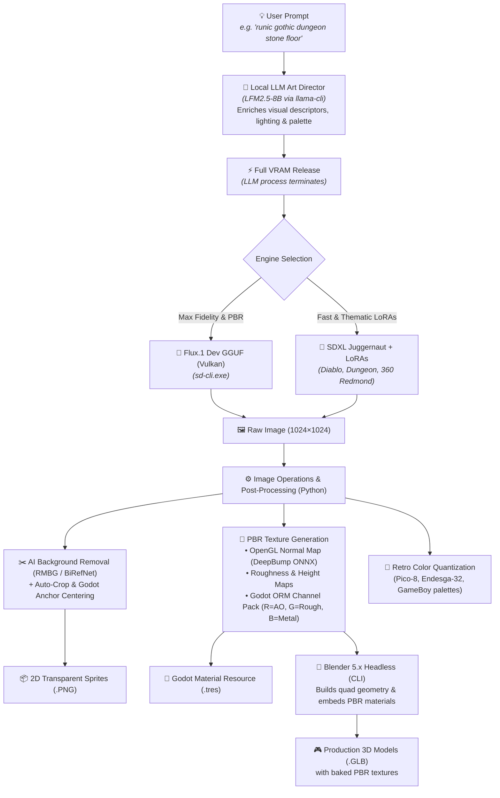
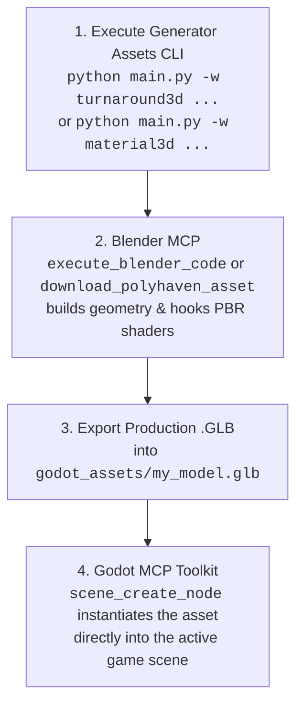

<div align="center">


# ⚔️ Generator Assets

### Modular, Headless AI Asset Pipeline for Godot Engine & Blender
**Flux.1 Dev & SDXL (Vulkan) • 3D PBR Materials • Headless Blender .GLB Meshes • 360° Skyboxes • MakeHuman / MPFB2 Characters • Procedural Audio & SFX • ESRGAN 4K**

[](https://www.python.org/)
[](https://godotengine.org/)
[](https://www.blender.org/)
[](https://www.vulkan.org/)
[](https://blackforestlabs.ai/)
[](#-3d-materials--geometry)
[](#-ai-models--lora-library)
[](LICENSE)
[](https://github.com/votre-compte/generator-assets/pulls)

<p align="center">
  <a href="#about">About</a> •
  <a href="#architecture">Architecture</a> •
  <a href="#capabilities">Capabilities</a> •
  <a href="#showcase">Showcase</a> •
  <a href="#models">Models & LoRAs</a> •
  <a href="#workflows">Workflows</a> •
  <a href="#cli">CLI Reference</a> •
  <a href="#godot">Godot 4 Guide</a> •
  <a href="#agents">AI Agents (MCP)</a> •
  <a href="#installation">Installation</a>
</p>

</div>

---

<span id="about"></span>
## 📌 About & Quick Overview

> **Repository Description (for GitHub "About"):**  
> *Headless, modular AI pipeline orchestrator generating production-ready 2D & 3D assets, PBR materials, .GLB models, and 360° skyboxes for Godot 4 & Blender via Flux.1, SDXL, and ESRGAN.*

### 🏷️ Recommended GitHub Topics / Keywords
```text
ai-game-assets, godot, godot-4, blender, blender-python, flux-dev, sdxl, pbr-textures,
game-development, deepbump, vulkan, esrgan, makehuman, mpfb2, procedural-generation,
headless-pipeline, 3d-mesh, audio-generation, pixel-art, controlnet, gguf, lora
```

`generator-assets` is a lightweight, local, and fully headless CLI pipeline orchestrator designed to transform natural language descriptions into **engine-ready 2D and 3D assets for Godot 4 and Blender**. 

Unlike heavy web-UI tools (Automatic1111, ComfyUI), this project operates with **zero Electron or web server overhead**, executes tasks sequentially with **strict VRAM management** (auto-unloading LLMs before launching diffusion models), and directly exports native engine formats: `.tres` materials, `.glb` models with embedded PBR textures, `.gdshader` files, 360° environment skies, and `.wav`/`.ogg` audio streams.

---

## ⚡ Core Value Highlights

| Feature | Description |
| :--- | :--- |
| 🎮 **Godot 4 Native First** | Generates `.tres` (`StandardMaterial3D`, `Environment`, `TileSet`, `StyleBoxTexture`), `.tscn` scenes, and `.gdshader` files out-of-the-box. |
| 🧱 **Complete PBR Map Generation** | Generates full PBR packs: Albedo, OpenGL Normal Maps (via DeepBump ONNX or Sobel), Roughness, Height, AO, and packed **ORM textures** (Red = AO, Green = Roughness, Blue = Metallic). |
| 🔨 **Headless Blender 3D Meshing** | Automatically builds 3D meshes (`.glb`) with embedded PBR textures via headless Blender CLI (`tile`, `cube`, `pillar`, `sphere`, `card`, `cutout`). |
| 👗 **MakeHuman / MPFB2 Character Suite** | Canonical humanoid 3D pipeline: seamless facial UV projections, barycentric garment retargeting (`.mhclo`), and studio Cycles validation renders. |
| 🌌 **Equirectangular 360° Skyboxes** | 2:1 panoramic skies with automated Godot 4 `WorldEnvironment` and Image-Based Lighting (IBL) configuration. |
| ⚡ **Zero VRAM Spikes** | Sequential sub-process execution: local LLM prompt enricher terminates and frees all VRAM before diffusion launches on Vulkan/GPU. |

---

<span id="architecture"></span>
## 🏛️ Pipeline Architecture



---

<span id="capabilities"></span>
## ⚖️ Capabilities & Realistic AI Boundaries

To ensure maximum productivity and avoid false expectations, here is a transparent overview of what the pipeline achieves 100% autonomously versus tasks requiring template meshes or multi-view sheets:

### ✅ 1. 100% Automated & Engine-Ready (One-Click)
- **🧱 Floors, Walls & PBR Materials (`material3d`)** : Seamless dungeon flagstones, cobblestone, mossy rock, bark, fabrics, metals with Normal, Roughness, ORM maps, and Godot `.tres`.
- **🌌 360° Skyboxes & Panoramas (`skybox`)** : Seamless equirectangular skies, space nebulae, apocalyptic clouds, and complete `WorldEnvironment.tres` setup.
- **🎲 3D Level Props (`mesh3d`)** : Floor tiles (`--shape tile`), crates/chests (`--shape cube`), pillars/columns (`--shape pillar`), orbs (`--shape sphere`), 2.5D standees (`--shape card`).
- **🔍 AI Super-Resolution (`upscale`)** : 2x, 4x, and 4K ESRGAN Vulkan upscaling with 100% Alpha channel transparency preservation.
- **✂️ Clean Cutouts & Sprites (`generate`, `rembg`)** : Clean edges with RMBG-1.4 / BiRefNet ONNX (no white halo artifacts).
- **🔊 Procedural Sound & Music (`sfx`, `audio_ambience`)** : Combat swings, magic potions, seamless background loops in `.wav` and `.ogg` formats.

---

### ⚠️ 2. What Requires Structured Approaches (Helmets, Armor & Characters)
- **The Case of a 3D Equipment Helmet (e.g. `casque.png`)** :
  - **Why ?** A single 2D front-facing image contains neither the interior hollow cavity, nor the rear geometry, nor 360° cheek guards.
  - **Direct 2.5D Extrusion Result** : Yields an embossed bas-relief or coin-like sculpture. It is **not** a hollow 3D helmet into which a character's head fits.
- **The Production-Grade Solutions Included in this Pipeline** :
  1. **Option A (Orthographic Modeling Sheet)** : Use the `turnaround3d` workflow to generate perfectly calibrated **Front + Profile orthographic views** as reference planes for Blender.
  2. **Option B (Base Mesh + PBR Retexturing)** : Download a clean base quad helmet from Kenney.nl or Godot Asset Library, then generate and project custom PBR materials using `material3d` or `outfit`.
  3. **Option C (MakeHuman / MPFB2 Canonical System)** : For human characters, use `character3d` and `makehuman_clothes` which leverage official quad helper geometries (`helper-tights`, `helper-skirt`) and barycentric binding (`.mhclo`).

---

<span id="showcase"></span>
## 🎨 Visual Showcase

### 1. PBR 3D Texture Pipeline (`material3d` & `mesh3d`)
| Runic Floor Albedo | OpenGL Normal Map | Godot ORM Channel Pack | Seamless 3x3 Tile Preview |
| :---: | :---: | :---: | :---: |
|  |  |  |  |
| *1024×1024 Base Color* | *DeepBump ONNX Relief* | *R=AO, G=Roughness, B=Metal* | *Zero-seam repeating tile* |

---

### 2. Thematic 2D Assets, Pixel Art & 4K AI Upscaling
| SDXL Diablo LoRA (`generate`) | 4K ESRGAN Super-Resolution (`upscale`) | Retro Pico-8 Pixel Art (`pixelart`) | Ancient Wood PBR (`material3d`) |
| :---: | :---: | :---: | :---: |
|  |  |  |  |
| *Dark fantasy item icon* | *Sharp 4096px with Alpha channel* | *16-color authentic palette* | *Weathered plank texture* |

---

### 3. Canonical 3D Character Suite (MakeHuman & MPFB2)
| Canonical Face Portrait | 3D Studio Cycles Render (`marc_novice`) | Runic Pillar 3D Mesh (`mesh3d`) | 360° Skybox Panorama (`skybox`) |
| :---: | :---: | :---: | :---: |
|  |  |  |  |
| *Seamless UV projection* | *Cycles 3-point studio check* | *Textured 3D .GLB mesh* | *Equirectangular 2:1 IBL sky* |

---

<span id="models"></span>
## 🤖 AI Models & LoRA Library

The architecture manages model execution dynamically without memory fragmentation:

### 1. Base Model Suite

| Model | Checkpoint File | Core Role & Strengths |
| :--- | :--- | :--- |
| **FLUX.1 [dev]** | `flux1-dev-Q6_K.gguf` | **Default Engine (3D & Photorealism)**: Unmatched prompt adherence via T5-XXL. Ideal for realistic PBR surfaces, intricate micro-details, and crisp 1024×1024 outputs. |
| **SDXL Juggernaut** | `juggernautXL_ragnarok.safetensors` | **Styles & LoRAs Engine**: Blazing fast generation (~3s/it). Automatically activated when applying style LoRAs. |
| **LFM2.5 8B** | `LFM2.5-8B-A1B-Q6_K.gguf` | **Local Art Director (LLM)**: Enriches concise prompts into professional visual diffusion descriptors. |
| **4x-UltraSharp** | `4x-UltraSharp.pth` | **Super-Resolution 4K (Default)**: 4x upscale (1024 ➔ 4096 px) preserving crisp edges and Godot Alpha transparency. |
| **RealESRGAN Anime** | `RealESRGAN_x4plus_anime_6B.pth` | **Stylized Super-Resolution**: Optimized for clean linework, cel-shading, and cartoon sprites. |

---

### 2. Pre-Installed LoRAs (`loras/` or `C:\Modeles_LLM\loras\`)

Apply any LoRA to any workflow via `-l "name:weight"`. When a LoRA is selected, the pipeline automatically switches to `SDXL Juggernaut`:

| LoRA Identifier | Size | Recommended Use Case |
| :--- | :---: | :--- |
| **`game_icon_diablo_style`** | `870 MB` | Item icons, weapons, flasks, and artifacts in a dark fantasy Diablo aesthetic. |
| **`JJsDungeon_XL`** | `435 MB` | Underground stone flagstones, dungeon walls, and mossy subterranean environments. |
| **`360RedmondResized`** | `433 MB` | Spherical 360° equirectangular panoramas for Godot environment lighting. |
| **`space_backround-XL-7`** | `217 MB` | Cosmic nebulas, deep space starfields, and planetary horizons. |
| **`game_icon_v1.0`** | `2.6 GB` | Stylized, high-contrast game inventory icons with sharp outlines. |

```bash
# Inspect available LoRAs and upscalers anytime:
python main.py --list-loras
python main.py --list-upscalers
```

---

<span id="workflows"></span>
## 📦 Complete Workflow Catalog

The engine features **26+ modular workflows** organized into 5 functional categories. Each workflow operates as an autonomous pipeline that produces production-ready assets:

```text
📋 Quick Category Map:
  • 3D Geometry & PBR Textures     : material3d, mesh3d, voxel3d, skybox, turnaround3d, flowmap
  • Humanoid 3D Characters & Outfits: character3d, makehuman_clothes, outfit, pose_control, rpg_portrait
  • 2D Sprites, Tiles & UI         : generate, spritesheet, autotile_pack, tileable, pixelart, variations, ui_9slice, rembg
  • Audio, Voice & VFX             : sfx, audio_ambience, tts_dialogue, vfx_flipbook, anim_loop, rife_interp
  • Style Consistency & Utilities  : ip_adapter, upscale, batch
```

---

### 🧱 1. 3D Geometry & PBR Textures

#### 1.1. `material3d` — Production PBR Texture Pack
* **Process**:
  1. Accepts either a textual concept (e.g., *"dungeon stone runes"*) or an existing 2D texture (`-i texture.png`).
  2. If prompt-based, generates a 1024×1024 diffuse albedo texture via Flux.1 Dev Vulkan.
  3. Feeds the albedo into DeepBump ONNX neural network to estimate physically accurate OpenGL normal, roughness, displacement height, and ambient occlusion maps (falls back to Sobel spatial gradients if `--pbr-engine sobel`).
  4. Packs AO (Red), Roughness (Green), and Metallic (Blue) into a unified Godot-standard ORM texture.
  5. Computes a 3×3 repeating grid to verify seamless tiling borders.
  6. Automatically writes a native Godot 4 `StandardMaterial3D` (`.tres`) linking all maps with correct UV channels.
* **Inputs**: `prompt` or `-i, --input`, `-s, --size` (512, 1024, 2048), `--pbr-engine` (`auto`, `deep`, `sobel`), `--normal-strength` (default: 3.5).
* **Engines**: Flux.1 Dev GGUF, DeepBump ONNX, PIL, NumPy.
* **Outputs**: `_albedo.png`, `_normal.png`, `_roughness.png`, `_height.png`, `_ao.png`, `_orm.png`, `_material.tres`, `_preview3x3.png`.
* **Example**:
  ```bash
  uv run python main.py -w material3d "ancient gothic stone tile with purple runes and moss" -s 1024 -o runic_stone
  ```

#### 1.2. `mesh3d` — Textured 3D Meshes (.GLB) via Headless Blender
* **Process**:
  1. Executes the `material3d` pipeline first to produce a complete PBR texture pack (Albedo, Normal, ORM, Height).
  2. Launches Blender 5.x in headless CLI mode (`--background --python-expr`) without opening any GUI window.
  3. Constructs parametric 3D quad geometry according to `--shape` (`tile` = beveled floor slab, `cube` = chest/crate with chamfered edges, `pillar` = octagonal dungeon column, `sphere` = magic orb, `card` = 2.5D standee, `cutout` = extruded silhouette).
  4. Automatically constructs a `Principled BSDF` material node graph with normal mapping and roughness reflections hooked up to the generated textures.
  5. Packs all textures directly into a binary `.glb` container optimized for Godot 4 `MeshInstance3D`.
* **Inputs**: `prompt` or `-i, --input`, `--shape` (`tile`, `cube`, `pillar`, `sphere`, `card`, `cutout`), `-s, --size`.
* **Engines**: Flux.1 Dev GGUF, DeepBump ONNX, Blender 5.x CLI (`bpy`).
* **Outputs**: `_3d_<shape>.glb` (self-contained with embedded textures), plus all underlying PBR map files.
* **Example**:
  ```bash
  uv run python main.py -w mesh3d "ornate ancient iron wrought chest" --shape cube -o chest_3d
  ```

#### 1.3. `voxel3d` — Discretized 3D Voxel Meshes (.GLB)
* **Process**:
  1. Accepts an input 2D sprite or generates a high-contrast item sprite with clean silhouette.
  2. Discretizes the 2D image into a 3D occupancy volume grid (NumPy array of shape `[grid_size, grid_size, voxel_depth]`).
  3. Computes voxel relief depth based on perceived luminance and silhouette boundaries.
  4. Executes aggressive internal face culling: scans adjacent voxel neighbors and strips all occluded interior quad faces, drastically reducing polycount.
  5. Launches Blender headless to build the optimized mesh, assigns sRGB Vertex Colors to vertices, and exports a lightweight `.glb` ready for Godot 4 `GridMap`.
* **Inputs**: `-i, --input` or `prompt`, `--grid-size` (e.g., 16, 32, 64), `--voxel-depth` (default: 4), `--voxel-scale` (default: 0.05).
* **Engines**: PIL, NumPy 3D Volume Array, Blender Headless CLI (`bpy`).
* **Outputs**: `_voxel.glb` with optimized vertex colors.
* **Example**:
  ```bash
  uv run python main.py -w voxel3d -i godot_assets/cheval.png --grid-size 32 --voxel-depth 4 -o horse_voxel
  ```

#### 1.4. `skybox` — 360° Equirectangular Panoramic Environments
* **Process**:
  1. Accepts a celestial or environment description (space nebula, stormy sky, fantasy dungeon vault).
  2. Injects equirectangular spherical horizon anchors into the prompt with seamless horizontal wrap conditioning.
  3. Renders a 2:1 widescreen spherical texture (e.g. 2048×1024 or 4096×2048) with Flux.1 Dev or SDXL + 360 LoRAs.
  4. Automatically formats and exports a Godot 4 `Environment.tres` resource configured with `PanoramaSkyMaterial`, `BackgroundSky` mode, tone mapping, and ambient Image-Based Lighting (IBL).
* **Inputs**: `prompt`, `-s, --size` / `--width` & `--height` (default: 2048×1024), `-l, --lora` (e.g., `360RedmondResized:1.0`).
* **Engines**: Flux.1 Dev / SDXL Vulkan, Godot Resource Serializer.
* **Outputs**: `_sky.png`, `_sky_env.tres`.
* **Example**:
  ```bash
  uv run python main.py -w skybox "purple cosmic galaxy nebula with glowing starlight" -o space_skybox
  ```

#### 1.5. `turnaround3d` — Calibrated Orthogonal Modeling Sheets
* **Process**:
  1. Formulates synchronized prompts for orthogonal Front (T-pose / A-pose) and Right-Side profile views.
  2. Enforces a fixed random seed and anatomical anchor constraints so character height, head proportions, and limb ratios match identically between perspectives.
  3. Removes background artifacts and crops each view to a calibrated bounding box.
  4. Assembles a unified side-by-side modeling card with horizontal alignment guideline overlays (crown, eyes, chin, shoulders, waist, knees, ground) for direct viewport loading in Blender.
* **Inputs**: `prompt`, `-s, --size` (default: 512 per view), `--seed`.
* **Engines**: Flux.1 Dev / SDXL, PIL canvas compositing.
* **Outputs**: `_front.png`, `_side.png`, `_model_sheet.png`.
* **Example**:
  ```bash
  uv run python main.py -w turnaround3d "dwarven warrior with heavy runic plate armor" -o dwarf_sheet
  ```

#### 1.6. `flowmap` — Vector Velocity Flowmaps & Water/Lava Shaders
* **Process**:
  1. Calculates a 2D directional vector field based on `--angle` (degrees) and adds procedural Curl Noise turbulence.
  2. Encodes directional velocity into RGB color space: Red = X vector, Green = Y vector, Blue = flow magnitude.
  3. Generates a seamless repeating flowmap texture.
  4. Writes a custom Godot 4 `.gdshader` script utilizing dual-sample phase-shifted time offsets to eliminate texture pulsing or visible resetting.
  5. Exports a pre-configured `ShaderMaterial` (`.tres`) ready to drop onto water planes, rivers, or lava channels in 2D or 3D.
* **Inputs**: `prompt`, `--angle` (degrees, default: 90 = downwards), `--flow-type` (`river`, `vortex`, `radial`, `optical`), `--turbulence` (0.0 to 1.0), `--mode-2d`.
* **Engines**: NumPy procedural vector field generator, Godot shader compiler.
* **Outputs**: `_flowmap.png`, `_water.gdshader`, `_material.tres`.
* **Example**:
  ```bash
  uv run python main.py -w flowmap "molten volcanic lava river" --angle 45 --turbulence 0.4 -o lava_flow
  ```

---

### 👤 2. Humanoid 3D Characters & Wardrobe (MakeHuman / MPFB2)

#### 2.1. `character3d` — Canonical Humanoid Pipeline
* **Process**:
  1. Generates photorealistic skin albedo and projects facial details (scars, dark circles, eye color) onto the MakeHuman hm08 standard UV layout without 2D cutting seams.
  2. Resolves barycentric vertex bindings for official quad garments (`.mhclo`), matching the target character's age, gender, and muscle sliders.
  3. Instantiates an MPFB2 avatar in headless Blender, attaches hair, eyes, and eyebrows, and configures Principled BSDF materials with Subsurface Scattering (SSS).
  4. Exports the editable `.blend` project, a game-ready `.glb` file, and produces a 3-point studio Cycles validation render.
* **Inputs**: `--portrait` (reference image), `--recipe-script` (MPFB python recipe), `--name` (character identifier).
* **Engines**: MakeHuman / MPFB2 headless, Blender Cycles, NumPy UV alignment.
* **Outputs**: `_face_diffuse.png`, `.blend`, `.glb`, `_beauty_render.png`.
* **Example**:
  ```bash
  uv run python scripts/character_pipeline.py --portrait "godot_assets/exact_face_portrait.png" --recipe-script "poc_3d/create_marc_mpfb2.py" --name marc_novice
  ```

#### 2.2. `makehuman_clothes` — Modular Quad Wardrobe Generator
* **Process**:
  1. Takes a thematic clothing concept (e.g. *"medieval leather rogue armor"*).
  2. Generates pure seamless raw material PBR textures (leather, linen, iron rings) with 4K ESRGAN Vulkan upscaling.
  3. Leverages official MakeHuman helper quad geometries (`helper-tights`, `helper-skirt`) to maintain natural draping, open sleeves, and high boots.
  4. Automatically compiles `.mhclo` (barycentric coordinates), `.obj` (3D geometry), `.mhmat` (material descriptor), and `.thumb` (preview icon) files directly into `%APPDATA%/.../mpfb/data/clothes/`.
  5. Creates a test `.blend` scene with an avatar dressed in the new wardrobe with Cycles lighting.
* **Inputs**: `prompt` (clothing theme), `--parts` (`torso,pants,shoes`), `--mpfb-dir` (custom target path).
* **Engines**: Flux.1 Dev, ESRGAN 4K, MakeHuman barycentric binding compiler, Blender 5.x.
* **Outputs**: `.mhclo`, `.obj`, `.mhmat`, `.thumb` files per clothing item, plus test `.blend`.
* **Example**:
  ```bash
  uv run python main.py -w makehuman_clothes "dark worn leather ranger armor" --parts "torso,pants,shoes" -o dark_ranger
  ```

#### 2.3. `outfit` — Automated UV Garment Retexturing
* **Process**:
  1. Inspects existing clothing meshes attached to a character in a Blender scene.
  2. Reads the original MakeHuman sewing pattern UV layouts (preserving 100% of seams, pockets, folds, and button placements).
  3. Generates seamless fabric/leather textures (Albedo, Normal, Roughness) via diffusion.
  4. Calls headless Blender to create independent material slots, applies the textures to the garment quad meshes, and updates the `.blend` file.
  5. Re-exports the production `.glb` model and renders an updated 3-point lighting beauty check.
* **Inputs**: `--character` (e.g. `marc_novice`), `--top` (description of top fabric), `--shoes` (description of footwear material).
* **Engines**: Flux.1 Dev Vulkan, Blender Headless CLI (`bpy`), PBR texture synthesis.
* **Outputs**: `godot_assets/textures/<character>/*`, updated `<character>.blend`, updated `<character>.glb`, `<character>_beauty_render.png`.
* **Example**:
  ```bash
  uv run python main.py -w outfit --character marc_novice --top "rough medieval beige burlap tunic" --shoes "dark worn leather boots"
  ```

#### 2.4. `pose_control` — OpenPose Skeleton Guidance & Rigged Godot Scenes
* **Process**:
  1. Queries the 18-point COCO OpenPose coordinate library for the chosen action pose (`idle`, `slash_attack`, `cast_spell`, `shield_block`, `jump`, `walk`).
  2. Renders the OpenPose colored bone skeleton stick-figure card.
  3. Uses the skeleton to guide character diffusion, locking the limbs and torso into the exact target posture.
  4. Removes the background cleanly via RMBG / BiRefNet.
  5. Computes dynamic 2D weapon and effect attachment points (hands, head, feet) from the pose keypoints.
  6. Automatically compiles a Godot 4 `.tscn` scene with a `Sprite2D` and hierarchical `Marker2D` nodes ready for attaching weapons or VFX.
* **Inputs**: `prompt`, `--pose` (`idle`, `slash_attack`, `cast_spell`, `shield_block`, `jump`, `walk`), `-s, --size`.
* **Engines**: OpenPose COCO 18-point mapper, Flux.1 / SDXL, Godot Scene Builder.
* **Outputs**: `_openpose_skeleton.png`, `_character.png`, `_character.tscn`, `_rig.json`.
* **Example**:
  ```bash
  uv run python main.py -w pose_control "shadow knight with a glowing sword" --pose slash_attack -o knight_slash
  ```

#### 2.5. `rpg_portrait` — Multi-Emotion Dialogue Character Sets
* **Process**:
  1. Takes a base character description or portrait image.
  2. Iterates across specified emotional states (*Neutral, Happy, Angry, Sad, Hurt, Surprised*), injecting calibrated emotional micro-descriptors while locking identity seeds.
  3. Removes background halos to isolate the character portraits.
  4. Combines the resulting portraits into a single reference contact sheet (`_portrait_grid.png`).
  5. Writes a Godot dialogue JSON manifest containing paths, emotional tags, and metadata ready for Dialogic or custom dialogue managers.
* **Inputs**: `prompt` or `-i, --input`, `--emotions` (default: `neutral,happy,angry,sad,hurt`), `-s, --size`.
* **Engines**: Flux.1 / SDXL Vulkan, BiRefNet / RMBG ONNX, JSON Manifest Generator.
* **Outputs**: individual emotion `.png` files, `_portrait_grid.png`, `_dialogue_manifest.json`.
* **Example**:
  ```bash
  uv run python main.py -w rpg_portrait "dark sorceress with golden eyes" --emotions "neutral,happy,angry,sad,hurt" -o sorceress
  ```

---

### 🎨 3. 2D Sprites, Tiles & UI

#### 3.1. `generate` — Standard Isolated 2D Game Asset
* **Process**:
  1. Accepts an item, character, prop, or tile concept.
  2. Optional prompt expansion via local LLM (`--use-llm`) or direct passthrough (default).
  3. Renders the asset on solid contrast background via Flux.1 Dev or SDXL with optional LoRAs (`-l`).
  4. Automatically removes background via flood-fill or AI neural segmentation (`--segmenter birefnet`).
  5. Crops tight bounding box and centers the asset with Godot bottom-center (characters) or exact-center (items) anchor offsets.
  6. Optionally triggers 4K AI ESRGAN upscaling (`--upscale`).
* **Inputs**: `prompt`, `-t, --type` (`item`, `character`, `prop`, `tile`), `-i, --input` (Img2Img), `--upscale`, `-l, --lora`.
* **Engines**: Flux.1 / SDXL, RMBG-1.4 / BiRefNet ONNX, Real-ESRGAN Vulkan.
* **Outputs**: Clean isolated transparent `.png`.
* **Example**:
  ```bash
  uv run python main.py -w generate "legendary royal gold shield with an engraved lion" --upscale
  ```

#### 3.2. `spritesheet` — Multi-Angle Character Sprite Sheet
* **Process**:
  1. Formulates 4 sequential perspective prompts (Front, Right-Side, Back, Left-Side) with consistent character identity anchors.
  2. Generates all 4 angles on isolated backgrounds.
  3. Performs background removal and automatic dimensional alignment across all frames.
  4. Stitches the frames into a clean horizontal or grid spritesheet atlas.
  5. Generates a Godot JSON frame atlas specifying UV rectangles for `SpriteFrames` / `AnimatedSprite2D`.
* **Inputs**: `prompt`, `-s, --size` (cell size, default: 256), `--columns` (default: 4), `--tolerance`.
* **Engines**: Flux.1 / SDXL, PIL grid compositor, JSON atlas generator.
* **Outputs**: `_spritesheet.png`, individual angle `.png` files, `_atlas.json`.
* **Example**:
  ```bash
  uv run python main.py -w spritesheet "undead skeleton warrior with rusted blade" --columns 4 -o skeleton_walk
  ```

#### 3.3. `autotile_pack` — 47-Tile Minimal 3x3 Wang Autotile Atlas
* **Process**:
  1. Generates or loads textures for Biome A (foreground, e.g. green grass) and Biome B (background, e.g. dark dirt).
  2. Programmatically constructs the 47 canonical tiles required by Wang / Minimal 3x3 autotiling: inner corners, outer corners, single edges, islands, and center fills.
  3. Compiles all 47 tiles into an organized 8-column atlas texture.
  4. Automatically constructs a Godot 4 `TileSet.tres` resource with terrain sets, terrain layers, and 3x3 minimal peering bits pre-configured for instant painted tiles.
* **Inputs**: `--biome-a` (prompt or image), `--biome-b` (prompt or image), `-s, --size` (tile resolution, e.g., 64, 128), `--columns` (default: 8).
* **Engines**: Flux.1 Dev, NumPy / PIL bitmask synthesis, Godot TileSet compiler.
* **Outputs**: `_atlas.png`, `_tileset.tres`.
* **Example**:
  ```bash
  uv run python main.py -w autotile_pack --biome-a "lush green grass" --biome-b "dark cracked dirt" --size 64 -o grass_to_dirt
  ```

#### 3.4. `tileable` — Infinite Seamless Repeating Textures
* **Process**:
  1. Takes a terrain or material prompt.
  2. Injects circular padding boundary conditions into the diffusion process so opposite edges (left/right, top/bottom) seamlessly match.
  3. Renders the square tile texture.
  4. Renders a 3×3 tiled verification preview to confirm absence of visible seams or repeating artifacts.
* **Inputs**: `prompt`, `-s, --size` (default: 512), `--no-preview` (optional).
* **Engines**: Flux.1 / SDXL with circular padding kernel, PIL 3x3 tiling verifier.
* **Outputs**: `_tile.png`, `_preview3x3.png`.
* **Example**:
  ```bash
  uv run python main.py -w tileable "mossy dark dungeon cobblestone pattern" -s 512 -o mossy_cobblestone
  ```

#### 3.5. `pixelart` — Retro Palette Color Quantization & Downsampling
* **Process**:
  1. Takes an existing image or generates a new sprite with clean outlines.
  2. Downsamples the image to a low-resolution pixel grid (`--grid-size`, e.g. 32×32, 64×64).
  3. Quantizes each pixel color to the nearest match in a chosen historical hardware palette (Pico-8 16-color, Endesga-32, GameBoy 4-color) using Euclidean distance in Lab color space.
  4. Upscales the resulting pixel art using Nearest-Neighbor interpolation to ensure razor-sharp pixels on modern displays.
* **Inputs**: `-i, --input` or `prompt`, `--palette` (`pico8`, `endesga32`, `gameboy`), `--grid-size` (default: 64), `-s, --size` (export display size).
* **Engines**: PIL ImageOps, NumPy color quantization.
* **Outputs**: `_pixelart_<palette>.png`.
* **Example**:
  ```bash
  uv run python main.py -w pixelart -i godot_assets/casque.png --palette pico8 --grid-size 64 -o helmet_retro
  ```

#### 3.6. `variations` — Thematic Elemental Asset Variations
* **Process**:
  1. Takes a base item/concept (e.g. *"magic sword"*).
  2. Iterates across specified themes (e.g. Fire, Ice, Poison, Lightning, Void).
  3. Performs guided diffusion with theme-specific descriptors and color harmonies.
  4. Removes backgrounds and centers each variant.
* **Inputs**: `prompt` or `-i, --input`, `--themes` (comma-separated list, e.g. `fire,ice,poison,lightning`), `-s, --size`.
* **Engines**: Flux.1 / SDXL Img2Img, RMBG segmentation.
* **Outputs**: Individual variant `.png` files named `<base>_<theme>.png`.
* **Example**:
  ```bash
  uv run python main.py -w variations -i godot_assets/potion_diablo.png --themes "fire,frost,poison,shadow" -o potion_elemental
  ```

#### 3.7. `ui_9slice` — Expandable 9-Patch Frames & Buttons
* **Process**:
  1. Generates an ornamental UI dialog frame, inventory slot, or button border (or loads `-i`).
  2. Performs automatic border detection (`--auto-margin`) or uses a specified pixel margin (`--margin`) to split the frame into 9 slices.
  3. Generates a Godot 4 `StyleBoxTexture` (`.tres`) with top, bottom, left, right margins configured with repeat/stretch axes.
  4. Generates an example Godot 4 `NinePatchRect` scene (`.tscn`).
  5. Exports a stretched test preview demonstrating distortion-free scaling.
* **Inputs**: `prompt` or `-i, --input`, `--margin` (default: 32), `--auto-margin`.
* **Engines**: PIL 9-slice analyzer, Godot Resource Serializer.
* **Outputs**: `.png`, `_stylebox.tres`, `_ninepatch.tscn`, `_preview_stretched.png`.
* **Example**:
  ```bash
  uv run python main.py -w ui_9slice "ornate fantasy golden dialog box with ruby corners" --margin 32 -o gold_dialog
  ```

#### 3.8. `rembg` — High-Precision Neural Background Removal
* **Process**:
  1. Loads an existing 2D asset image with complex edges (hair, fur, semi-transparent glass, weapons).
  2. Runs ONNX neural segmentation (RMBG-1.4 or BiRefNet).
  3. Computes a continuous alpha matte, completely removing solid or noisy backgrounds without white fringes.
  4. Automatically centers the sprite and tightens transparent margins.
* **Inputs**: `-i, --input` (required), `--segmenter` (`birefnet`, `rmbg`), `-s, --size` (optional resize).
* **Engines**: BiRefNet ONNX / RMBG-1.4 ONNX, NumPy, PIL.
* **Outputs**: `_rembg.png`.
* **Example**:
  ```bash
  uv run python main.py -w rembg -i godot_assets/cheval.png -o horse_transparent
  ```

---

### 🔊 4. Audio, Voice & VFX

#### 4.1. `sfx` — Procedural Sound Effects Synthesis
* **Process**:
  1. Accepts a sound effect category or description (`sword_slash`, `magic_potion`, `explosion`, `coin_pickup`, `spell_cast`).
  2. Synthesizes multi-oscillator audio waveforms (sine, saw, noise bursts, resonant low-pass filter sweeps, pitch envelopes) at 44.1 kHz 16-bit PCM.
  3. Applies dynamic range compression, normalization, and smooth attack/release envelopes to eliminate clipping and pop artifacts.
  4. Exports both lossless WAV and compressed OGG Vorbis formats optimized for Godot's `AudioStreamPlayer`.
* **Inputs**: `prompt` (sound category or concept), `--duration` (in seconds, default: 1.5).
* **Engines**: NumPy audio synthesizer, SoundFile encoder.
* **Outputs**: `_sfx.wav`, `_sfx.ogg`.
* **Example**:
  ```bash
  uv run python main.py -w sfx "heavy sword slash metal impact" --duration 1.2 -o sword_strike
  ```

#### 4.2. `audio_ambience` — Procedural Seamless Looping Ambient Soundscapes
* **Process**:
  1. Accepts an environmental theme (`dungeon`, `forest`, `storm`, `space`, `tavern`, `campfire`).
  2. Synthesizes multi-layered procedural audio tracks (e.g. for dungeon: subterranean rumble, resonant water drops, wind gusts, dark binaural drones).
  3. Applies seamless circular crossfading so the beginning and end of the audio loop match phase without any clicks or gaps.
  4. Generates a Godot 4 `AudioBusLayout.tres` resource featuring configured Reverb and low-shelf filter buses.
  5. Exports an `AudioStreamPlayer` scene (`.tscn`) pre-configured with autoplay and loop flags.
* **Inputs**: `prompt` (ambience preset or description), `--duration` (seconds, default: 8.0).
* **Engines**: NumPy procedural audio synthesizer, SoundFile encoder, Godot bus serializer.
* **Outputs**: `_ambience.wav`, `_ambience.ogg`, `_bus_layout.tres`, `_player.tscn`.
* **Example**:
  ```bash
  uv run python main.py -w audio_ambience "dark subterranean dungeon with distant water drops" --duration 8.0 -o dungeon_ambience
  ```

#### 4.3. `tts_dialogue` — Emotional Character Voice & Lip-Sync
* **Process**:
  1. Accepts a character name, a list of emotions (`neutral,happy,angry,sad,hurt`), and voice pitch tuning.
  2. Generates spoken voice lines with intonation, timbre, and cadence modified according to each emotional state.
  3. Extracts real-time phonetic visemes (A, E, I, O, U, consonants, silence) mapped with precise timecodes.
  4. Exports individual `.wav` and `.ogg` audio files for each emotion line.
  5. Generates a consolidated dialogue manifest (`.json`) ready for Godot 4 dialogue engines (Dialogic, DialogueManager) to animate 2D or 3D mouths.
* **Inputs**: `prompt` (character name), `--emotions` (comma-separated), `--pitch` (fundamental pitch in Hz, default: 160.0).
* **Engines**: Kokoro TTS / Python audio synthesizer, viseme alignment engine.
* **Outputs**: `<emotion>.wav`, `<emotion>.ogg`, `_dialogue_manifest.json`.
* **Example**:
  ```bash
  uv run python main.py -w tts_dialogue "dark_sorceress" --emotions "neutral,happy,angry,hurt" --pitch 180 -o sorceress_voice
  ```

#### 4.4. `vfx_flipbook` — 4x4 Animated Particle Sheets (.tscn)
* **Process**:
  1. Takes an effect concept (`explosion`, `fire`, `lightning`, `portal`, `slash`, `aura`).
  2. Generates a 4×4 grid (16 chronological animation frames) of the evolving particle simulation with alpha transparency.
  3. Writes a Godot 4 `StandardMaterial3D` or `CanvasItemMaterial` with `particles_anim_h_frames = 4` and `particles_anim_v_frames = 4`.
  4. Writes a `ParticleProcessMaterial.tres` with velocity, lifetime, and color ramp settings.
  5. Writes a complete `GPUParticles3D` / `GPUParticles2D` scene (`.tscn`) ready to instantiate in your game level.
* **Inputs**: `prompt`, `--vfx-type` (`explosion`, `fire`, `lightning`, `portal`, `slash`, `aura`), `--mode-2d`.
* **Engines**: Flux.1 Dev / SDXL, PIL grid compositor, Godot particle resource generator.
* **Outputs**: `_flipbook.png`, `_vfx_material.tres`, `_particles_process.tres`, `_vfx.tscn`.
* **Example**:
  ```bash
  uv run python main.py -w vfx_flipbook "purple arcane void explosion" --vfx-type explosion -o arcane_explosion
  ```

#### 4.5. `anim_loop` — Seamless Animated Loop Shaders
* **Process**:
  1. Accepts an effect or texture animation prompt (portal vortex, flowing waterfall, flickering fire).
  2. Synthesizes a periodic keyframe sequence where frame N connects seamlessly back to frame 0.
  3. Stitches the frames into an animation atlas spritesheet.
  4. Exports a custom Godot 4 `.gdshader` with time-offset dual sampling to eliminate looping seams.
  5. Exports a pre-configured `ShaderMaterial` (`.tres`) and `AnimatedTexture` (`.tres`) for UI and CanvasItem nodes.
* **Inputs**: `prompt`, `--frames` (default: 16), `--fps` (default: 12.0), `--columns` (default: 4), `--mode-2d`.
* **Engines**: Periodic circular phase generator, PIL atlas builder, Godot shader writer.
* **Outputs**: `_spritesheet.png`, `_loop.gdshader`, `_loop_material.tres`, `_animated_tex.tres`.
* **Example**:
  ```bash
  uv run python main.py -w anim_loop "swirling cosmic void portal" --frames 16 --fps 12 -o void_portal
  ```

#### 4.6. `rife_interp` — AI Frame Rate Multiplication (60 FPS)
* **Process**:
  1. Takes an existing linear spritesheet (e.g. a 4-frame walk cycle or 8-frame attack).
  2. Slices the sheet into separate discrete sequential image frames.
  3. Employs RIFE v4 ONNX optical flow neural network to interpolate intermediate in-between motion frames (2x or 4x multiplication).
  4. Preserves 100% of alpha transparency across interpolated frames.
  5. Reassembles the new smooth sequence into a continuous high-framerate spritesheet.
* **Inputs**: `-i, --input` (source spritesheet path), `--columns` (number of frames), `--factor` (2 or 4).
* **Engines**: RIFE v4 ONNX optical flow model, PIL frame sequencer.
* **Outputs**: `_rife_<factor>x.png`.
* **Example**:
  ```bash
  uv run python main.py -w rife_interp -i godot_assets/spritesheet.png --columns 4 --factor 2 -o anim_60fps
  ```

---

### 🛠️ 5. Style Consistency, Upscaling & Batching

#### 5.1. `ip_adapter` — Art Style Locking & Godot Palettes
* **Process**:
  1. Takes a reference image representing your game's visual identity, palette, and materials.
  2. Extracts dominant color palettes, luminance ranges, and shading rules.
  3. Iterates across a requested list of items (e.g., `sword,shield,ring,helmet`) conditioning each generation on the reference image features.
  4. Assembles an interactive Consistency Board image comparing the reference against all derived items.
  5. Exports the extracted color scheme into a Godot 4 `.tres` palette, Aseprite `.gpl`, and JSON palette.
* **Inputs**: `-i, --input` (reference image), `--items` (comma-separated list of items), `-s, --size`.
* **Engines**: Style analysis extractor, Flux.1 / SDXL, Godot palette exporter.
* **Outputs**: Item `.png` files, `_consistency_board.png`, `.tres`, `.gpl`, `.json`.
* **Example**:
  ```bash
  uv run python main.py -w ip_adapter -i godot_assets/potion_diablo.png --items "sword,shield,ring,helmet" -o diablo_set
  ```

#### 5.2. `upscale` — 4K AI Super-Resolution (ESRGAN Vulkan)
* **Process**:
  1. Loads any 2D sprite, texture, or render.
  2. Passes the RGB channels through Real-ESRGAN Vulkan neural network (4x-UltraSharp or RealESRGAN Anime 6B) for super-sharp edge reconstruction.
  3. Separately processes and bilinearly scales the Alpha transparency channel, merging it back to guarantee zero alpha halos or border corruption.
* **Inputs**: `-i, --input` (source image), `--factor` (e.g., 2, 4), `--upscale-model` (`ultrasharp`, `anime`, `auto`).
* **Engines**: Real-ESRGAN Vulkan (`4x-UltraSharp.pth`, `RealESRGAN_x4plus_anime_6B.pth`).
* **Outputs**: `_upscaled_<WxH>.png`.
* **Example**:
  ```bash
  uv run python main.py -w upscale -i godot_assets/casque.png --factor 4 --upscale-model ultrasharp
  ```

#### 5.3. `batch` — Automated Batch Recipe Execution
* **Process**:
  1. Loads a JSON recipe file or text prompt list.
  2. Parses target workflows, prompts, and custom overrides per task.
  3. Sequentially executes each generation task while actively releasing VRAM between jobs.
  4. Produces a consolidated report of all exported assets.
* **Inputs**: `--file` / `--recipe` (JSON recipe path or newline-delimited text file).
* **Engines**: WorkflowRegistry dispatcher, JSON recipe parser.
* **Outputs**: Complete batch of generated game assets.
* **Example**:
  ```bash
  uv run python main.py -w batch --file recipes/dungeon_pack.json
  ```

---

<span id="cli"></span>
## 💻 CLI Reference & Cheat Sheet

```text
Usage: python main.py [prompt] [options]

Primary Options:
  prompt                    Asset description or design concept.
  -w, --workflow            Target workflow name (default: 'generate').
  -i, --input               Input image path (for Img2Img, upscale, variations, pixelart).
  -t, --type                2D asset category: item, character, prop, tile.
  --shape                   3D shape for mesh3d: tile, cube, pillar, cylinder, sphere, card, cutout.
  -o, --output              Output file basename (without extension).
  -d, --output-dir          Destination directory (default: 'godot_assets/').
  -s, --size                Square output resolution in pixels.

AI Engines & Models:
  --sd-model                Diffusion model: 'flux', 'juggernaut', 'sdxl' or file path.
  --use-llm                 Enable local LLM prompt expansion (default: direct prompt passthrough).
  --no-llm                  Disable local LLM prompt expansion (default behavior).
  --seed                    Random seed (-1 for automatic random).
  --strength                Denoising strength for Img2Img / guided diffusion (default: 0.55).
  --segmenter               Background remover: 'auto', 'birefnet', 'rmbg', 'floodfill', 'none'.
  --pbr-engine              PBR estimator: 'auto', 'deep' (DeepBump ONNX), 'sobel'.
  -l, --lora                Apply LoRA in 'name:weight' format (e.g. -l 'game_icon_diablo_style:0.8').
  --upscale                 Automatically trigger 4K ESRGAN AI upscaling after generation.
  --upscale-model           ESRGAN model ('ultrasharp', 'anime', 'auto').

Workflow-Specific Flags:
  --pose                    OpenPose preset for pose_control (idle, slash_attack, cast_spell, shield_block, jump, walk).
  --pitch                   Voice pitch in Hz for tts_dialogue (default: 160.0).
  --fps                     Framerate for anim_loop (default: 12.0).
  --items                   Comma-separated list of items for ip_adapter (e.g. 'sword,shield,ring,helmet').
  --angle                   Flow angle in degrees for flowmap (default: 90 = downwards).
  --flow-type               Flow type for flowmap ('river', 'vortex', 'radial', 'optical').
  --turbulence              Turbulence strength for flowmap (default: 0.35).
  --margin                  Fixed 9-slice margin in pixels for ui_9slice.
  --auto-margin             Automatic margin detection for ui_9slice.
  --voxel-depth             Extrusion thickness in voxels for voxel3d.
  --voxel-scale             Voxel size in Godot units for voxel3d.
  --biome-a, --biome-b      Biome prompts/textures for autotile_pack.
  --factor                  Multiplication factor for upscaling or RIFE interpolation (2x, 4x).
  --vfx-type                Effect preset for vfx_flipbook or anim_loop ('explosion', 'fire', 'portal').
  --emotions                Comma-separated emotions for rpg_portrait and tts_dialogue.
  --duration                Duration in seconds for sfx and audio_ambience.
  --character               Target character name for outfit (default: 'marc_novice').
  --top, --shoes            Materials description for outfit workflow.

Utility Flags:
  --interactive             Launch the interactive console menu (workflows 1-26).
  --check                   Verify system requirements, paths, and model checkpoints.
  --list-workflows          Display all registered workflows.
  --list-loras              Display detected LoRAs.
  --list-upscalers          Display detected ESRGAN models.
```

---

### ⚡ Practical CLI Quick Examples

```bash
# 1. Generate 2D item icon with auto 4K AI upscaling (4096×4096 px)
uv run python main.py -w generate "royal gold shield with an engraved lion" --upscale

# 2. Generate dark fantasy potion using Diablo LoRA (auto-switches to SDXL)
uv run python main.py -w generate "dark mana potion" -l game_icon_diablo_style:0.9 --upscale

# 3. Create complete PBR stone floor tile (.tres + OpenGL Normal + ORM + Albedo)
uv run python main.py -w material3d "ancient gothic stone tile with purple runes" -s 1024 -o sol_runique

# 4. Generate 3D mesh model with embedded PBR textures via Blender
uv run python main.py -w mesh3d "ancient iron wrought treasure chest" --shape cube -o coffre_3d

# 5. Generate 360° equirectangular skybox with space LoRA
uv run python main.py -w skybox "purple cosmic nebula with dark obsidian moons" -l space_backround-XL-7:1.0

# 6. Re-texture MakeHuman character outfit with custom medieval materials
uv run python main.py -w outfit --character marc_novice --top "rustic medieval beige burlap tunic" --shoes "dark worn leather boots"

# 7. Upscale existing image directly with 4x-UltraSharp
uv run python main.py -w upscale -i godot_assets/casque.png --factor 4 --upscale-model ultrasharp
```

---

<span id="godot"></span>
## 🎮 Godot 4 Integration Guide

### 1. Applying PBR Materials (`.tres`)
1. Drag and drop the `godot_assets/` folder into your Godot project's `res://assets/`.
2. Add a **`MeshInstance3D`** node (e.g. `PlaneMesh` for ground or `BoxMesh` for walls).
3. In the Inspector, drag the generated `.tres` file (e.g. `sol_runique_material.tres`) directly into the **Material** property.
4. Albedo, dynamic OpenGL Normal relief, and ORM reflections are active immediately.

---

### 2. Using 3D Meshes (`.glb`)
1. Drag the `.glb` file (e.g. `coffre_3d.glb` or `sol_runique_3d_tile.glb`) into your **3D Scene Tree** or Viewport.
2. Geometry, UV coordinates, and embedded PBR textures load seamlessly with zero manual shader setup.

---

### 3. Setting Up 360° Skyboxes
1. Add a **`WorldEnvironment`** node to your 3D scene.
2. Drag the generated environment resource (e.g. `ciel_space_env.tres`) into the **Environment** slot.
3. Your scene instantly gains realistic 360° panoramic background visuals and Image-Based Lighting (IBL).

---

<span id="agents"></span>
## 🤖 AI Coding Agents Guide (MCP)

> **Note for AI Assistant Agents (Claude, Gemini, Antigravity):**  
> Users often do not wish to model manually in Blender or write repetitive engine setup code. You can leverage the `blender` and `godot-mcp-toolkit` MCP servers to automate the complete asset pipeline end-to-end.



### Typical Agent Actions:
1. **Humanoid Characters & Outfits** :
   - Consult the dedicated [**`GUIDE_AGENT_IA_HABILLAGE.md`**](GUIDE_AGENT_IA_HABILLAGE.md).
   - Use official **MakeHuman Community patterns (`.mhclo`)** that automatically adapt to any body morphology (**Male**, **Female**, **Child**).
   - Separate clothing into modular 3D objects (`Torso`, `Pants`, `Shoes`).
   - Retexture existing UV patterns via `scripts/retexture_uv_garment.py` to preserve 100% of geometric seams, pockets, and buttons.
2. **Complex Equipment (Helmets, Shields, Weapons)** :
   - Run `turnaround3d` to produce orthogonal orthographic reference cards.
   - Use `execute_blender_code` to extrude symmetrical quad geometry (`Mirror Modifier`) and hook up PBR maps in `Principled BSDF`.
3. **Engine Placement** :
   - Call `scene_open` and `scene_create_node` from the Godot MCP toolkit to instantiate the resulting `.glb` without requiring manual user intervention.

---

<span id="installation"></span>
## ⚡ Installation & Quickstart

### 1. Clone & Setup Virtual Environment
This project is optimized for [**uv**](https://docs.astral.sh/uv/) for near-instant package installation:

```bash
git clone https://github.com/votre-compte/generator-assets.git
cd generator-assets

# Synchronize dependencies with uv:
uv sync
```

*(Alternatively, standard pip: `python -m venv .venv && source .venv/bin/activate && pip install -r requirements.txt`)*

---

### 2. Verify System Requirements & Paths
Check that your local executables (`sd-cli.exe`, `llama-cli.exe`, Blender) and model checkpoints are detected:

```bash
python main.py --check
```

---

### 3. Launch the Interactive Console
```bash
python main.py --interactive
```

---

## 📂 Project Structure

```text
generator-assets/
├── core/                   # Pipeline core: config, CLI orchestrators, LLM enrichers
│   ├── clothes_catalog.py  # 177-model MakeHuman semantic clothes catalog
│   ├── config.py           # Model paths, VRAM management, hardware settings
│   └── pbr.py              # DeepBump ONNX and Sobel PBR map generators
├── workflows/              # 26 modular workflow implementations
│   ├── material3d.py       # PBR materials & Godot .tres export
│   ├── mesh3d.py           # Headless Blender 3D meshing
│   ├── character3d.py      # MakeHuman humanoid character pipeline
│   ├── outfit.py           # UV garment texture generator
│   └── ...                 # audio, skybox, turnaround, autotile, etc.
├── godot_assets/           # Default output directory for generated assets
├── data/                   # JSON registries & garment databases
├── scripts/                # Specialized helper utilities and build scripts
├── loras/                  # Local directory for SDXL / Flux LoRAs
├── upscalers/              # Local directory for ESRGAN .pth checkpoints
├── docs/                   # Documentation assets (banner, diagrams)
└── main.py                 # Unified CLI entrypoint & interactive shell
```

---

## 📄 License
This project is distributed under the **MIT License**.  
FLUX.1 [dev] model weights are governed by the [FLUX.1 [dev] Non-Commercial License](https://huggingface.co/black-forest-labs/FLUX.1-dev/blob/main/LICENSE.md).  
SDXL and ESRGAN models are subject to their respective open licenses.
