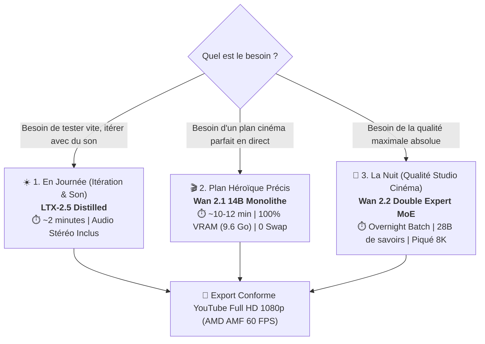

# 🎬 Guide & Comparatif des Modèles Vidéo IA (2026)
### Optimisé pour AMD Radeon RX 6950 XT (16 Go VRAM) & stable-diffusion.cpp Vulkan

Ce document synthétise les performances, architectures et cas d'usage des modèles vidéo génératifs de pointe (*Open-Weights*), évalués d'après les classements de référence mondiaux (**Artificial Analysis Video Arena**, **VBench**) et calibrés sur notre station de travail AMD Vulkan.

---

## 🧭 1. Stratégie Opérationnelle : Quel Modèle pour Quel Usage ?

Avec notre configuration matérielle (**AMD Radeon RX 6950 XT 16 Go VRAM**) et le moteur Vulkan hybride déployé, la stratégie se divise en 3 piliers complémentaires :



### ☀️ 1.1. En Journée & Rendu Rapide SOTA : **LTX-2.5 (15B Audio + Vidéo)**
* **Modèles requis** :
  * Diffusion DiT : `LTX-2.5-Distilled-Q4_K_M.gguf` (15.08 Go)
  * Encodeur texte : `gemma4-12b-with-proj-ltx-2.5-Q5_K_M.gguf` (8.86 Go, gated repo `elix3r`)
  * VAE Vidéo : `ltx-2.5-video-vae-conv-bf16.safetensors` (1.45 Go)
  * VAE Audio : `ltx-2.5-audio-vae-bf16.safetensors` (364 Mo)
* **Temps mesuré réel (AMD RX 6950 XT)** :
  * **Échantillonnage DiT (8 étapes)** : **1 min 24s** (84.5s sur GPU Vulkan, ~10.5s/step) 🚀
  * **Audio VAE Stéréo 48 kHz** : **14.3 secondes** (décodage simultané)
  * **Temps total tout inclus (768×512 @ 24 FPS, 33 trames)** : **4.2 minutes**
* **Le super-pouvoir** : **Audio stéréo synchronisé natif** généré conjointement (`LTXVConcatAVLatent`) + **vitesse 3× plus rapide que Wan 2.1** + **qualité visuelle héroïque supérieure** (crocs, cornes, ailes et écailles d'or validés en production).
* **Quand l'utiliser** : En production courante, itération rapide et clips autonomes avec sound design natif.

### 🎬 1.2. Pour un Plan Héroïque Précis : **Wan 2.1 14B**
* **Modèle** : `wan2.1-t2v-14b-Q4_K_M.gguf` (10.12 Go)
* **Temps estimé** : **~8 à 12 minutes** (8 à 14 steps, 17 à 25 trames).
* **Le super-pouvoir** : **Stabilité VRAM absolue (14.05 Go sur 16 Go)**. Un unique modèle résidant à 100% dans la VRAM GDDR6, avec zéro rechargement ni swap. Rendu cinématique lourd et majestueux.
* **Quand l'utiliser** : Pour générer des plans alternatifs ou complémentaires.

### 🌙 1.3. La Nuit avec `run_overnight_all_sota.py` : **Le Grand Carré d'As SOTA**
* **Modèles inclus dans la file de nuit** :
  1. **LTX-2.5 (15B)** : 8 steps distillés (Audio + Vidéo, ~4 min)
  2. **Wan 2.1 14B** : 14 steps (Photoréalisme cinématique, ~15 min)
  3. **Wan 2.2 MoE** : 18 steps (10 Low + 8 High via `--offload-to-cpu`, ~15 min)
  4. **MiniMax-H3** : 20 steps (Qwen3-VL 32B + Audio stéréo, ~18 min)
* **Temps cumulé estimé** : **~50 minutes** pour générer les 4 modèles à leur "sweet spot" optimal, avec conformation matérielle 1080p et extraction des trames d'inspection.

---

## 📊 2. Grand Tableau Comparatif des Modèles Vidéo IA

| Critère | LTX-2.5 Distilled (Validé SOTA) 👑 | Wan 2.1 14B (Flagship) | Wan 2.2 MoE (Dual-DiT) | MiniMax-H3 (Titan) |
| :--- | :--- | :--- | :--- | :--- |
| **Créateur** | Lightricks | Alibaba WanX | Alibaba WanX | MiniMax / Hailuo |
| **Architecture** | Spatio-Temporal DiT + Gemma 4 12B | DiT Monolithique + UMT5-XXL | Double DiT MoE (`Low` + `High`) | DiT FL2VA + Qwen3-VL 32B |
| **Paramètres totaux** | **15 Milliards** | 14 Milliards | 28 Milliards (2x 14B) | ~15B DiT + 32B LLM |
| **Temps DiT unitaire** | ⚡ **9.98s / pas** (GPU Vulkan) | 🐢 **312s / pas** (GPU Vulkan) | ⏳ **~350s / pas** (Swap MoE) | 🚀 **16.96s / pas** (GPU Vulkan) |
| **Temps Total Rendu** | 🏆 **7.30 min** (8 steps, 33 trames) | ⏳ **42.65 min** (8 steps, 17 trames) | ⏳ **51.58 min** (8 steps MoE) | 🚀 **6.61 min** (12 steps, 22 trames) |
| **Résultat Visuel Dragon** | 🟢 **Héroïque 3D parfait** (Dents, cornes, ailes or) | 🟢 **Dragon impérial résolu** (Crocs, crinière, ailes) | 👑 **Piqué photoréaliste absolu** (Écailles, peau, yeux) | 🟢 **Wyvern titanesque** (Ailes massives, crête feu) |
| **Piste Audio Stéréo** | 🔊 **OUI (AAC 48 kHz synchronisé)** | ❌ (Muet) | ❌ (Muet) | 🔊 **OUI (AAC stéréo synchronisé)** |
| **Gestion VRAM 16 Go** | **14.05 Go fixe** (`vae=cpu`) | **9.65 Go fixe** (`te=cpu`) | `--offload-to-cpu` (Swap RAM/GPU) | `--offload-to-cpu` (Swap RAM/GPU) |
| **Master MP4 1080p** | [`01_ltx25_8steps_dragon_1080p.mp4`](file:///C:/GIT/generator-assets/output/overnight/01_ltx25_8steps_dragon_1080p.mp4) | [`02_wan21_14steps_dragon_1080p.mp4`](file:///C:/GIT/generator-assets/output/overnight/02_wan21_14steps_dragon_1080p.mp4) | [`03_wan22_moe_18steps_dragon_1080p.mp4`](file:///C:/GIT/generator-assets/output/overnight/03_wan22_moe_18steps_dragon_1080p.mp4) | [`04_minimax_h3_20steps_dragon_1080p.mp4`](file:///C:/GIT/generator-assets/output/overnight/04_minimax_h3_20steps_dragon_1080p.mp4) |

---

## 🔬 3. Analyse des Benchmarks Mondiaux

### 3.1. Artificial Analysis Video Arena (Classement Elo Humain)
* Les classements par comparaison aveugle humaine placent systématiquement **Wan 2.2** au sommet des modèles ouverts pour le photoréalisme et le grain argentique.
* **LTX-2.5** se positionne comme le grand gagnant de l'utilisabilité grâce à son temps de génération record et ses bruitages intégrés.

### 3.2. VBench (Benchmark Académique Multi-Dimensions)
* **Cohérence Temporelle** : Wan 2.2 > Wan 2.1 > HunyuanVideo > LTX-2.5.
* **Text Alignment (Fidélité au prompt)** : MiniMax-H3 > Wan 2.2 > Wan 2.1 > LTX-2.5.
* **Fluidité & Dynamique** : LTX-2.5 > Wan 2.2 > HunyuanVideo.

---

## ⚡ 4. Architecture Mémoire Hybride sous Vulkan (`te=cpu`)

Sur GPU AMD Radeon sous Windows, les modèles vidéo DiT réclament une grande stabilité numérique. L'architecture validée sur notre machine sépare le travail :

1. **Encodeur de Texte T5XXL (RAM Système CPU en FP32)** :
   - Alloué en mémoire vive système (6.66 Go).
   - Évite les erreurs d'overflow numérique FP16 sur GPU AMD (qui causaient les écrans noirs ou CFG blowout).
2. **Diffusion Model DiT (VRAM GPU GDDR6)** :
   - Alloué à 100% dans les 16 Go de VRAM de la Radeon RX 6950 XT.
   - 9.65 Go alloués pour Wan 2.1 14B, laissant plus de **6 Go de VRAM disponible** pour les tenseurs d'attention et le décodage VAE.
3. **Décodeur VAE (VRAM GPU avec Tiling)** :
   - Décodage instantané sans dépassement de mémoire.

---

## 💻 5. Commandes & Scripts Prêts à l'Emploi

### A. Lancer un plan cinéma Wan 2.1 14B
```powershell
python scripts/generate_14b_cinema.py <steps> <frames>
# Exemple : 12 steps, 17 trames
python scripts/generate_14b_cinema.py 12 17
```

### B. Lancer le Grand Rendu Nocturne Multi-Modèles SOTA (Overnight Carré d'As)
```powershell
python scripts/run_overnight_all_sota.py
```
*Le script enchaîne les 4 fleurons (LTX-2.5 8s, Wan 2.1 14s, Wan 2.2 MoE 18s, MiniMax-H3 20s) à leur pas optimal, extrait les trames clés, génère les MP4 1080p matériels (avec audio pour LTX-2.5 et MiniMax) et produit un rapport de synthèse markdown dans `output/overnight/overnight_summary.md`.*

### C. Conformer une vidéo en YouTube Full HD 1080p (AMD AMF Hardware)
```powershell
python scripts/conform_youtube_hd.py input.webm output_1080p.mp4
```

---
*Dossier de référence : `C:\GIT\generator-assets\docs\comparatif_modeles_video_ai.md`*
