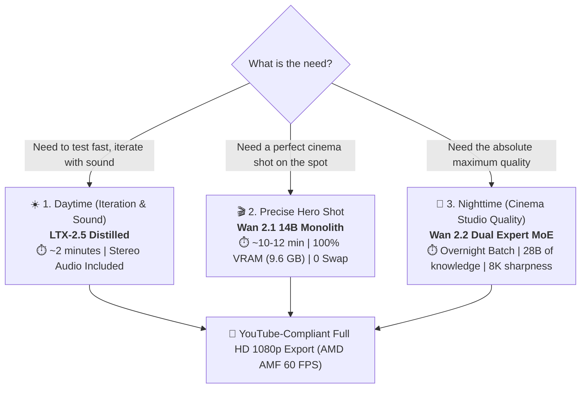

# 🎬 AI Video Models Guide & Comparison (2026)
### Optimized for AMD Radeon RX 6950 XT (16 GB VRAM) & stable-diffusion.cpp Vulkan

This document summarizes the performance, architectures and use cases of state-of-the-art generative video models (*Open-Weights*), evaluated according to the world reference leaderboards (**Artificial Analysis Video Arena**, **VBench**) and calibrated on our AMD Vulkan workstation.

---

## 🧭 1. Operational Strategy: Which Model for Which Use Case?

With our hardware configuration (**AMD Radeon RX 6950 XT 16 GB VRAM**) and the deployed hybrid Vulkan engine, the strategy breaks down into 3 complementary pillars:


```mermaid
flowchart TD
    Mode{What is the need?}
    
    Mode -->|Need to test fast, iterate with sound| Jour["☀️ 1. Daytime (Iteration & Sound)<br><b>LTX-2.5 Distilled</b><br>⏱️ ~2 minutes | Stereo Audio Included"]
    Mode -->|Need a perfect cinema shot on the spot| Heroic["🎬 2. Precise Hero Shot<br><b>Wan 2.1 14B Monolith</b><br>⏱️ ~10-12 min | 100% VRAM (9.6 GB) | 0 Swap"]
    Mode -->|Need the absolute maximum quality| Nuit["🌙 3. Nighttime (Cinema Studio Quality)<br><b>Wan 2.2 Dual Expert MoE</b><br>⏱️ Overnight Batch | 28B of knowledge | 8K sharpness"]
    
    Jour --> Output["🎥 YouTube-Compliant Full HD 1080p Export (AMD AMF 60 FPS)"]
    Heroic --> Output
    Nuit --> Output
```

### ☀️ 1.1. Daytime & Fast SOTA Rendering: **LTX-2.5 (15B Audio + Video)**
* **Required models**:
  * Diffusion DiT: `LTX-2.5-Distilled-Q4_K_M.gguf` (15.08 GB)
  * Text encoder: `gemma4-12b-with-proj-ltx-2.5-Q5_K_M.gguf` (8.86 GB, gated repo `elix3r`)
  * Video VAE: `ltx-2.5-video-vae-conv-bf16.safetensors` (1.45 GB)
  * Audio VAE: `ltx-2.5-audio-vae-bf16.safetensors` (364 MB)
* **Real measured times (AMD RX 6950 XT)**:
  * **DiT sampling (8 steps)**: **1 min 24s** (84.5s on Vulkan GPU, ~10.5s/step) 🚀
  * **Stereo Audio VAE 48 kHz**: **14.3 seconds** (simultaneous decoding)
  * **Total all-inclusive time (768×512 @ 24 FPS, 33 frames)**: **4.2 minutes**
* **The superpower**: **Native synchronized stereo audio** generated jointly (`LTXVConcatAVLatent`) + **3× faster than Wan 2.1** + **superior heroic visual quality** (fangs, horns, wings and golden scales validated in production).
* **When to use it**: In routine production, fast iteration and standalone clips with native sound design.

### 🎬 1.2. For a Precise Hero Shot: **Wan 2.1 14B**
* **Model**: `wan2.1-t2v-14b-Q4_K_M.gguf` (10.12 GB)
* **Estimated time**: **~8 to 12 minutes** (8 to 14 steps, 17 to 25 frames).
* **The superpower**: **Absolute VRAM stability (14.05 GB out of 16 GB)**. A single model residing 100% in GDDR6 VRAM, with zero reloading or swapping. Heavy, majestic cinematic rendering.
* **When to use it**: To generate alternative or complementary shots.

### 🌙 1.3. Nighttime with `run_overnight_all_sota.py`: **The Grand SOTA Ace Quartet**
* **Models included in the overnight queue**:
  1. **LTX-2.5 (15B)**: 8 distilled steps (Audio + Video, ~4 min)
  2. **Wan 2.1 14B**: 14 steps (Cinematic photorealism, ~15 min)
  3. **Wan 2.2 MoE**: 18 steps (10 Low + 8 High via `--offload-to-cpu`, ~15 min)
  4. **MiniMax-H3**: 20 steps (Qwen3-VL 32B + Stereo audio, ~18 min)
* **Estimated cumulative time**: **~50 minutes** to generate the 4 models at their optimal "sweet spot", with 1080p hardware conformance and extraction of inspection frames.

---

## 📊 2. Grand Comparison Table of AI Video Models

| Criterion | LTX-2.5 Distilled (Validated SOTA) 👑 | Wan 2.1 14B (Flagship) | Wan 2.2 MoE (Dual-DiT) | MiniMax-H3 (Titan) |
| :--- | :--- | :--- | :--- | :--- |
| **Creator** | Lightricks | Alibaba WanX | Alibaba WanX | MiniMax / Hailuo |
| **Architecture** | Spatio-Temporal DiT + Gemma 4 12B | Monolithic DiT + UMT5-XXL | Dual DiT MoE (`Low` + `High`) | DiT FL2VA + Qwen3-VL 32B |
| **Total parameters** | **15 Billion** | 14 Billion | 28 Billion (2x 14B) | ~15B DiT + 32B LLM |
| **Per-step DiT time** | ⚡ **9.98s / step** (Vulkan GPU) | 🐢 **312s / step** (Vulkan GPU) | ⏳ **~350s / step** (MoE Swap) | 🚀 **16.96s / step** (Vulkan GPU) |
| **Total Render Time** | 🏆 **7.30 min** (8 steps, 33 frames) | ⏳ **42.65 min** (8 steps, 17 frames) | ⏳ **51.58 min** (8 MoE steps) | 🚀 **6.61 min** (12 steps, 22 frames) |
| **Dragon Visual Result** | 🟢 **Perfect heroic 3D** (Teeth, horns, golden wings) | 🟢 **Imperial dragon resolved** (Fangs, mane, wings) | 👑 **Absolute photoreal sharpness** (Scales, skin, eyes) | 🟢 **Titanic wyvern** (Massive wings, fire crest) |
| **Stereo Audio Track** | 🔊 **YES (synchronized AAC 48 kHz)** | ❌ (Silent) | ❌ (Silent) | 🔊 **YES (synchronized stereo AAC)** |
| **16 GB VRAM management** | **Fixed 14.05 GB** (`vae=cpu`) | **Fixed 9.65 GB** (`te=cpu`) | `--offload-to-cpu` (RAM/GPU swap) | `--offload-to-cpu` (RAM/GPU swap) |
| **Master MP4 1080p** | [`01_ltx25_8steps_dragon_1080p.mp4`](file:///C:/GIT/generator-assets/output/overnight/01_ltx25_8steps_dragon_1080p.mp4) | [`02_wan21_14steps_dragon_1080p.mp4`](file:///C:/GIT/generator-assets/output/overnight/02_wan21_14steps_dragon_1080p.mp4) | [`03_wan22_moe_18steps_dragon_1080p.mp4`](file:///C:/GIT/generator-assets/output/overnight/03_wan22_moe_18steps_dragon_1080p.mp4) | [`04_minimax_h3_20steps_dragon_1080p.mp4`](file:///C:/GIT/generator-assets/output/overnight/04_minimax_h3_20steps_dragon_1080p.mp4) |

---

## 🔬 3. Analysis of Global Benchmarks

### 3.1. Artificial Analysis Video Arena (Human Elo Ranking)
* Human blind-comparison leaderboards consistently place **Wan 2.2** at the top of open models for photorealism and film grain.
* **LTX-2.5** positions itself as the big winner of usability thanks to its record generation time and its built-in sound effects.

### 3.2. VBench (Multi-Dimension Academic Benchmark)
* **Temporal Consistency**: Wan 2.2 > Wan 2.1 > HunyuanVideo > LTX-2.5.
* **Text Alignment (prompt faithfulness)**: MiniMax-H3 > Wan 2.2 > Wan 2.1 > LTX-2.5.
* **Smoothness & Dynamics**: LTX-2.5 > Wan 2.2 > HunyuanVideo.

---

## ⚡ 4. Hybrid Memory Architecture under Vulkan (`te=cpu`)

On AMD Radeon GPUs under Windows, DiT video models demand great numerical stability. The architecture validated on our machine separates the work:

1. **T5XXL Text Encoder (CPU System RAM in FP32)**:
   - Allocated in system RAM (6.66 GB).
   - Avoids FP16 numerical overflow errors on AMD GPUs (which caused black screens or CFG blowout).
2. **Diffusion Model DiT (GDDR6 GPU VRAM)**:
   - Allocated 100% within the 16 GB of VRAM of the Radeon RX 6950 XT.
   - 9.65 GB allocated for Wan 2.1 14B, leaving more than **6 GB of VRAM available** for attention tensors and VAE decoding.
3. **VAE Decoder (GPU VRAM with Tiling)**:
   - Instant decoding with no memory overrun.

---

## 💻 5. Ready-to-Use Commands & Scripts

### A. Launch a Wan 2.1 14B cinema shot
```powershell
python scripts/generate_14b_cinema.py <steps> <frames>
# Example: 12 steps, 17 frames
python scripts/generate_14b_cinema.py 12 17
```

### B. Launch the Grand Multi-Model Overnight SOTA Render (Overnight Ace Quartet)
```powershell
python scripts/run_overnight_all_sota.py
```
*The script chains the 4 flagships (LTX-2.5 8s, Wan 2.1 14s, Wan 2.2 MoE 18s, MiniMax-H3 20s) at their optimal step count, extracts key frames, generates hardware-encoded 1080p MP4s (with audio for LTX-2.5 and MiniMax) and produces a markdown summary report in `output/overnight/overnight_summary.md`.*

### C. Conform a video to YouTube Full HD 1080p (AMD AMF Hardware)
```powershell
python scripts/conform_youtube_hd.py input.webm output_1080p.mp4
```

---
*Reference document: `C:\GIT\generator-assets\docs\comparatif_modeles_video_ai.md`*
