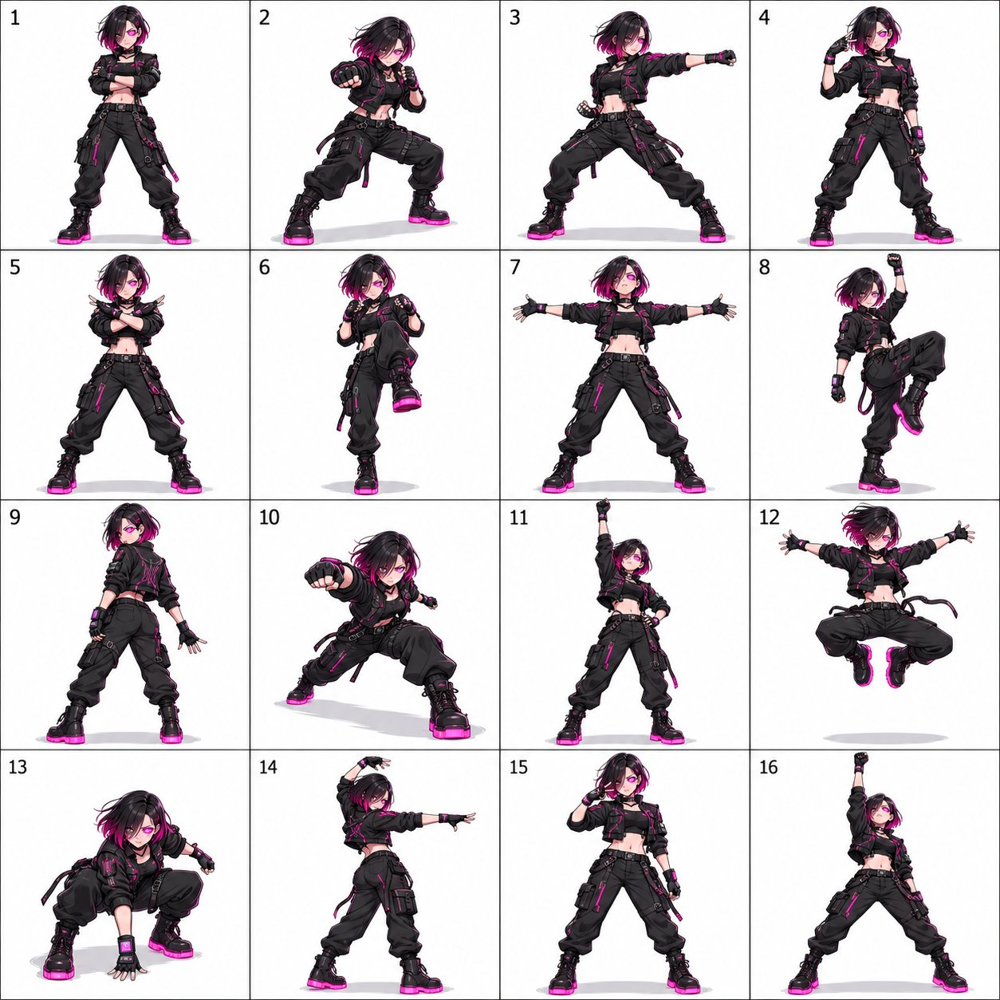

# Created this cyberpunk dance pose sheet with GPT Image 2.5  

Then brought the choreography to life with Seedance 2.5  

Made with @ImagineArt_X  

Prompt 👇  
#AIArt #GPTImage #Seedance #AIVideo #Cyberpunk #Anime  

*(Média : 1 vidéo + 1 image)*:

---

### Réponse 1 (suite du thread)  
**Mahnoor Fatima (@MahnoorAi12)**

**Prompt pour la planche de poses (Character sheet image prompt)**

Créer une planche de poses de danse 4×4 mettant en scène un personnage original, avec exactement 16 panneaux de taille égale dans une seule image carrée.

**DESIGN DU PERSONNAGE**  
Concevoir une hackeuse cyberpunk tranchante avec un bob asymétrique noir et magenta, un œil cybernétique lumineux, une veste tactique noire ajustée avec des accents de motifs de circuits, des gants techniques sans doigts avec de petits écrans, un pantalon cargo et des bottes massives à semelles néon. Garder son visage exact, sa coiffure, ses couleurs, ses proportions, sa tenue et ses accessoires parfaitement cohérents sur les 16 panneaux — aucun redesign, recoloration ou changement de costume entre les panneaux.

**STYLE ARTISTIQUE**  
Rendu en anime 2D, ombrage cel à fort contraste avec lumière de contour néon, contours nets et éclairage cohérent sur chaque panneau.

**CHORÉGRAPHIE**  
Concevoir une séquence de danse cohérente de 16 poses avec un début clair, une montée, un climax et une fin, ordonnée de gauche à droite, de haut en bas. Inclure : une pose d’ouverture qui établit la personnalité ; un petit pas rythmique avec un geste de bras coordonné ; un pas latéral avec un bras tendu ; un geste expressif compact près du visage ; une posture ancrée avec les bras croisés ou balayant vers l’intérieur ; une levée de genou ou un transfert de poids ; une pose expansive ouverte avec les bras écartés ; une pose d’équilibre ludique ; une pose de rotation montrant une vue trois-quarts arrière ; une inclinaison diagonale vers l’avant ; un accent fort vers le haut ; un saut climactique (ou une extension complète du corps si le saut ne convient pas) ; une posture abaissée avec un geste vers l’avant ; une transition dynamique de profil ; un geste signature unique au personnage ; et une pose finale confiante avec une silhouette claire de finition.

**COMPOSITION**  
Utiliser un fond blanc propre, de fines lignes de grille et de petits numéros lisibles 1–16 dans le coin supérieur gauche de chaque panneau. Une représentation en pied complète du personnage par panneau, échelle, distance de caméra, éclairage et style de rendu cohérents. Angle de caméra fixe tandis que le personnage tourne naturellement. Garder l’intégralité du personnage — cheveux, mains, pieds, ailes, queues et accessoires — à l’intérieur de chaque panneau avec des marges confortables, avec des ombres au sol subtiles et des mouvements secondaires naturels des cheveux et des tissus.

**À ÉVITER**  
Poses répétées ou quasi identiques, dérive d’identité, changements de costume, proportions incohérentes, membres en trop ou manquants, mains malformées, parties du corps coupées, panneaux qui se chevauchent, personnages supplémentaires, traînées de mouvement, décors d’arrière-plan, accessoires non listés, bulles de dialogue et filigranes.

**Sortie finale :** une image carrée soignée, une grille 4×4 clairement organisée de 16 poses de danse distinctes et adaptées au personnage.

**Prompt vidéo (Seedance)**  
Utiliser cette planche pour l’apparence du personnage et la chorégraphie. Suivre les poses 1→16 de gauche à droite, de haut en bas, en les reliant en une danse continue.

Créer une animation continue en anime 2D, ombrage cel à fort contraste avec lumière de contour néon du personnage de la planche de référence, dansant dans un espace blanc uni. Préserver exactement son visage, sa coiffure, ses couleurs, ses proportions, sa tenue et ses accessoires, en correspondance précise avec la référence à chaque image. Maintenir son identité pleinement cohérente tout au long.

Sa performance est élégante, contrôlée et intensément calme, comme si chaque mouvement était calculé.

Utiliser une caméra fixe de face dans un plan en pied ininterrompu. Commencer immédiatement en pose 1. Garder toute sa silhouette — y compris les mains, les cheveux, les ailes/queue le cas échéant, et les pieds — à l’intérieur du cadre avec des marges blanches confortables. Une ombre ovale gris clair douce l’ancre au sol et reste présente pendant les sauts.

La grille définit uniquement l’ordre de la chorégraphie. Montrer un seul personnage dans un espace continu. Pas de planche de référence, d’écrans partagés, de bordures, de numéros, de légendes, de figures dupliquées, d’images rémanentes, de coupures ou de mouvement de caméra.

Chaque pose numérotée occupe 0,5 seconde (16 poses = 8 secondes au total). Articuler clairement la silhouette de chaque pose, puis transitionner par un mouvement naturel vers la suivante. Maintenir une anatomie continue et un transfert de poids : les pieds s’appuient et atterrissent, les articulations absorbent l’impact, les hanches et les épaules guident les rotations. Les cheveux, les vêtements et les accessoires suivent avec un léger retard. Éviter les transitions de type diaporama, le morphing, le glissement des pieds ou les changements soudains de position des membres.

- 0.0–0.5s — Pose 1 : Elle se tient droite, pieds écartés à la largeur des épaules, bras croisés sur la poitrine, regard confiant et tranchant ; décroise les bras et passe en posture prête.  
- 0.5–1.0s — Pose 2 : Elle bascule dans une posture basse de garde avec un poing en avant, poids sur la jambe arrière ; pousse et lève un genou.  
- 1.0–1.5s — Pose 3 : Elle adopte une large posture de puissance avec un bras tendu sur le côté et l’autre ramené à la hanche ; se recule et pivote le torse.  
- 1.5–2.0s — Pose 4 : Elle tourne brusquement la tête et le regard vers la caméra, une main levée près de la tempe dans un geste tranchant ; abaisse la main et fait un grand pas.  
- 2.0–2.5s — Pose 5 : Elle croise les deux avant-bras en X devant la poitrine, poids centré, coudes tranchants ; ouvre les bras d’un coup sec vers l’extérieur.  
- 2.5–3.0s — Pose 6 : Elle lève un genou de façon explosive, les deux poings en garde devant la poitrine ; pose le pied fermement et transfère le poids vers l’avant.  
- 3.0–3.5s — Pose 7 : Elle écarte les deux bras à hauteur d’épaules, poitrine ouverte, menton relevé dans une présence dominante ; ramène les bras vers le bas et l’intérieur.  
- 3.5–4.0s — Pose 8 : Elle pivote sur une jambe avec le genou opposé levé, un poing levé au-dessus de la tête en triomphe ; abaisse la jambe et se prépare à tourner.  
- 4.0–4.5s — Pose 9 : Elle tourne en vue trois-quarts arrière avec un bras traînant derrière, regardant brusquement par-dessus l’épaule ; continue de tourner pour revenir de face.  
- 4.5–5.0s — Pose 10 : Elle se penche en avant bas avec un bras tendu droit devant et l’autre en appui arrière pour l’équilibre ; se redresse.  
- 5.0–5.5s — Pose 11 : Elle tend un bras droit au-dessus de la tête en ligne verticale forte, l’autre en appui à la hanche ; accumule de l’énergie en pliant les genoux pour un saut.  
- 5.5–6.0s — Pose 12 : Elle effectue un saut explosif avec les deux genoux relevés et les bras écartés dans une forme dynamique ; atterrit fermement mais de façon contrôlée, en amortissant avec les genoux.  
- 6.0–6.5s — Pose 13 : Elle atterrit en position basse avec un poing au sol, regard vers la caméra ; se relève lentement en déplaçant le poids sur un côté.  
- 6.5–7.0s — Pose 14 : Elle tourne en posture de profil avec un bras balayant au-dessus de la tête et l’autre tendu droit sur le côté ; revient de face.  
- 7.0–7.5s — Pose 15 : Elle adopte brusquement une pose signature tranchante (salut, poing sur la poitrine ou main levée), tient brièvement ; se relâche pour la pose finale.  
- 7.5–8.0s — Pose 16 : Elle termine en large posture de puissance ancrée avec un bras levé en poing ou paume ouverte vers le ciel, menton relevé, regard inébranlable ; tient et se stabilise.

Terminer la pose finale à 7,8 secondes et la maintenir jusqu’à 8,0 secondes pendant que les cheveux et les vêtements se stabilisent.

*(Suggestions de personnages supplémentaires listées : Fantasy Elf Archer, Mecha Pilot Power-Pose, RPG Game NPC Idle-to-Dance, etc.)*

---

### Réponse 2 (suite)  
**Mahnoor Fatima (@MahnoorAi12)**

**Prompt vidéo Seedance 2.5**  
*(Version quasi identique au précédent, avec quelques variations mineures de formulation.)*

Utiliser cette planche pour l’apparence du personnage et la chorégraphie. Suivre les poses 1→16 de gauche à droite, de haut en bas, en les reliant en une danse continue.

[… le même détail de timing et de poses que ci-dessus …]

---

### Réponse d’un autre utilisateur  
**KrishnaG (@KrishnaBio1)**  
*13 septembre 2026 – 02:51 GMT*

Pose sheet gives each movement a clear visual structure  
*(La planche de poses donne à chaque mouvement une structure visuelle claire.)*

---

**Note :** Le thread original contient une vidéo (environ 5 s) montrant l’animation de danse cyberpunk et une image de la planche de poses 4×4. Les prompts détaillés ci-dessus sont ceux partagés par l’autrice pour reproduire le résultat avec GPT Image 2.5 + Seedance 2.5.