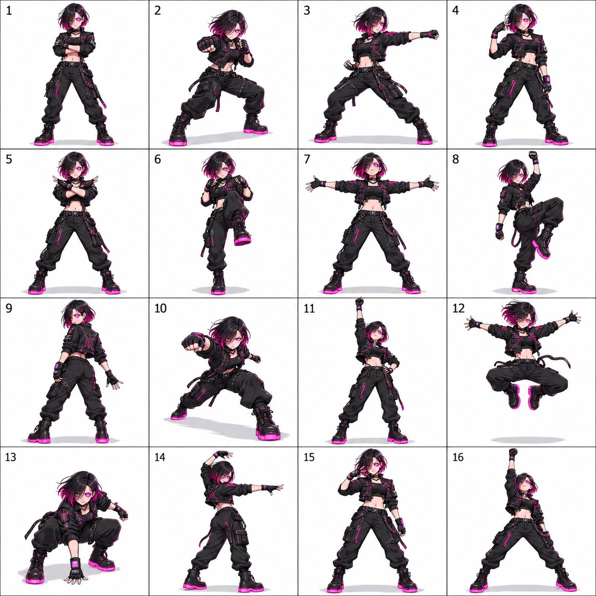

# Created this cyberpunk dance pose sheet with GPT Image 2.5  

Then brought the choreography to life with Seedance 2.5  

Made with @ImagineArt_X  

Prompt 👇  
#AIArt #GPTImage #Seedance #AIVideo #Cyberpunk #Anime  

*(Media: 1 video + 1 image)*:

---

### Reply 1 (thread continuation)  
**Mahnoor Fatima (@MahnoorAi12)**

**Prompt for the pose sheet (Character sheet image prompt)**

Create a 4×4 dance pose sheet featuring an original character, with exactly 16 equal-sized panels in a single square image.

**CHARACTER DESIGN**  
Design a sharp cyberpunk hacker girl with a black and magenta asymmetric bob, one glowing cybernetic eye, a fitted black tactical jacket with circuit-pattern accents, technical fingerless gloves with small screens, cargo pants and massive boots with neon soles. Keep her exact face, hairstyle, colors, proportions, outfit and accessories perfectly consistent across all 16 panels — no redesign, recoloring or costume change between panels.

**ART STYLE**  
2D anime rendering, high-contrast cel shading with neon rim light, crisp outlines and consistent lighting on every panel.

**CHOREOGRAPHY**  
Design a coherent 16-pose dance sequence with a clear beginning, a build-up, a climax and an ending, ordered left to right, top to bottom. Include: an opening pose that establishes the personality; a small rhythmic step with a coordinated arm gesture; a side step with an extended arm; a compact expressive gesture near the face; a grounded stance with arms crossed or sweeping inward; a knee lift or a weight shift; an open expansive pose with arms spread; a playful balance pose; a rotation pose showing a back three-quarter view; a diagonal forward lean; a strong upward accent; a climactic jump (or a full body extension if a jump does not fit); a lowered stance with a forward gesture; a dynamic profile transition; a signature gesture unique to the character; and a confident final pose with a clear finishing silhouette.

**COMPOSITION**  
Use a clean white background, thin grid lines and small readable numbers 1–16 in the top-left corner of each panel. One full-body depiction of the character per panel, with consistent scale, camera distance, lighting and rendering style. Fixed camera angle while the character rotates naturally. Keep the entire character — hair, hands, feet, wings, tails and accessories — inside each panel with comfortable margins, with subtle ground shadows and natural secondary motion of hair and fabric.

**AVOID**  
Repeated or near-identical poses, identity drift, costume changes, inconsistent proportions, extra or missing limbs, malformed hands, cropped body parts, overlapping panels, extra characters, motion trails, background scenery, unlisted accessories, speech bubbles and watermarks.

**Final output:** a polished square image, a clearly organized 4×4 grid of 16 distinct dance poses tailored to the character.

**Video prompt (Seedance)**  
Use this sheet for the character's appearance and choreography. Follow poses 1→16 left to right, top to bottom, linking them into one continuous dance.

Create a continuous 2D anime animation, high-contrast cel shading with neon rim light, of the character from the reference sheet, dancing in a plain white space. Preserve exactly her face, hairstyle, colors, proportions, outfit and accessories, in precise match with the reference on every frame. Keep her identity fully consistent throughout.

Her performance is elegant, controlled and intensely calm, as if every movement were calculated.

Use a fixed front-facing camera in an uninterrupted full-body shot. Start immediately in pose 1. Keep her entire silhouette — including hands, hair, wings/tail if any, and feet — inside the frame with comfortable white margins. A soft light-gray oval shadow anchors her to the ground and remains present during jumps.

The grid only defines the choreography order. Show a single character in a continuous space. No reference sheet, split screens, borders, numbers, captions, duplicated figures, ghosting, cuts or camera movement.

Each numbered pose lasts 0.5 seconds (16 poses = 8 seconds total). Clearly articulate the silhouette of each pose, then transition with natural movement into the next one. Maintain continuous anatomy and weight shifting: feet push off and land, joints absorb impact, hips and shoulders lead the rotations. Hair, clothing and accessories follow with a slight delay. Avoid slideshow-style transitions, morphing, foot sliding or sudden limb position changes.

- 0.0–0.5s — Pose 1: She stands upright, feet shoulder-width apart, arms crossed over her chest, confident sharp gaze; uncrosses her arms and shifts into a ready stance.  
- 0.5–1.0s — Pose 2: She shifts into a low guard stance with one fist forward, weight on the back leg; pushes off and lifts a knee.  
- 1.0–1.5s — Pose 3: She takes a wide power stance with one arm extended to the side and the other pulled to her hip; steps back and twists her torso.  
- 1.5–2.0s — Pose 4: She snaps her head and gaze toward the camera, one hand raised near her temple in a sharp gesture; lowers the hand and takes a big step.  
- 2.0–2.5s — Pose 5: She crosses both forearms in an X in front of her chest, weight centered, elbows sharp; flings her arms outward in one sharp motion.  
- 2.5–3.0s — Pose 6: She lifts a knee explosively, both fists in guard in front of her chest; plants the foot firmly and shifts the weight forward.  
- 3.0–3.5s — Pose 7: She spreads both arms at shoulder height, chest open, chin raised in a dominant presence; draws her arms down and inward.  
- 3.5–4.0s — Pose 8: She pivots on one leg with the opposite knee raised, one fist raised overhead in triumph; lowers the leg and prepares to spin.  
- 4.0–4.5s — Pose 9: She turns into a back three-quarter view with one arm trailing behind, glancing sharply over her shoulder; keeps turning to come back to front.  
- 4.5–5.0s — Pose 10: She bends low forward with one arm extended straight ahead and the other braced behind for balance; straightens up.  
- 5.0–5.5s — Pose 11: She extends one arm straight overhead in a strong vertical line, the other braced at her hip; builds up energy by bending her knees for a jump.  
- 5.5–6.0s — Pose 12: She performs an explosive jump with both knees raised and arms spread in a dynamic shape; lands firmly but in a controlled way, absorbing with her knees.  
- 6.0–6.5s — Pose 13: She lands in a low stance with one fist to the ground, eyes toward the camera; rises slowly while shifting weight to one side.  
- 6.5–7.0s — Pose 14: She turns into a profile stance with one arm sweeping overhead and the other extended straight to the side; comes back to front.  
- 7.0–7.5s — Pose 15: She snaps into a sharp signature pose (salute, fist over chest or raised hand), holds briefly; relaxes into the final pose.  
- 7.5–8.0s — Pose 16: She ends in a wide, grounded power stance with one arm raised in a fist or open palm to the sky, chin up, unwavering gaze; holds and settles.

Finish the final pose at 7.8 seconds and hold it until 8.0 seconds while the hair and clothing settle.

*(Additional character suggestions listed: Fantasy Elf Archer, Mecha Pilot Power-Pose, RPG Game NPC Idle-to-Dance, etc.)*

---

### Reply 2 (continuation)  
**Mahnoor Fatima (@MahnoorAi12)**

**Seedance 2.5 video prompt**  
*(Nearly identical version to the previous one, with a few minor wording variations.)*

Use this sheet for the character's appearance and choreography. Follow poses 1→16 left to right, top to bottom, linking them into one continuous dance.

[… the same timing and pose detail as above …]

---

### Reply from another user  
**KrishnaG (@KrishnaBio1)**  
*September 13, 2026 – 02:51 GMT*

Pose sheet gives each movement a clear visual structure  
*(The pose sheet gives each movement a clear visual structure.)*

---

**Note:** The original thread contains a video (about 5 s) showing the cyberpunk dance animation and an image of the 4×4 pose sheet. The detailed prompts above are the ones shared by the author to reproduce the result with GPT Image 2.5 + Seedance 2.5.
